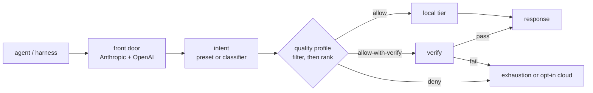

<div align="center">


# anvil-serving

> **The quality-gated local-model router for coding agents.**
>
> *Run local where it is measured safe. Verify risky local output. Keep cloud explicit.*

[](LICENSE)
[](CHANGELOG.md)
[](https://fakoli.github.io/anvil-serving/)
[](https://github.com/fakoli/anvil-serving)
[](tests)

</div>

Point a coding agent or harness at one anvil-serving endpoint. Per request, the router resolves a
workload intent, chooses a fast-local, heavy-local, or opt-in cloud tier from a measured quality
profile, and runs structural verification where the profile says a local answer must be checked
before it reaches the agent.

anvil-serving is not a generic token proxy. It is a local-first routing layer that answers the
question a proxy cannot answer: **is this local model trusted for this kind of work?**

For OpenClaw and agent-assisted operations, anvil-serving also exposes a structured control plane:
`anvil-serving mcp` for same-host stdio MCP, and `anvil-serving controller serve` for a
token-authenticated tailnet controller that lets a gateway on `fakoli-mini` operate a separate
GPU/router host without making raw SSH the product contract.

## Why It Exists

Local models can be cheap and fast for bounded coding work, but they are not uniformly reliable.
The planning eval that shaped anvil-serving found local outputs were usually structurally valid,
while dependency and ordering reasoning lagged far behind frontier models. Static routing by model
name, regex, or cost cannot catch that.

anvil-serving routes with evidence:

| Need | anvil-serving behavior |
|------|------------------------|
| Keep proven work local | `allow` rows in the quality profile stay on local tiers. |
| Verify risky work | `allow-with-verify` rows buffer and check output before returning it. |
| Avoid known local failures | `deny` rows skip local or exhaust cleanly. |
| Preserve one agent endpoint | Anthropic Messages and OpenAI Chat Completions terminate at the router. |
| Keep billing explicit | The default config has no cloud API key; metered cloud is opt-in. |
| Operate safely | MCP/controller tools expose status, route probes, preflight, benchmark, and OpenClaw sync. |

## How It Works

Callers send a workload intent in the `model` field:

```text
planning   quick-edit   review   chat   chat-fast   long-context
```

The router maps that intent to candidate tiers, filters them by hard constraints, ranks by the
quality profile, and optionally verifies the response before returning it. If the caller cannot set
an intent, the Tier-0 classifier infers the work class from the request.



The response stays transparent: anvil-serving reports the real tier/model that served the request
and logs the routing decision.

## Evaluate Quickly

Install from a clone when evaluating the current `main` documentation and control-plane commands:

```bash
pip install -e .
```

`pip install anvil-serving` installs the latest published package, which can lag `main`; use it
only when you do not need unreleased commands such as MCP/controller operations.

First prove the front door with the built-in echo backend. This requires no GPU and no model server:

```bash
python -m anvil_serving.router
```

If port `8000` is already in use, pass `--port <free-port>` and use that port in the URLs below.

Then, in another shell:

```bash
curl -s http://127.0.0.1:8000/v1/models
curl -s http://127.0.0.1:8000/v1/chat/completions \
  -H 'content-type: application/json' \
  -d '{"model":"chat","messages":[{"role":"user","content":"hello from anvil-serving"}]}'
```

To route real local tiers, start compatible OpenAI-style model serves on the URLs named in
`configs/example.toml`, validate them with `preflight`, then run:

```bash
anvil-serving serve --config configs/example.toml
```

Use `127.0.0.1` for local URLs.

Full walkthrough: [Getting started](docs/GETTING-STARTED.md).

## Command Surface

| Command | Purpose |
|---------|---------|
| `anvil-serving serve` | Start the Anthropic/OpenAI router front door. |
| `anvil-serving router` | Manage the deployed router container, token, logs, reloads, and profile promotion. |
| `anvil-serving serves` | Manage local model serves through Docker Compose. |
| `anvil-serving profile` | Measure real coding-agent usage to right-size local tiers. |
| `anvil-serving models sync` | Catalog cached models and serving facts. |
| `anvil-serving models pull` | Pull Hugging Face repos into a named Docker volume. |
| `anvil-serving preflight` | Correctness-check a model endpoint before trusting it. |
| `anvil-serving benchmark` | Replay representative traffic and measure capacity. |
| `anvil-serving external-bench` | Import and compare external inference benchmark priors. |
| `anvil-serving harness sync openclaw` | Render OpenClaw model config from live router presets. |
| `anvil-serving voice-sidecar` | Validate or render a Hugging Face speech-to-speech sidecar manifest. |
| `anvil-serving host doctor` | Inspect WSL/Docker Desktop host safety settings. |
| `anvil-serving mcp` | Expose status, route probes, OpenClaw sync, preflight, and benchmark probes as stdio MCP tools. |
| `anvil-serving controller` | Expose the same MCP tool contract over a token-authenticated private/tailnet HTTP controller. |

## Cost And Security Defaults

- **Local-only by default:** `configs/example.toml` contains no cloud tier and no cloud API key.
- **Opt-in cloud:** `configs/example-with-cloud.toml` shows explicit metered cloud routing. Only
  work classes listed in `[router].metered_cloud` can use that tier.
- **Credentials by env var:** configs name env vars such as `ANTHROPIC_API_KEY`; they never contain
  literal secrets.
- **Loopback first:** the front door binds `127.0.0.1` by default.
- **Token before exposure:** configure `[server].auth_env = "ANVIL_ROUTER_TOKEN"` before publishing
  the router beyond loopback.
- **Controller token required:** bind `anvil-serving controller serve` only to `127.0.0.1` or a
  private/tailnet address and set `ANVIL_CONTROLLER_TOKEN` through `--auth-token-env`; unauthenticated
  loopback is an explicit development opt-out, not the default.

See [SECURITY.md](SECURITY.md) for the threat model and vulnerability reporting path.

## Status

**The source tree is versioned 0.10.0, while published tags and package releases can lag `main`.**
The router, local serving tools, host management, router/serve lifecycle verbs, harness sync, and
OpenClaw MCP/controller control plane all ship on `main`. Install from a clone when evaluating those
main-only surfaces. The control plane keeps the request data plane clean: OpenClaw's hook plugin
handles per-turn intent, the router handles quality and configured fallback/exhaustion, and
MCP/controller tools handle explicit operations such as status, preflight, benchmarking, and
OpenClaw config sync.

## Known Limitations

- OpenClaw native failover does not reliably escape a plugin-pinned provider for local-preferred
  classes. Use `ANVIL_CLOUD_CLASSES` or anvil-serving's opt-in cloud tier for at-risk classes.
- Most shipped promotion verdicts are seed verdicts, pending operator-promoted real-traffic
  calibration. The planning-class deny decision has hard eval evidence; other classes should be
  remeasured on your served models.
- The local-tier quickstart requires compatible model serves already running at the configured
  `base_url` values. Use the echo-backend path above for a no-GPU evaluator smoke test.

## Documentation

| Read this | When you need |
|-----------|---------------|
| [Getting started](docs/GETTING-STARTED.md) | No-GPU smoke test, real-tier setup, and harness pointers. |
| [Product architecture](docs/QUALITY-GATED-ROUTER.md) | Intent presets, quality profile, verification, fallback, and integrations. |
| [Terminology](docs/TERMINOLOGY.md) | Product naming, user-facing terms, and technical definitions. |
| [Operator playbooks](docs/OPERATOR-PLAYBOOKS.md) | MCP/controller workflows for status, preflight, benchmark, OpenClaw sync, and promotion evidence. |
| [OpenClaw operations ADRs](docs/adr/0013-openclaw-layers-and-mcp-control-plane.md) | Hook/router/MCP layers and split-host controller transport. |
| [Model settings](docs/MODEL-SETTINGS-EXAMPLE.md) | Thinking/sampling settings and model-specific serve flags. |
| [Serves & eval](docs/SERVES-AND-EVAL.md) | Local serve lifecycle and eval entry points. |
| [External benchmarks](docs/EXTERNAL-BENCHMARKS.md) | Import, report, export, and compare advisory benchmark data. |
| [OpenClaw integration](docs/OPENCLAW-INTEGRATION-SPEC.md) | Reference integration contract and current caveats. |
| [Hugging Face speech-to-speech](examples/huggingface-speech-to-speech/) | Voice sidecar recipe for Realtime audio with anvil-routed LLM turns. |
| [ADRs](docs/adr/README.md) | Architecture decisions and rationale. |
| [Changelog](CHANGELOG.md) | Release history. |

MIT licensed.
