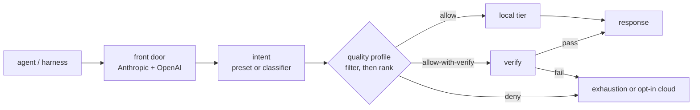

<div align="center">


# anvil-serving

> **The quality-gated local-model router for coding agents.**
>
> *Run local where it is measured safe. Verify risky local output. Keep cloud explicit.*

[](LICENSE)
[](CHANGELOG.md)
[](https://fakoli.github.io/anvil-serving/)
[](tests)

</div>

Point a coding agent or harness at one anvil-serving endpoint. Per request, the router resolves a
workload intent, chooses a fast-local, heavy-local, or opt-in cloud tier from a measured quality
profile, and runs structural verification where the profile says a local answer must be checked
before it reaches the agent.

anvil-serving is not a generic token proxy. It is a local-first routing layer that answers the
question a proxy cannot answer: **is this local model trusted for this kind of work?**

For OpenClaw and agent-assisted operations, anvil-serving also exposes a structured control plane:
`anvil-serving mcp serve` for same-host stdio MCP, and `anvil-serving controller serve` for a
token-authenticated private/tailnet controller that lets a gateway host operate a separate
router, serve, or voice host without making raw SSH the product contract.

## Why It Exists

Local models can be cheap and fast for bounded coding work, but they are not uniformly reliable.
The planning eval that shaped anvil-serving found local outputs were usually structurally valid,
while dependency and ordering reasoning lagged far behind frontier models. Static routing by model
name, regex, or cost cannot catch that.

anvil-serving routes with evidence:

| Need | anvil-serving behavior |
|------|------------------------|
| Keep proven work local | `allow` rows in the quality profile stay on local tiers. |
| Verify risky work | `allow-with-verify` rows buffer and check output before returning it. |
| Avoid known local failures | `deny` rows skip local or exhaust cleanly. |
| Stop a model serve safely | Configured local health checks remove an unavailable tier before inference and automatically readmit it after recovery. |
| Preserve one agent endpoint | Anthropic Messages and OpenAI Chat Completions terminate at the router. |
| Keep billing explicit | The default config has no cloud API key; metered cloud is opt-in. |
| Operate safely | MCP/controller tools expose status, route probes, voice lifecycle, preflight, benchmark, and OpenClaw sync. |

## How It Works

Callers send a workload intent in the `model` field:

```text
planning   quick-edit   review   chat   chat-fast   long-context
```

The router maps that intent to candidate tiers, filters them by hard constraints, ranks by the
quality profile, and optionally verifies the response before returning it. If the caller cannot set
an intent, the Tier-0 classifier infers the work class from the request.



Every routed request is logged as a metadata-only decision record — work class, tier attempts,
verify outcomes, token counts — retrievable from the router's `/v1/decisions` endpoint.

## Evaluate Quickly

The only prerequisite is **Python >= 3.11** — the runtime is standard-library only. Docker (and a
GPU) matter only when you stand up real local model serves.

Install from a clone when evaluating the current `main` documentation and control-plane commands:

```bash
pip install -e .
```

`pip install anvil-serving` installs the latest published package, which can lag `main`; use it
only when you do not need unreleased commands such as MCP/controller operations.

First prove the front door with the built-in echo backend. This requires no GPU and no model server:

```bash
python -m anvil_serving.router
```

If port `8000` is already in use, pass `--port <free-port>` and use that port in the URLs below.

Then, in another shell:

```bash
curl -s http://127.0.0.1:8000/v1/models
curl -s http://127.0.0.1:8000/v1/chat/completions \
  -H 'content-type: application/json' \
  -d '{"model":"chat","messages":[{"role":"user","content":"hello from anvil-serving"}]}'
```

To route real local tiers, start compatible OpenAI-style model serves on the URLs named in
`configs/example.toml` (`anvil-serving serves` manages them as Docker Compose services), validate
them with `preflight`, then run:

```bash
anvil-serving router run --config configs/example.toml
```

Use `127.0.0.1` for local URLs.

Full walkthrough: [Getting started](docs/GETTING-STARTED.md).

## Command Surface

One CLI covers the router, the local serving tools, the measurement loop that feeds the quality
profile, and the control plane. Full flags and examples: [CLI reference](docs/CLI.md).
Run `anvil-serving --help` for the grouped command surface, `anvil-serving <command> --help` for
focused action flags, and `anvil-serving --version` to verify the installed build.

**Data plane** — run and manage the router:

| Command | Purpose |
|---------|---------|
| `anvil-serving router run` | Start the Anthropic/OpenAI router front door. |
| `anvil-serving router` | Manage the deployed router container, token, logs, reloads, and profile promotion. |

**Local serving tools** — stand up and validate the tiers the router routes across:

| Command | Purpose |
|---------|---------|
| `anvil-serving serves` | Manage local model serves through Docker Compose. |
| `anvil-serving models` | Catalog cached models (`sync`), pull Hugging Face repos into a named Docker volume (`pull`), and inspect recorded serve recipes (`recipes`). |
| `anvil-serving serves render` | Render a tuned SGLang/vLLM docker-compose for a GPU and model. |
| `anvil-serving init` | Generate a consistent local bring-up and generic offline topology. |
| `anvil-serving eval preflight` | Correctness-check a model endpoint before trusting it. |
| `anvil-serving eval benchmark run` | Replay representative traffic and measure capacity. |
| `anvil-serving eval benchmark external` | Import and compare external inference benchmark priors. |
| `anvil-serving serves multiplex` | Swap a single resident model on one GPU (SGLang and vLLM backends). |
| `anvil-serving models cache prune` | Plan Hugging Face cache cleanup (plan-only, never deletes on its own). |
| `anvil-serving doctor` | Preflight the environment a router deploy depends on (Python, Docker, Compose, GPU runtime). |
| `anvil-serving host doctor` | Inspect WSL/Docker Desktop host safety settings (memory caps, mmap gotchas). |
| `anvil-serving host status` | Inspect a local or topology-targeted host through its authenticated controller. |

**Quality loop** — the measurements behind the routing profile:

| Command | Purpose |
|---------|---------|
| `anvil-serving eval usage` | Measure real coding-agent usage to right-size local tiers. |
| `anvil-serving eval` | Run the shadow-eval harness; bootstrap a quality profile from it. |
| `anvil-serving eval calibrate` | Grade confirmed local traffic with an independent judge and write a candidate profile (never auto-promotes). |
| `anvil-serving models score` | Rank models for a role from a transcribed benchmark table. |

**Control plane and integrations:**

| Command | Purpose |
|---------|---------|
| `anvil-serving harness sync openclaw` | Render OpenClaw model config from live router presets. |
| `anvil-serving harness status openclaw` | Read bounded OpenClaw gateway status from its declared owner. |
| `anvil-serving topology show|validate|resolve` | Inspect and resolve deployment ownership offline. |
| `anvil-serving mcp serve` | Expose status, route probes, voice lifecycle, OpenClaw sync, preflight, and benchmark probes as stdio MCP tools. |
| `anvil-serving mcp tools` | Print the MCP tool catalog as JSON. |
| `anvil-serving controller` | Expose the same MCP tool contract over a token-authenticated private/tailnet HTTP controller. |
| `anvil-serving voice` | Manage STT/TTS lifecycle, switch voice profiles, bridge private audio endpoints, run the local Realtime voice server, benchmark voice turns, and delegate nested `voice sidecar` operations. |
| `anvil-serving voice sidecar` | Validate or render a Hugging Face speech-to-speech sidecar manifest. |

### CLI Compatibility Notes

Canonical command changes:

- `anvil-serving deploy` → `anvil-serving serves render`
- `anvil-serving external-bench` → `anvil-serving eval benchmark external`
- `anvil-serving cache-prune` → `anvil-serving models cache prune`
- `anvil-serving score` → `anvil-serving models score`

Removed forms fail with migration guidance instead of silently dispatching. See the
[CLI migration table](docs/CLI.md#migration-from-legacy-commands) for every replacement.

## Cost And Security Defaults

- **Local-only by default:** `configs/example.toml` contains no cloud tier and no cloud API key.
- **Opt-in cloud:** `configs/example-with-cloud.toml` shows explicit metered cloud routing. Only
  work classes listed in `[router].metered_cloud` can use that tier.
- **Credentials by env var:** configs name env vars such as `ANTHROPIC_API_KEY`; they never contain
  literal secrets.
- **Loopback first:** the front door binds `127.0.0.1` by default.
- **Token before exposure:** configure `[server].auth_env = "ANVIL_ROUTER_TOKEN"` before publishing
  the router beyond loopback.
- **Controller token required:** bind `anvil-serving controller serve` only to `127.0.0.1` or a
  private/tailnet address and set `ANVIL_CONTROLLER_TOKEN` through `--auth-token-env`; unauthenticated
  loopback is an explicit development opt-out, not the default.

See [SECURITY.md](SECURITY.md) for the threat model and vulnerability reporting path.

## Status

**The source tree is versioned 0.12.0, while published tags and package releases can lag `main`.**
The router, local serving tools, host management, router/serve/voice lifecycle verbs, harness sync,
and OpenClaw MCP/controller control plane all ship on `main`. Install from a clone when evaluating
those main-only surfaces. The control plane keeps the request data plane clean: OpenClaw's hook
plugin handles per-turn intent, the router handles quality and configured fallback/exhaustion, and
MCP/controller tools handle explicit operations such as status, voice lifecycle, preflight,
benchmarking, and OpenClaw config sync.

## Known Limitations

- OpenClaw native failover does not reliably escape a plugin-pinned provider for local-preferred
  classes. Use `ANVIL_CLOUD_CLASSES` or anvil-serving's opt-in cloud tier for at-risk classes.
- Most shipped promotion verdicts are seed verdicts, pending operator-promoted real-traffic
  calibration. The planning-class deny decision has hard eval evidence; other classes should be
  remeasured on your served models.
- The local-tier quickstart requires compatible model serves already running at the configured
  `base_url` values. Use the echo-backend path above for a no-GPU evaluator smoke test.

## Documentation

Start with the path that matches you:

- **Evaluating anvil-serving?** This README → [Getting started](docs/GETTING-STARTED.md) (no-GPU
  smoke test) → [Architecture](docs/ARCHITECTURE.md) → the full
  [Quality-gated router](docs/QUALITY-GATED-ROUTER.md) design reference.
- **Operating a deployment?** [Getting started](docs/GETTING-STARTED.md) (real tiers) →
  [Configuration reference](docs/CONFIGURATION.md) → [CLI reference](docs/CLI.md) →
  [Operator playbooks](docs/OPERATOR-PLAYBOOKS.md) →
  [Troubleshooting](docs/TROUBLESHOOTING.md); [`examples/fakoli-dark/`](examples/fakoli-dark/)
  contains an offline Dark/Mini topology reference alongside the existing machine-specific
  two-GPU operational artifacts.
- **Contributing?** [CONTRIBUTING.md](CONTRIBUTING.md) (module map and extension recipes) →
  [Architecture](docs/ARCHITECTURE.md) → [ADRs](docs/adr/README.md).

| Read this | When you need |
|-----------|---------------|
| [Getting started](docs/GETTING-STARTED.md) | No-GPU smoke test, real-tier setup, and harness pointers. |
| [Architecture](docs/ARCHITECTURE.md) | The concise system overview: request path, tier ladder, quality profile, deployment shapes. |
| [Configuration reference](docs/CONFIGURATION.md) | Every `[server]`/`[router]`/tier/mode key, env vars, and the shipped example configs. |
| [CLI reference](docs/CLI.md) | Every verb, subcommand, and key flag. |
| [Troubleshooting](docs/TROUBLESHOOTING.md) | Symptom-first fixes: 503 exhaustion, preflight failures, empty responses, auth. |
| [Quality-gated router](docs/QUALITY-GATED-ROUTER.md) | The full design reference: intent presets, quality profile, verification, fallback, integrations. |
| [Terminology](docs/TERMINOLOGY.md) | Product naming, user-facing terms, and technical definitions. |
| [Operator playbooks](docs/OPERATOR-PLAYBOOKS.md) | MCP/controller workflows for status, preflight, benchmark, OpenClaw sync, and promotion evidence. |
| [Operator skills and sub-agents](docs/OPERATOR-SKILLS-AND-SUBAGENTS.md) | Verb coverage, skill design, and small-model sub-agent workflow slices. |
| [Device topologies](docs/DEVICE-TOPOLOGIES.md) | Spreading gateway, voice, router, and serve roles across hosts over private connectivity. |
| [Model settings](docs/MODEL-SETTINGS-EXAMPLE.md) | Thinking/sampling settings and model-specific serve flags. |
| [Serves & eval](docs/SERVES-AND-EVAL.md) | Local serve lifecycle and eval entry points. |
| [Voice pipeline](docs/VOICE.md) | Native voice runtime commands, multi-device audio/LLM topology, Realtime server, and benchmarks. |
| [RTX PRO 6000 benchmark guide](docs/benchmarks/index.md) | Decision tables for quality, concurrency, context, and generation, with model recipes and gotchas. |
| [Benchmark result archive](docs/BENCHMARKS.md) | Chronological model, voice, and end-to-end results with their tested configurations and caveats. |
| [External benchmarks](docs/EXTERNAL-BENCHMARKS.md) | Import, report, export, and compare advisory benchmark data. |
| [OpenClaw integration](docs/OPENCLAW-INTEGRATION-SPEC.md) | Reference integration contract and current caveats. |
| [Hugging Face speech-to-speech](examples/huggingface-speech-to-speech/) | Voice sidecar recipe for Realtime audio with anvil-routed LLM turns. |
| [ADRs](docs/adr/README.md) | Architecture decisions and rationale. |
| [Findings](docs/findings/README.md) | Dated evidence snapshots behind the decisions. |
| [Changelog](CHANGELOG.md) | Release history. |

Contributions welcome — see [CONTRIBUTING.md](CONTRIBUTING.md) and the
[code of conduct](CODE_OF_CONDUCT.md).

MIT licensed.
