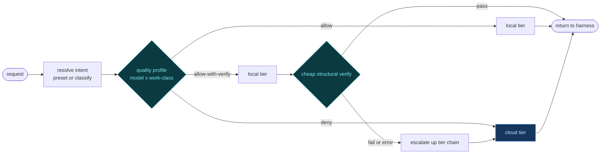
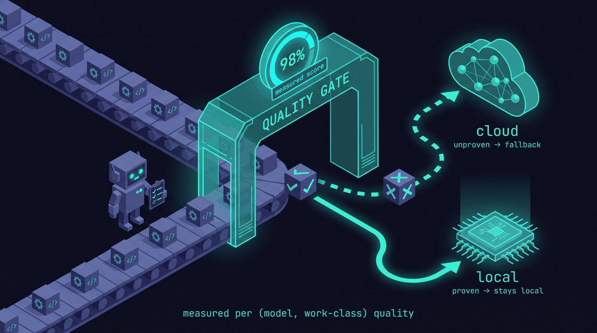
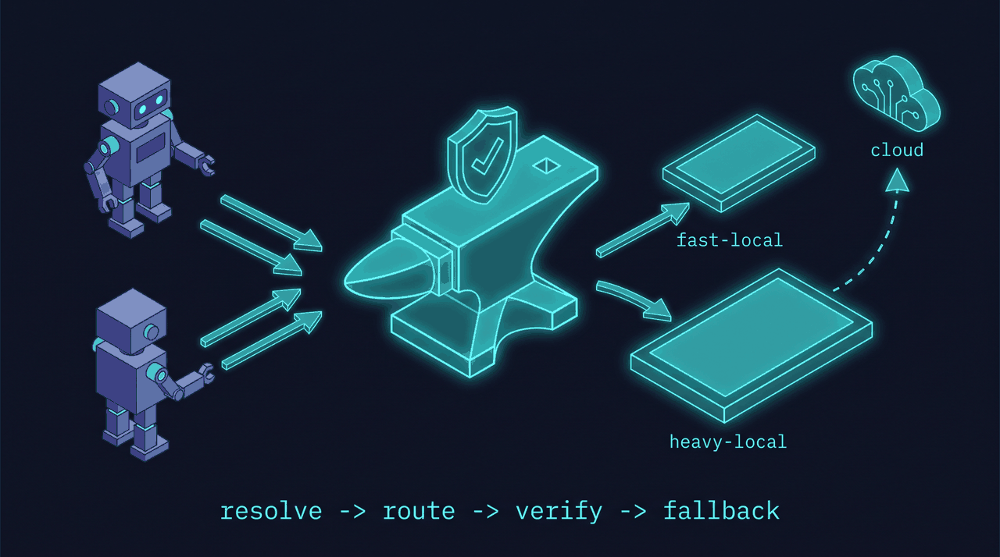

<div align="center">


# anvil-serving

> **The quality-gated local-model router for coding harnesses.**

> *Local where it's been proven, cloud where it hasn't — verified, with automatic fallback.*

[](LICENSE)
[](CHANGELOG.md)
[](https://github.com/fakoli/anvil-serving)
[](tests)

</div>

Point your coding harness (Claude Code, Codex, Aider, Cline, Continue — OpenClaw as the
near-first-class beachhead) at **one** anvil-serving endpoint. Per request, the router resolves an
**intent** to a **tier** — fast-local, heavy-local, or cloud — using a **measured per-(model,
work-class) quality profile**, cheaply **verifies** the output, and **falls back** to the next
tier (ultimately cloud) when the local answer fails. The harness sees one reliable endpoint and
never silently eats a local-quality failure mid-run.

The router is built on a serving substrate that already exists in this repo — usage profiling,
model cataloging, tuned deployment, a correctness gate, capacity benchmarking, and a
single-GPU model multiplexer. Those tools (documented below) right-size and stand up the local
tiers; the router decides what each one is *trusted* to serve.

---

## Why a router, and not just another proxy

Transport is a commodity — LiteLLM, claude-code-router, Ollama, OpenRouter all move tokens.
None of them know **whether local can actually do *this* work.** They route by static rules
(model name, cost, regex). On anvil's real PRD→tasks planning prompt, the gap was measured
directly:

- Local output is **structurally valid ≥92%** of the time (5 of 6 outputs scored 100% — parses
  cleanly under the strict schema, no cycles, no dangling edges) — structural validity is **not**
  the differentiator.
- But on **dependency/ordering reasoning** local collapses: blind-judge totals were
  **frontier 24.75/25, fast 16.0, heavy 13.25** (local ≈ 55–65% of frontier), with the gap
  squarely in dependency correctness (frontier **5.0/5** vs local **~2/5**).

A dumb proxy sends that planning request to local and silently corrupts a long agent run. The
defensible asset is therefore **not** the transport — it's the **quality profile** (per model ×
work-class, measured on the operator's own workload) plus the **verify-and-fallback loop.**
Competitors can copy transport in a weekend; they can't copy "we measured that `gpt-oss-20b` is
safe for bounded edits but unsafe for dependency planning on *your* repos."

Two more decisions fell out of the research and shaped the design:

- **The integration point is the harness/runtime, not a ledger.** An audit of the `anvil`
  state engine confirmed it is *not* an LLM gateway — it exposes a single `custom_base_url` for
  optional planning augmentation, with no router and no two-tier endpoint routing.
  So the router lives where the agent traffic actually flows: in front of the harness.
- **The `model` field is the one routing channel unmodified harnesses expose.** It is required
  in both wire schemas, forwarded verbatim, and free-form — so "named presets in the model
  field" is the right wire surface.

---

## How it works

### Intent presets in the `model` field

Callers declare an **intent** — a closed enum of named presets — instead of a model name. The
router owns `intent → (model, tier, params)`:

```
planning   quick-edit   review   chat   long-context
```

Accepted bare (`planning`) or namespaced (`anvil/planning`). Each preset resolves internally to
**hard constraints** (context length, privacy=local-only, tool/structured-output support, cost
ceiling) that *filter* the candidate pool, plus a quality intent that *ranks* the survivors via
the profile. **Filter, then rank.** A `model:`-pin escape hatch stays available for repro and
debugging. `/v1/models` advertises the preset vocabulary so presets surface in harness model
pickers, and responses stay **transparent** — the response reports the *real* tier that served.

### The graceful-degradation tier ladder

Intent resolution degrades to the highest tier the originating harness can reach. The
classifier is the **universal floor**, because most requests arrive on a single session model
string with no declared intent:

| Tier | Mechanism | Available on |
|---|---|---|
| **0 — Infer** | classify work-class from the raw payload (token count, `thinking` flag, tool types, image content, system-prompt fingerprint) — per-request intent with no caller cooperation | every harness that reaches the endpoint |
| **1 — Named presets in `model`** | caller/config sets a preset token; router maps preset → tier | Claude Code, Codex, Aider, Cline, Continue — **not** Cursor/Amp/Devin |
| **2 — extra_body / header dimensions** | optional structured hints (budget, latency, verifier policy) | Codex, Continue; Aider (config) |
| **3 — Native intent field** | a first-class per-request intent field | none today (needs a standard/harness change) |

**Work-class taxonomy v0:** `chat/Q&A`, `bounded-edit`, `multi-file-refactor`,
`planning/decomposition`, `review/critique`, `long-context-retrieval`. Ambiguous
classifications bias toward the safer/cloud tier and are logged for calibration.

### Verify-and-fallback



Most "quality control" is **routing done ahead of time** (never send a `deny` work-class to
local). Verification is a cheap safety net, tiered:

1. **Prevent** — the profile's `deny` decisions keep risky classes (e.g. dependency planning)
   off local entirely. Free.
2. **Cheap structural verify (inline)** — near-zero-cost checks that caught real failures in the
   eval: empty/truncated content (thinking-budget starvation), tool-call JSON that doesn't
   validate, code that doesn't parse, a diff that doesn't apply.
3. **Confidence signals** — logprob/entropy thresholds, refusal markers where available.
4. **Async LLM-judge (off the hot path)** — sampled cloud grading that feeds the profile, never
   a blocking gate.

On verify-fail / error / timeout / low-confidence the router retries **up the tier chain**
(fast → heavy → cloud), with retry caps, circuit breakers, and a per-session cost budget. For
fail-prone classes on the streaming path, a non-streamed **commit window** buffers and verifies
before the first byte reaches the harness, so a local miss never delivers partial tokens. Every
fallback is logged as a profile signal.

### Default: local-only / $0 metered cloud

**The default config (`configs/example.toml`) routes local-only — anvil holds no cloud API key
and incurs $0 metered API billing.** The "cloud tier" in the diagram above operates in two modes:

- **Keyless (default):** no cloud tier is configured. On a local verify-failure, all candidates
  are exhausted and anvil returns an **`exhaustion_status`** (503 by default, configurable) with
  nothing local committed. A gateway like OpenClaw treats this as a transport failure and re-routes
  the request on its native subscription provider — **flat-rate, not metered.**
- **Opt-in keyed:** when an operator explicitly adds a cloud tier via
  `configs/example-with-cloud.toml`, verify-failures escalate internally to the cloud tier and
  return **200**. This is metered — every cloud-routed request bills per token against the API key.

> **Billing warning:** the opt-in cloud tier routes through a metered API key
> (`ANTHROPIC_API_KEY`, etc.), not your flat-rate subscription. Per-token charges apply to every
> request the cloud tier serves. The per-intent `[router].metered_cloud` map controls which
> work-classes are ever eligible for the cloud tier — nothing is metered unless you explicitly
> list it there. See [`configs/example-with-cloud.toml`](configs/example-with-cloud.toml) and
> [ADR-0001](docs/adr/0001-cloud-cost-and-subscription-auth.md) for the full opt-in config and
> rationale.

**`POST /v1/route` — the routing-brain endpoint.** The decision is also queryable standalone,
without serving the request: send a completions-shaped body, get back
`{ tier, model, provider, work_class, reason, confidence, session_id }`. The OpenClaw plugin
uses this to route `deny`-class requests directly to the gateway's native provider — bypassing
anvil entirely — and to send `allow`-class requests through. Status 200 (decision made, even
if `cloud`), 400 (malformed), 503 (no suitable tier).

### The quality profile (the moat)



A table keyed `(model, work-class) → {quality_score, sample_n, last_measured, decision}` where
`decision ∈ {allow, allow-with-verify, deny}`. Hand-seeded for the MVP; later bootstrapped from
the shadow-eval harness (the planning eval generalized to arbitrary work-classes), right-sized
from your real usage via `profile`, and continuously calibrated from sampled production traffic
graded off the hot path. Keyed on a **serve fingerprint** (model + quant + engine + serve flags)
so a quant/engine swap marks affected rows stale and triggers re-measure.

### Architecture



```
          ┌──────────────────── anvil-serving router ───────────────────┐
harness → │ front door → resolve intent → route → [verify] → return     │ → harness
(CC/Codex)│  (Anthropic   (preset in        (filter by    │  on fail ↘          │
          │   +OpenAI      model field, else  constraints, │  fall back to       │
          │   dialects)    infer work-class)  rank by       │  next tier / cloud  │
          │                                   quality profile)                   │
          └───────────────────────────────┬──────────────┴────────────────────┘
                                           ▼
                fast-local :30001   heavy-local :30000   cloud (Anthropic/OpenAI)
                  (multiplexer-managed)                    (your existing key/sub)
```

The core stays **protocol-standard** (Anthropic Messages + OpenAI Chat Completions) with **zero
OpenClaw coupling.** OpenClaw is the near-first-class beachhead because its `before_model_resolve`
hook (fires per run — plausibly one user message; exact cadence is a documented validate-first gap)
unlocks client-side per-request intent the closed harnesses can't do
— but it ships as a **thin, swappable adapter plugin**, not a dependency. Focus, not couple.
Full design: [`docs/QUALITY-GATED-ROUTER.md`](docs/QUALITY-GATED-ROUTER.md). OpenClaw spec
(verdict: go-with-caveats, medium risk / API churn):
[`docs/OPENCLAW-INTEGRATION-SPEC.md`](docs/OPENCLAW-INTEGRATION-SPEC.md).

---

## Install

```bash
pip install anvil-serving   # stdlib-only; no required deps
anvil-serving --help
```

> `pip install anvil-serving` works once the package is published to PyPI. Until then (or for
> development), install from a clone: `pip install -e .`.

### 30-second quickstart

```bash
# 1) install
pip install anvil-serving            # or: pip install -e .  (from a clone)

# 2) start the router front door on 127.0.0.1:8000
anvil-serving serve --config configs/example.toml

# 3a) Claude Code: point it at the router (use 127.0.0.1, never localhost)
export ANTHROPIC_BASE_URL="http://127.0.0.1:8000"
export ANTHROPIC_MODEL="planning"        # an intent preset, sent verbatim in the model field

# 3b) or any OpenAI-compatible client: point its base URL at the router
export OPENAI_API_BASE="http://127.0.0.1:8000/v1"
# then use a preset token as the model id, e.g. "planning" / "quick-edit" / "chat"
```

Both the router front door (`anvil-serving serve`) and the serving substrate commands ship today.

### Pointing a harness at the router (config recipes)

Use `127.0.0.1` in local URLs — on Windows, `localhost` can stall on an IPv6 lookup. Secrets are
referenced by **env-var name** only; never paste a key into config.

**Claude Code** — intent preset per session slot:
```bash
export ANTHROPIC_BASE_URL="http://127.0.0.1:8000"
export ANTHROPIC_AUTH_TOKEN="$ANVIL_ROUTER_TOKEN"        # -> Authorization header
export ANTHROPIC_MODEL="planning"                        # main-loop intent, sent verbatim
export ANTHROPIC_DEFAULT_HAIKU_MODEL="quick-edit"        # background/utility intent
export CLAUDE_CODE_SUBAGENT_MODEL="review"               # subagent-class intent
export CLAUDE_CODE_ENABLE_GATEWAY_MODEL_DISCOVERY=1       # optional: enumerate router presets
```

**Aider** — the preset rides in the model string (`openai/` forces compat routing):
```bash
export OPENAI_API_BASE="http://127.0.0.1:8000/v1"
export OPENAI_API_KEY="$ANVIL_ROUTER_TOKEN"
aider --model openai/planning --editor-model openai/quick-edit --weak-model openai/chat
```

**Cline / Continue.dev** — select "OpenAI Compatible", Base URL `http://127.0.0.1:8000/v1`,
Model (ID) = a preset token. **Codex CLI** — set `base_url` + `model = "planning"` in
`~/.codex/config.toml`. **Cursor / Amp / Devin are out of scope** — backend-mediated or
backend-locked, so they can't be repointed at a self-hosted endpoint. Full recipes:
[`docs/QUALITY-GATED-ROUTER.md`](docs/QUALITY-GATED-ROUTER.md) (Appendix).

---

## Security & exposure

The front door binds **`127.0.0.1`** by default and has **no built-in authentication**. That is
the right default — keep it loopback-only unless you have a reason not to.

If you bind it publicly (`--host 0.0.0.0`) or otherwise put it on a reachable address, **you are
responsible for authentication and network controls** (a reverse proxy with auth, firewall rules,
a private network). An open endpoint lets **any** caller drive routing and, if you have configured an opt-in metered
cloud tier, **consume your cloud credentials** — so an unauthenticated public bind is both a
quality and a billing exposure. (The default local-only config carries no cloud key, but the risk
still applies if you later add one.) Cloud credentials are referenced by env-var name and redacted
from logs; see [`SECURITY.md`](SECURITY.md) for the full threat model and how to report a
vulnerability.

---

## The serving substrate (the foundation the router builds on)

These commands ship today and are how you right-size, stand up, and validate the local tiers the
router routes across. Stdlib-only; the hard-won gotchas (below) are baked in as defaults.

```
anvil-serving profile      # parse ~/.claude logs -> usage baseline (context/gen/concurrency percentiles, role split)
anvil-serving models sync  # scan your HF caches -> card catalog + INDEX (GGUF vs safetensors, ctx, quant, license, thinking)
anvil-serving deploy       # render a tuned SGLang docker-compose for YOUR gpu + model
anvil-serving preflight    # correctness gate against any OpenAI-compatible endpoint (sm_120-aware)
anvil-serving benchmark    # replay YOUR measured request distribution (TTFT, throughput, prefix-cache hit)
anvil-serving multiplexer  # single-resident model swap on one GPU (multi-engine: SGLang + vLLM)
```

### Substrate quickstart

```bash
# 1) understand your usage (-> the routing profile is right-sized from this)
anvil-serving profile --out-dir .

# 2) see what models you have and which a server can actually load
anvil-serving models sync --out ./model-library
#    -> ./model-library/INDEX.md  (the (yes/no) "SGLang-loadable" column is the one that saves you)

# 3) generate a deployment for a local model on GPU 1
anvil-serving deploy --model /path/to/model-dir --gpu 1 --context 131072 --served-name local-specialist
docker compose -f docker-compose.yml up -d

# 4) validate + benchmark the tier (use 127.0.0.1, never localhost, on Windows)
anvil-serving preflight --base-url http://127.0.0.1:30000/v1 --model local-specialist --needle-ctx 60000
anvil-serving benchmark --base-url http://127.0.0.1:30000/v1 --model local-specialist --burst 20
```

`preflight` is the router's **correctness gate** in microcosm — it's the same verify-before-trust
philosophy applied to a single endpoint. `multiplexer` is the **Backend seam** that already
exists: it manages the single-resident fast/heavy swap pair on one GPU behind one interface.
(`score` and `cache-prune` are additional substrate helpers.)

### What's baked in (the knowledge, not just code)

- **Load-time OOM fix:** loading a model without mmap pulls it fully into RAM — on WSL2 the
  default ~50%-of-host cap OOM-kills the scheduler (SIGKILL/-9). Raise the WSL VM memory; the
  deploy uses `--weight-loader-disable-mmap` (fast sequential reads vs catastrophic
  mmap-over-virtiofs).
- **GGUF != SGLang.** GGUF is llama.cpp-only; SGLang/vLLM need safetensors. The catalog flags
  this up front.
- **Thinking-by-default models** (Qwen3.5 etc.) return *empty* content with a small `max_tokens`
  — they spend the budget reasoning. Disable per request with
  `chat_template_kwargs:{enable_thinking:false}`, or give >= 4096 tokens. See
  [`docs/MODEL-SETTINGS-EXAMPLE.md`](docs/MODEL-SETTINGS-EXAMPLE.md).
- **GPU pinning** (`device_ids`) so one card serves while another stays free (gaming / second job).
- **Blackwell sm_120 caveats:** some FP8 MoE paths hang on load; AWQ/compressed-tensors via
  Marlin works; NVFP4 large-prefill is still rough. Pre-flight before you trust throughput.

### Worked example — `fakoli-dark`

[`examples/fakoli-dark/`](examples/fakoli-dark/) is a real two-tier instance and the bake-off
context for the router:

- **heavy** `:30000` — `qwen3-coder-30b` on **SGLang**, RTX PRO 6000 96GB.
- **fast** `:30001` — `gpt-oss-20b` on **vLLM**, RTX 5090 32GB.
- **gateway** — **Fakoli Mini** runs **OpenClaw** (already installed), the beachhead harness; the
  router sits between it and the serves.

It carries the actual compose files, the `.wslconfig` fix snapshot, the model index, the setup
story ([`SETUP-STORY.md`](examples/fakoli-dark/SETUP-STORY.md)), the decisions log, and the
[`BAKE-OFF-RUNBOOK.md`](examples/fakoli-dark/BAKE-OFF-RUNBOOK.md) (where local-planning failover
now lives, after the router promotion).

---

## Status

**v0.3.0 is shipped.** The `harness-router` PRD is **complete — all 18 tasks built
(milestones M0–M3), 378 tests green**. Both the router front
door (`anvil-serving serve`) and the serving substrate (profile / models sync / deploy / preflight
/ benchmark / multiplexer) ship today. See the [CHANGELOG](CHANGELOG.md) for the full release
notes.

What shipped, by milestone:

- **M0 — front door + config:** Anthropic + OpenAI dialects, SSE streaming, pass-through to one
  backend, tier-topology config schema. Drop-in for Claude Code.
- **M1 — intent + policy:** Tier-0 classifier (the floor) **and** preset parsing from the `model`
  field, residency-aware routing policy over the multiplexer, `/v1/models` preset discovery,
  cloud-tier credentials on the Backend seam.
- **M2 — the wedge:** cheap inline structural verify + verify-gated fallback-to-cloud (with the
  streaming commit window), transparent responses + decision log, the typed extension seams, the
  `anvil-serving serve --config ...` CLI verb, and the OpenClaw reference adapter plugin.
- **M3 — the moat:** quality-profile bootstrap from the generalized shadow-eval, async opt-in
  calibration + serve-fingerprint staleness, validation on routed traffic, and the per-work-class
  promotion decision (planning/critic stay cloud-default, failover-only).

### Known limitations

- **OpenClaw live validation is manual.** Validating against a real OpenClaw install (firing
  cadence + outbound wire `model` form) is a human step on the gateway box —
  [`examples/openclaw/README.md`](examples/openclaw/README.md). The committed
  `hook-fire-log.jsonl` is a representative fixture, not a live capture.
- **Most promotion verdicts are seed/expected.** The shipped per-work-class promotion decisions
  are hand-seeded, pending real-traffic calibration; only `planning` rests on hard eval data
  (blind-judge scores: frontier 24.75/25, fast 16.0, heavy 13.25 — full data in the companion notes repo).
- **The T017 traffic fixture is synthetic** — traffic-metrics behavior is exercised against a
  synthetic fixture, not yet against real routed production traffic.

### Reuse map

| Capability | Module | Status |
|---|---|---|
| Right-size from real usage | `profile` | exists |
| Per-model serving facts / sane defaults | `models sync`, `analyze` | exists / designed |
| Bring up + on-demand model swap on one GPU | `multiplexer` | exists |
| Correctness gate | `preflight` | exists |
| Throughput / capacity measurement | `benchmark` | exists |
| Per-work-class quality measurement | shadow-eval harness | built + generalized |
| Front door + intent-resolve + route + verify + fallback | `router` module | **shipped** |

### Docs

- **Product design:** [`docs/QUALITY-GATED-ROUTER.md`](docs/QUALITY-GATED-ROUTER.md) (full router
  design — intent presets, tier ladder, verify-fallback, quality profile, plugin seams, appendix
  config recipes)
- **Cloud cost & auth:** [ADR-0001](docs/adr/0001-cloud-cost-and-subscription-auth.md)
  (why anvil does not relay cloud by default) ·
  [`docs/PLAN-advise-and-defer.md`](docs/PLAN-advise-and-defer.md) (implementation plan)
- **OpenClaw integration:** [`docs/OPENCLAW-INTEGRATION-SPEC.md`](docs/OPENCLAW-INTEGRATION-SPEC.md)
  (source-verified buildable spec, go-with-caveats verdict) ·
  [`docs/OPENCLAW-LIVE-VALIDATION.md`](docs/OPENCLAW-LIVE-VALIDATION.md) (live-validation runbook)
- **Serving reference:** [`docs/MODEL-SETTINGS-EXAMPLE.md`](docs/MODEL-SETTINGS-EXAMPLE.md)
  (thinking-by-default model config and sampling) ·
  [`docs/SERVES-AND-EVAL.md`](docs/SERVES-AND-EVAL.md) (serve lifecycle + eval entry point)
- **Architecture decisions:** [`docs/adr/`](docs/adr/) — one ADR per significant design choice

MIT licensed.
