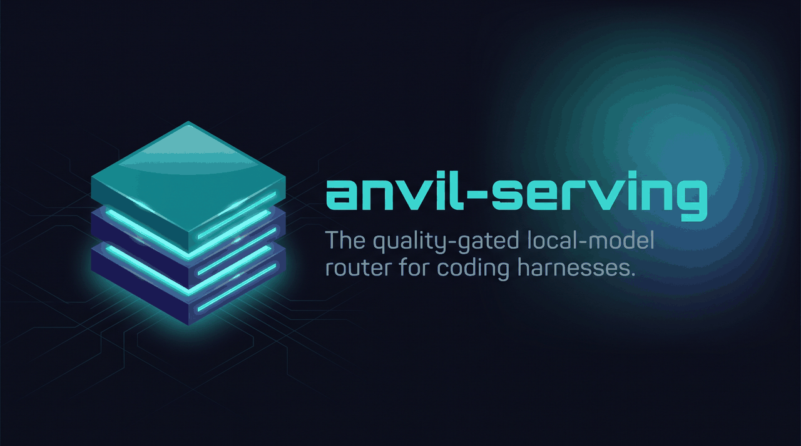

<div align="center">



# anvil-serving

> **Benchmark and serve local models through one explicit capability gateway.**

[](LICENSE)
[](CHANGELOG.md)
[](https://fakoli.github.io/anvil-serving/)

</div>

anvil-serving runs and benchmarks local model serves, then exposes their named
capabilities through one authenticated endpoint. It is deliberately a thin
gateway: a caller chooses a configured `model` alias, and that alias maps to
one local tier. There is no request classifier, quality-profile router,
semantic fallback, cloud escalation, or hidden substitute model.

The reference topology serves primary LLM work on the RTX PRO 6000. The RTX
5090 offers either an exclusive 30B Omni stack for auxiliary text, general
vision, and OCR, or a smaller Omni stack co-resident with dedicated STT/TTS.
Embeddings/reranking and on-demand ComfyUI remain optional separate stacks. The
gateway keeps authentication, dialect translation, streaming, readiness,
admission, and decision evidence consistent across those capabilities.

## Direct capability contract

```toml
[router.model_routes]
llm.primary = "primary-local"
llm.voice = "omni-local"
vision.ocr = "omni-local"
vision.general = "omni-local"
```

Send one of those aliases as the chat `model`. Matching is case-insensitive
after trimming; compatibility prefixes are not accepted. `/v1/models` advertises the
configured aliases. Unknown or missing chat aliases return 404. An unavailable
selected tier returns an exhaustion error, not an alternate model.
The authenticated `/v1/models/capacity` endpoint joins declared model/GPU
capacity with bounded live engine telemetry; it does not operate a serve or
grant the router GPU-device access.
Related authenticated endpoints expose declared capabilities and fingerprints,
router build/config identity, bounded-buffer statistics, request traces, and
Prometheus gauges. See the
[router observability API](docs/THIN-CAPABILITY-GATEWAY.md#router-observability-api).

Purpose models and audio are equally explicit: embeddings and reranking use
their configured model names on dedicated endpoints, while STT/TTS use
operator-configured audio routes. ComfyUI is lifecycle-managed rather than a
chat capability.

## Quick start

Python 3.11+ is the only runtime prerequisite. Docker and a GPU are required
only for real local model serves.

```bash
pip install -e .
anvil-serving init
anvil-serving serves groups
anvil-serving serves up SERVE_NAME --dry-run
anvil-serving serves up SERVE_NAME --confirm
anvil-serving router run
```

`init` writes the packaged operational manifests to `~/.anvil-serving`. It
detects NVIDIA GPU UUIDs with `nvidia-smi`, assigns the highest-VRAM card to
Primary and the lowest-VRAM card to Auxiliary, and resolves the host's Tailscale IPv4
address. Equal-VRAM cards are assigned deterministically by runtime index.
Use explicit host-value flags to override discovery, `--no-detect-host` to keep
placeholders, `--out-dir` to choose another location, or `--single-model` for a
focused one-model scaffold. `serves up` is the canonical bring-up path for
models and other manifest-owned resources. Rerunning `init` leaves
content-identical files untouched; only changed files receive numbered backups
before replacement. Preview the resolved operation before confirming it.

With the selected serves running, call the gateway:

```bash
curl -s http://127.0.0.1:8000/v1/models
curl -s 'http://127.0.0.1:8000/v1/models/capacity?model=llm.primary&images=1&image_tokens=2048'
curl -s http://127.0.0.1:8000/v1/chat/completions \
  -H 'content-type: application/json' \
  -d '{"model":"llm.primary","messages":[{"role":"user","content":"hello"}]}'
```

Use `anvil-serving eval preflight` before mapping a real model to an alias, and
record capacity and quality evidence with `anvil-serving eval benchmark`. A
mapping is an exposure decision, not a model promotion claim.

## What it provides

| Surface | Purpose |
|---|---|
| `anvil-serving router run` | Authenticated Anthropic/OpenAI-compatible capability gateway. |
| `anvil-serving serves` | Compose-backed model lifecycle, GPU reservation, and switching tools. |
| `anvil-serving eval preflight` | Functional qualification of a concrete endpoint. |
| `anvil-serving eval benchmark` | Capacity and quality evidence collection. |
| `anvil-serving models` | Model cache, source, and serve-recipe management. |
| `anvil-serving voice` | Operator-owned STT/TTS, bridge, Realtime, and voice benchmark lifecycle. |
| `anvil-serving mcp serve` / `controller` | Structured same-host or private control-plane access. |

## Documentation

- [Getting started](docs/GETTING-STARTED.md)
- [Architecture](docs/ARCHITECTURE.md)
- [Configuration](docs/CONFIGURATION.md)
- [Thin capability gateway](docs/THIN-CAPABILITY-GATEWAY.md)
- [CLI reference](docs/CLI.md)
- [Serves and evaluation](docs/SERVES-AND-EVAL.md)
- [Voice pipeline](docs/VOICE.md)
- [Benchmark portal](docs/benchmarks/index.md)
  - [RTX PRO 6000](docs/benchmarks/hardware/rtx-pro-6000.md)
  - [RTX 5090](docs/benchmarks/hardware/rtx-5090.md)
- [Benchmark run catalog](docs/benchmarks/runs.md)
- [OpenClaw integration](docs/OPENCLAW-INTEGRATION-SPEC.md)
- [ADRs](docs/adr/README.md)

## Security and operating boundaries

- Use `127.0.0.1`, never `localhost`, for same-host URLs.
- Keep router authentication enabled before exposing it beyond loopback.
- Store credentials only through environment-variable references.
- Treat readiness and preflight as different checks: readiness says a serve can
  receive traffic; preflight and benchmark evidence establish whether it should.
- Fakoli Mini is model-free in the reference topology. Its local audio proxy
  ports forward to Dark; they do not make Mini a serving host.

See [SECURITY.md](SECURITY.md) for the threat model and reporting policy.
