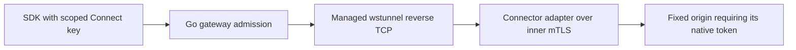

# Anvil Connect transport qualification

Observed 2026-09-09 on Linux amd64 with Go 1.27.1. The initial transport
experiment and subsequent API integration use isolated synthetic applications;
neither is a deployed access gateway.

## Decision

Use managed **wstunnel 10.7.1 over verified WSS** for the first origin connector.
The lab demonstrates the reverse TCP transport needed for HTTP APIs and
dashboards. Ordinary browsers will connect to the application gateway over
HTTPS; they do not need a tunnel client. Keep finite HTTPS polling deferred until
a required network demonstrably blocks this transport and permits that fallback.
Port 443 alone does not guarantee proxy compatibility.

The [upstream release](https://github.com/erebe/wstunnel/releases/tag/v10.7.1)
was published 2026-09-01. It is BSD-3-Clause licensed. The
[transport lock](https://github.com/fakoli/anvil-serving/blob/main/connect/transport.lock.json) records the release URL, archive
digest and executable digest. The linux-amd64 archive SHA-256 is
`fa842ed53fbb14b1c69cd98829f9895d7f8a6b0d562c57c1175851a52cea9ea2`;
the extracted executable SHA-256 is
`628143a837e35e8dcbda032bc1e2b07937412bc69e2344b9b583c3acfef8431d`.
The reported version is `wstunnel-cli 10.7.1`.

## Reproduce

Obtain the locked release artifact, verify its archive digest before extracting
the regular `wstunnel` executable, then set its location explicitly:

```sh
export ANVIL_CONNECT_WSTUNNEL=/path/to/verified/wstunnel
go -C connect test ./lab -count=1 -v
```

The lab refuses a missing or mismatched executable; it never downloads silently
or skips qualification. It creates temporary one-hour certificates, fixed
loopback destinations and restricted loopback reverse listeners. It inherits
only PATH into child processes, plus explicit test trust settings. Logs retain
at most 64 KiB per child. Cleanup reaps children and fails on unexpected errors.
Linux socket ownership checks prevent a colliding process from satisfying a
listener assertion; an allocation collision can still fail the lab because the
upstream cannot inherit an already bound socket.

The [fixture](https://github.com/fakoli/anvil-serving/blob/main/connect/lab/fixture_test.go) records exact invocations. In
particular, **`--tls-verify-certificate` is required**: upstream disables server
verification by default. A private test CA is supplied through child-local
`SSL_CERT_FILE` and an empty `SSL_CERT_DIR`. The server requires client
certificates and applies an anchored connector-CN restriction to one TCP reverse
port on `127.0.0.1/32`. This constrains the remote listener; it does not replace
the product's local destination envelope or per-request authorization.

## Measured results

The initial [transport lab](https://github.com/fakoli/anvil-serving/blob/main/connect/lab/transport_test.go) passed in 2.916 seconds.
Timing below describes one loopback run, not a latency SLO.

| Probe | Observation |
|---|---|
| Mutual TLS | Trusted peers accepted; absent/unknown client certificates and an unknown server CA refused. The actual connector rejects the wrong server trust root and succeeds when only that root is corrected. |
| Explicit proxy | A synthetic HTTP CONNECT proxy permits only the fixture gateway address and carries opaque mutually authenticated TLS successfully. |
| SSE | First event reaches the caller while the origin waits for permission to finish; 290 microseconds in the recorded run. |
| WebSocket | Subprotocol, text and 64-KiB binary messages preserved; close reaches the origin. |
| Cancellation | Cancelling the HTTP request context reaches the origin before closing the response body; 110 microseconds in the recorded run. |
| Disconnect | Killing the connector interrupts a response; reconnecting does not repeat the admitted POST. One origin execution is counted. |
| Restrictions | A different CA-trusted connector identity and an unassigned reverse port are refused; valid controls establish the assigned listener. |
| Backpressure | A nonreading caller causes the origin's two-second write deadline to expire after 9,532,323 bytes accepted across application, transport and kernel buffers. The 64-MiB response cannot drain completely. |

## API integration extension

The [API tests](https://github.com/fakoli/anvil-serving/blob/main/connect/lab/api_test.go) now exercise this complete path with
the real pinned server and connector children:



The origin validates a deployment-issued gateway certificate and its local
resource envelope before fetching the native token. The gateway validates the
connector certificate and uses only its declared reverse address. Redirects
cannot change the allowed hostname/path, and caller credentials are stripped.
Inner ordinary requests require HTTP/2 so unknown-length bodies preserve their
framing; classic WebSocket upgrades use a separate HTTP/1 connection.

Passing controls cover SSE before origin completion, cancellation reaching the
origin, a killed connector yielding one POST execution, 64-KiB WebSocket data and
subprotocol/close preservation, and an actual HTTP/2 unknown-length upload.
A stalled declared-length upload releases gateway and origin capacity under a
one-second configured deadline. Independent review found and corrected that
upload-cancellation gap. Separate regression tests preserve HTTP/1 keepalive and
keep a concurrent HTTP/2 stream alive when a sibling upload times out. Focused
tests also reject missing, wrong-name, unknown-CA, expired and wrong-EKU inner
peers, mismatched gateway private keys, and replacement file/directory paths.

These API adapter results alone do not establish installation-generation
revocation, Caddy integration or browser authorization. Subsequent implementation
adds a Go gate that owns each authenticated Upgrade stream between Caddy and the
private wstunnel listener; terminating TLS at Caddy alone does not preserve the
connector certificate identity. Inner service certificates bind the current
enrolled generation and public key. See the
[implementation record](ANVIL-CONNECT-IMPLEMENTATION.md) for those separate gates.

## Limits and next qualification

The backpressure result **does not establish the proposed 256-KiB application
buffer budget**, per-connection RSS or aggregate admission limits. Production
gateway and connector adapters must implement and measure those bounds. No GPU,
model or installed router was involved.

TLS interception, HTTP/2 downgrade/buffering, WebSocket-blocking proxies, idle
timeouts, packet loss, public port 443, NAT deployments, other operating systems
and load/concurrency remain unqualified. CONNECT here is an explicit HTTP proxy
passing opaque TLS, not an HTTPS-intercepting proxy or proof of arbitrary
corporate network compatibility. The
[upstream documentation](https://github.com/erebe/wstunnel) describes separate
HTTP/2 limitations; this lab does not select that mode.

The reverse listener may outlive its disconnected connector. Listener existence
therefore cannot imply application readiness. Connect now checks renewable
connector leases, enrollment, browser admission and active revocation, with
owned lifecycle commands. Each selected deployment must qualify the complete
path before exposure. A tunnel's client certificate is distinct from a browser
session or an application key.
