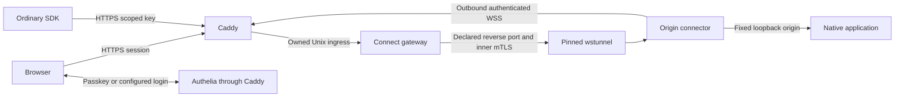

# Anvil Connect

Anvil Connect provides application access through a self-hosted HTTPS gateway.
An ordinary browser opens a protected dashboard; an ordinary API SDK supplies a
base URL and a scoped key. An outbound origin connector carries traffic to an
explicit local application. It is part of Control Plane & Fleet, alongside the
existing Tailscale edge tools, and adds no Python runtime dependencies.

This delivery targets Linux amd64 and one administrative trust domain. The
[implementation evidence](ANVIL-CONNECT-IMPLEMENTATION.md) distinguishes code,
isolated tests, and deployment qualification. No installed VPN, public DNS record,
or production application is changed by the implementation tests.

## Request paths



The outer tunnel uses WSS. Its authenticated Upgrade gate is in Connect; Caddy
terminating TLS does not itself authenticate an installation. The private tunnel
server accepts only its gate peer. Inside the tunnel, separate mTLS credentials
bind each origin resource to an approved installation and current authority epoch.

For normal requests, Caddy forwards HTTP/2 over an owned Unix socket. Classic
WebSocket upgrades use HTTP/1. Inner ordinary application requests use HTTP/2;
classic upgrades use a separate HTTP/1 transport. SSE is forwarded incrementally.
Neither the gateway nor the connector retries an ambiguously dispatched request.

WSS over port 443 is a compatibility choice, not a promise that every proxy will
permit it. The [transport experiments](ANVIL-CONNECT-TRANSPORT.md) qualify an
explicit CONNECT proxy passing opaque TLS. TLS interception, networks rejecting
WebSocket upgrades, public NAT operation, and other operating systems still need
their own evidence. Finite HTTPS polling and a full IP overlay are outside this
implementation.

## Three independent kinds of authority

| Identity | Provisioning | Authority |
|---|---|---|
| API caller | Owner issues an expiring resource/method key | One declared API grant; not a native application token |
| Human | Authelia OIDC plus an explicit Connect issuer/subject grant | Host/resource browser session; not a native dashboard role |
| Installation | Locally generated key, expiring invitation, fingerprint approval | Its declared connector resources and short renewable leases |

No SDK or shared binary contains a client private key. The connector stores its
own installation and TLS keys in its private service directory. A caller's
Connect API key is removed before the connector supplies an explicitly declared
native application token. Native tokens are environment-backed and remain at
the origin. Controller delegation is outside the initial profile.

For one browser identity across Connect and Observatory, explicitly enable
[signed identity handoff](ANVIL-CONNECT-IDENTITY.md). This preserves native
permissions while removing a second dashboard password. That guide also covers
passkeys, profile provisioning and signing-key rotation.

For day-to-day user grants and session revocation, see
[Access administration in Observatory](ANVIL-CONNECT-ACCESS.md).

The standalone client's [terminal sign-in flow](ANVIL-CONNECT-DEVICE-LOGIN.md)
uses browser approval to obtain a short-lived API grant, including from SSH.
After approval, ordinary SDKs can use its local HTTP endpoint and local caller
key. The browser identity and API principal must be explicitly linked.

The browser gateway uses state, nonce and PKCE and verifies OIDC signature,
issuer, audience and time claims. It checks the authorization-response issuer
before exchanging a code, and requires it when advertised by provider metadata.
The callback supports the pinned Authelia `iss` and `scope=openid` response.
See [RFC 9207](https://www.rfc-editor.org/rfc/rfc9207.html) for issuer comparison.
Authelia's opaque subject identifier must be provisioned as the human grant;
a username is not an interchangeable identity.

Connect's cookie is opaque, Secure, HttpOnly and host-only. Native application
cookies and CSRF headers remain separate. Logout invalidates that human's Connect
sessions across resources and cancels admitted streams; it does not remove
Authelia's login or the application's own cookies. A later explicit login may
reuse the IdP session. Revocation closes access at the gateway; it does not claim
to terminate work already running inside a model engine.

## Declarations and operation

For a separate installation without the Anvil Serving package, use the
[standalone Connect bundle and installer](ANVIL-CONNECT-INSTALL.md).

Start from the generic [deployment manifest](https://github.com/fakoli/anvil-serving/blob/main/connect/examples/deployment.json).
It declares resources, matching origin envelopes, private state locations,
versioned binary paths, a dedicated non-root service user/group, and secret-file
references. A resource has an exact hostname, canonical path prefix, allowed
methods, concurrency/body/duration limits and native-auth mode. The connector's
local envelope independently rejects destinations or permissions outside it.

New isolated deployments declare `service_identities` and a matching
`service_limits` map. Each gateway, edge, IdP, connector, and client role has
an exact positive `memory_max_bytes` and `tasks_max` limit; rendered systemd
units apply them as `MemoryMax` and `TasksMax`. The legacy single-service-user
shape remains readable for recovery inspection and shutdown, but cannot be
activated as an isolated deployment.

The optional `gateway.browser_session_lifetime_seconds` controls the lifetime
of Connect's opaque browser admission session. It accepts whole seconds from
60 through 86400 and defaults to 28800 (eight hours) when omitted. It neither
changes the IdP login lifetime nor native application cookies.

The managed manifest currently requires at least one browser resource and
renders one Authelia OIDC client with all declared callback URLs. Standalone
native API-only declarations are supported by the Go runtime; an API-only
managed deployment profile is deferred. Registering each dashboard with a
separate OAuth implementation is unnecessary. Applications with existing native
authorization keep it; applications without it can rely on the outer human gate
only when that resource is explicitly declared accordingly.

The [CLI reference](cli/connect.md) describes validation, staging, initialization,
enrollment, administration, selected or coordinated activation, diagnostics,
backup, restore and migration preview. Mutations preview by default and require
`--confirm`; `--dry-run` remains a preview if supplied together with confirmation.
These selectors name local deployment roles, not remote SSH/controller targets.

Generated public configuration and systemd unit sources carry an ownership
manifest. Existing foreign files, units, drop-ins and unsafe drift are refused.
An activation records executable digests and can restore the prior configuration
and service state after failure. Upgrades retain old verified executable paths;
replacing an executable in place cannot provide that rollback guarantee.
Authority databases and native application credentials are never part of
configuration rollback.

For gateway startup the managed order is Authelia, Caddy, then Connect, so issuer
discovery can succeed. Origin connectors and local SDK clients are separately
selected. The native process creates only its owned listeners and children;
process status is not application readiness. Gateway service certificates are
currently renewed by a supervised process restart before 24-hour expiry, not by
zero-downtime certificate rotation.

## Cloudflare edge publishing

The public side of a Connect deployment is one Cloudflare tunnel plus one DNS
record per published host. The cloudflared agent runs on the edge host under
its own service identity with the tunnel token in a protected environment
reference (`ExecStart=/usr/bin/cloudflared tunnel run --token ...`, the token
file 0600 and outside any tracked tree). The tunnel is remotely managed, so
its ingress rules live in Cloudflare's tunnel configuration — which is exactly
what the edge verbs own:

```bash
anvil-serving connect edge-status --manifest <PATH> --edge-config <PATH>
sudo anvil-serving connect edge-apply --manifest <PATH> --edge-config <PATH> --confirm
```

The private edge-publishing configuration (the generic template is
[connect/examples/edge-cloudflare.json](https://github.com/fakoli/anvil-serving/blob/main/connect/examples/edge-cloudflare.json))
carries the account id, zone name, tunnel UUID, CA-pool path, origin service,
and the name of the environment variable holding an API token with Zone DNS
Edit and Account Cloudflare Tunnel Edit scopes. `edge-status` derives the
required DNS CNAMEs and ingress rules from the deployment manifest and
compares them with the live tunnel configuration and zone records; the apply
merges exactly the difference, preserves every ingress rule it does not own,
keeps the catch-all last, and verifies the tunnel is reporting an active
connector before it reports success. Hosts declared outside the configured
zone are rejected, and the token is read from the environment reference only —
it never appears in output, configuration, or evidence.

Retirement is deliberate: a host removed from the declaration keeps routing
until it is retired. `edge-status` reports those orphans (ingress rules owned
by this family's origin service and CNAMEs pointing at this tunnel, both
restricted to the configured zone), and
`edge-apply --retire-orphans --confirm` removes exactly that state — routes
owned by other systems are never reported or retired. If an apply fails part
way (a DNS write, or connector verification), the error carries the list of
already-completed mutations and the failed step, so a partial application is
visible and repaired by repeating the apply. Rules of the road: apply after
every manifest change that adds, renames, or removes a published host (a
`render`/`up` alone does not touch Cloudflare — renames and removals additionally
want `edge-apply --retire-orphans --confirm`), keep the token scoped to the
two permissions above plus reads, and treat a degraded `edge-status` tunnel
status as an agent problem first (the cloudflared unit's journal) before
suspecting the API.

## Connector resource extension

Widening an enrolled connector's resource set is one managed command:

```bash
anvil-serving connect extend --manifest <PATH> --service connector:<id> --dry-run
sudo anvil-serving connect extend --manifest <PATH> --service connector:<id> --confirm
```

The preflight accepts purely additive resource-set changes and rejects removals
or renames (those change trust scope; use `installation-revoke` plus a full
re-declaration instead). The managed sequence then runs inside one reversible
transaction: the new generation is staged and activated with only gateway
units restarted, the native admin revoke/invite pair runs against the running
gateway, the connector redeems the invitation with `init --bundle` from its
own state directory, the new fingerprint is approved, and the connector
restarts and stabilizes with the extended set. Invitation material lives only
in role-owned 0700 state directories and is deleted on redemption.

Two boundaries remain operator decisions. Existing principals keep their prior
resource lists until `admin human-set` extends each one — the first browser
login for the new resource fails with a classified 401 until then, and the
identity-provider subject is the per-user identifier from the IdP's session
store, not the username. And the Cloudflare-side DNS record and tunnel ingress
for the new host are published with `connect edge-apply`.

## Recovery

Stop the gateway before `connect backup`. It takes a consistent read-only logical
snapshot under the database lock and includes the two private CA bundles. Unknown
database namespaces are rejected; the 1 MiB archive bound is enforced without
truncation. Output is an exclusive mode-0600 file in an existing private service
directory. It is not encrypted. Retain its returned SHA-256 independently.

`connect restore` requires that digest and the approved native executable digest.
It writes only a fresh private directory beneath an existing owned mode-0700
parent. It validates the archive and CA key pairs, creates a new epoch, restores
all human/API principals disabled, and omits old keys, installations, invitations,
sessions and replay caches. Directory durability precedes the final authority
file that permits startup. Failed recovery leaves an inert directory for
inspection; retry with a different fresh destination.

The operator then reviews grants, reenrolls connectors, issues new keys, updates
the manifest's gateway state location and separately activates the deployment.
Recovery does not restore Authelia's database or secrets, native application
state, binaries or operator configuration. Those require independent private
backup procedures. Never use an old database as a binary rollback artifact.

## Initial limits

This is application access rather than a general VPN: no subnet routes, exit
nodes, arbitrary destination proxy, SSH forwarding or peer-to-peer mesh are
provided. Origins are fixed loopback HTTP endpoints. URL forms outside the
canonical declaration grammar, domain cookies and redirects escaping a resource
are rejected rather than rewritten. The initial API key lifetime is 24 hours,
with an explicit range from one minute to 30 days.

Deployment requires the pinned binaries, a dedicated service account, provisioned
secret files and a selected external gateway/TLS arrangement. Tests use isolated
loopback resources. Public hosting selection, DNS/certificate provisioning and
production cutover are separate decisions made after the intended deployment
has a concrete preview.
