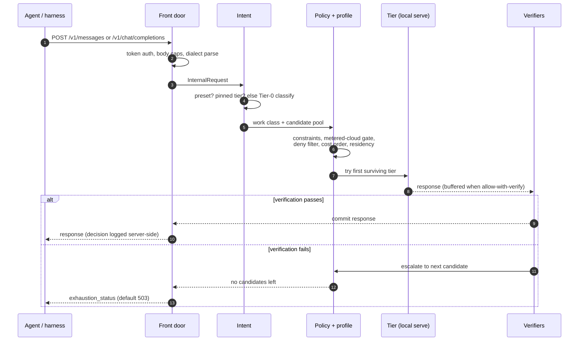
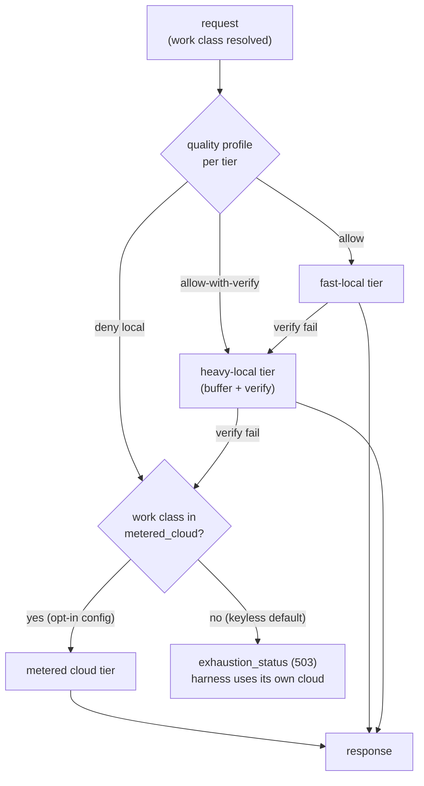
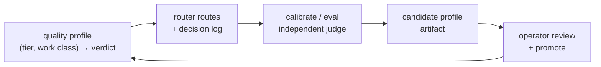
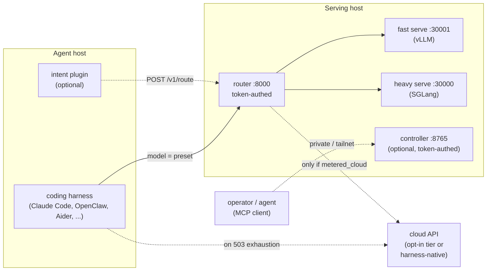

# Architecture

This page is the concise system overview: how a request travels through anvil-serving, how the
quality gate decides where work is allowed to run, and how the pieces deploy. For the full design
rationale — grounding evidence, trade-offs, milestones — read
[Quality-gated router](QUALITY-GATED-ROUTER.md); for the *why* behind individual decisions, read
the [ADRs](adr/README.md).

## The System In One Page

anvil-serving is a **quality-gated router** that sits between a coding agent (or any
OpenAI/Anthropic-speaking client) and a set of model **tiers** — typically a fast local serve, a
heavy local serve, and an optional, explicitly-metered cloud endpoint.

1. The **front door** (`router/front_door.py`) is a single stdlib HTTP server that terminates both
   wire dialects: Anthropic Messages (`POST /v1/messages`) and OpenAI Chat Completions
   (`POST /v1/chat/completions`). It also serves `GET /v1/models` (the preset vocabulary),
   `POST /v1/route` (a routing decision without generation), `GET /v1/decisions` (recent decision
   records), and `GET /healthz`. Optional bearer/`x-api-key` token auth covers every route except
   the health check.
2. **Intent resolution** (`router/intent.py`) turns the request's `model` field into a work class
   and a candidate tier pool, in strict precedence: a **declared preset** (`planning`,
   `quick-edit`, `review`, `chat`, `chat-fast`, `long-context`, `ocr`), else a **pinned tier id**, else
   the **Tier-0 classifier** (`router/classify.py`) infers the work class from the payload.
   Ambiguous inference collapses to the safest configured tier. `resolve()` never raises.
3. The **routing policy** (`router/policy.py`) filters and orders that pool: hard constraints
   (context window, tool support) → the **metered-cloud gate** (cloud is only ever a candidate for
   work classes listed in `[router].metered_cloud`; the default empty list means cloud is never
   routed) → the **quality-profile deny filter** (fail-closed) → config cost order → a residency
   reorder that avoids thrashing a single-GPU model multiplexer. A caller pin is a preference
   inside the gate, never an override of it.
4. The **quality profile** (`router/profile_store.py`) is the evidence table: per
   `(tier, work class)` it answers `allow` (stream straight through), `allow-with-verify` (buffer
   and check before releasing), or `deny` (never route here). Unmeasured local tiers on high-risk
   classes (`planning`, `multi-file-refactor`) default to `deny` — the safe direction. Each entry
   is keyed to a **serve fingerprint** (model + quantization + engine + flags); a changed
   fingerprint marks rows stale.
5. **Verify-and-fallback** (`router/fallback.py`, `router/verify.py`, `router/commit_window.py`)
   walks the ordered candidates. For `allow-with-verify`, the response is buffered and run through
   cheap structural verifiers — `NonEmptyContent`, `NotTruncated`, `ToolCallJSONValid`,
   `CodeParses`, `DiffWellFormed`, `FormatWellFormed`, `RefusalMarker` — before the first byte
   reaches the caller; a failure escalates to the next tier with **zero partial tokens leaked**.
   A retry budget and a per-tier circuit breaker bound the walk.
6. When no tier survives the gate, the router **exhausts cleanly**: a configurable status
   (`[router].exhaustion_status`, default `503`) tells the calling harness to use its own cloud
   path, keeping metered billing an explicit caller decision
   ([ADR-0001](adr/0001-cloud-cost-and-subscription-auth.md)).
7. A **control plane** (`anvil-serving mcp serve`, `anvil-serving controller serve`) exposes operations —
   status, probes, harness sync, promotion — as guarded MCP tools, kept strictly out of the request
   data plane ([ADR-0013](adr/0013-openclaw-layers-and-mcp-control-plane.md)).

Everything is standard-library Python; there is no FastAPI, no SDK, and no required runtime
dependency.

## Request Path

The routing outcome is recorded server-side: every request that walks the fallback ladder writes
a metadata-only decision record (`router/decision_log.py`) — work class, per-tier attempts,
verifier *names*, token counts, and outcomes, never response content or secrets — retrievable via
`GET /v1/decisions`. (The wire response's `model` field echoes the caller's routing token;
requests refused before the ladder runs, and cloud-tier `allow` responses streamed straight
through, are visible in the stderr log rather than the decision record.)

## The Tier Ladder And The Two Cost Postures

The shipped default is **keyless**: `configs/example.toml` names no cloud tier and holds no cloud
credential, so anvil-serving cannot create metered spend. Cloud is **opt-in**
(`configs/example-with-cloud.toml`): a cloud tier plus an explicit `[router].metered_cloud`
allowlist of work classes that may reach it ([ADR-0001](adr/0001-cloud-cost-and-subscription-auth.md)).
A separate global switch, `--mode agentic|flexibility`, selects between whole router configs for
different working styles ([ADR-0011](adr/0011-two-mode-operation.md)).

Reading the ladder:

- **`allow`** rows skip the full verifier chain. A cloud `allow` tier streams straight through
  (time-to-first-token preserved); a *local* `allow` tier still passes a minimal buffered
  `NonEmptyContent` + `NotTruncated` window before the first byte under the default
  `verify_local_min = true` — set it to `false` to stream local raw.
- **`allow-with-verify`** rows buffer the whole local response, verify it, and only then release
  the first byte; a failure discards the local output and escalates.
- **`deny`** rows are filtered before dispatch. `planning` never routes to an unmeasured local
  tier — that verdict came from the eval evidence that motivated the product.
- **Exhaustion is a feature, not a failure**: in the keyless posture the 503 is the router's
  explicit "this work needs a stronger model than I am allowed to bill for" signal. Be aware that
  some harnesses do not reliably fail over on it
  ([ADR-0005](adr/0005-anvil-503-native-failover-unreliable.md), and see
  [Troubleshooting](TROUBLESHOOTING.md)).

## The Quality Profile And The Calibration Loop

The profile is measured, not asserted. The shipped seed profile encodes the original eval evidence
(most notably the `planning` deny); everything else is expected to be remeasured on *your* served
models via the closed loop ([ADR-0009](adr/0009-profile-write-back-loop.md)):

- `anvil-serving eval usage` measures real harness usage to right-size tiers.
- `anvil-serving eval` runs the shadow-eval harness; `eval bootstrap` seeds a profile from it.
- `anvil-serving eval calibrate` grades confirmed local-tier traffic with an independent judge and
  writes a **candidate** profile — it never auto-promotes.
- `anvil-serving models score` ranks models for a role from a transcribed benchmark table.
- `anvil-serving router promote` (or the guarded MCP `router_promote` tool) is the supported
  operator path for making a reviewed profile live; the underlying mechanism is
  `[router].profile_path` plus a router reload.

Two invariants hold everywhere: **no self-verification** (the judge is never the model that
produced the output) and **fail-closed** (an unmeasured high-risk local row denies).

## Deployment Topology

The router is the only network-facing boundary; model serves stay private
([ADR-0004](adr/0004-router-as-a-service-containerized-and-authed.md)). The picture below is
hardware-agnostic — see `examples/fakoli-dark/` in the repository for a fully worked two-GPU
instance, and [Device topologies](DEVICE-TOPOLOGIES.md) for multi-device layouts.

Deployment shapes, smallest to largest:

| Shape | What runs where | Notes |
|-------|-----------------|-------|
| Single process, no GPU | `python -m anvil_serving.router` (echo backend) | The evaluator smoke test — protocol surface only. |
| Single host | `anvil-serving router run --config ...` + local serves | Front door binds `127.0.0.1` by default. |
| Containerized service | `anvil-serving router up` (Docker Compose) | Router is the only published port; serves live on the internal network ([ADR-0004](adr/0004-router-as-a-service-containerized-and-authed.md)). |
| Split-host control plane | Gateway host runs the harness; serving host runs router + serves + `anvil-serving controller serve`; operators bridge with `anvil-serving mcp serve --controller-url ...` | Controller traffic stays on a private/tailnet address with mandatory token auth ([ADR-0014](adr/0014-tailnet-controller-transport.md)). |

## Module Map

| Area | Modules | Role |
|------|---------|------|
| Wire surface | `router/front_door.py`, `router/dialects/` | HTTP server; Anthropic/OpenAI parse, render, SSE streaming, cross-dialect tool translation. |
| Decision | `router/intent.py`, `router/classify.py`, `router/policy.py`, `router/profile_store.py` | Preset/pin/classifier resolution; filter-then-rank routing; the quality profile. |
| Execution | `router/serve.py`, `router/fallback.py`, `router/verify.py`, `router/commit_window.py`, `router/backends/` | Backend composition, ordered tier walk, structural verifiers, streaming commit window, HTTP relays and demo backends. |
| Audit | `router/decision_log.py`, `router/metrics.py`, `router/secrets.py`, `router/fingerprint.py` | Metadata-only decision records, traffic metrics, secret redaction, serve-identity fingerprints. |
| Quality loop | `profile.py`, `eval.py`, `calibrate.py`, `score.py`, `router/profile_bootstrap.py`, `router/calibrate.py` | Usage measurement, shadow eval, guarded write-back, role scoring. |
| Serving tools | `serves.py`, `models.py`, `deploy.py`, `init.py`, `preflight.py`, `benchmark.py`, `multiplexer.py`, `cache_prune.py`, `doctor.py`, `host.py` | Compose-defined serve lifecycle, model catalog, tuned compose rendering, correctness/capacity gates, single-GPU model swapping, environment checks. |
| Control plane | `mcp.py`, `controller.py`, `harness.py`, `router_manage.py` | Guarded MCP tools, tailnet HTTP controller, harness config sync, deployed-router lifecycle. |
| Voice | `voice/`, `voice_sidecar.py` | Local realtime voice pipeline and speech-to-speech sidecar rendering. |

For extension seams — adding a verifier, a dialect, a backend, or an MCP tool — see
[CONTRIBUTING](https://github.com/fakoli/anvil-serving/blob/main/CONTRIBUTING.md) and the
plugin-seams section of [Quality-gated router](QUALITY-GATED-ROUTER.md).
