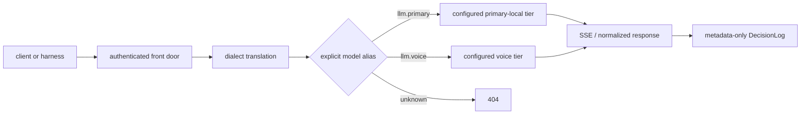
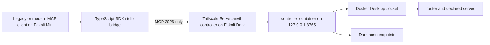
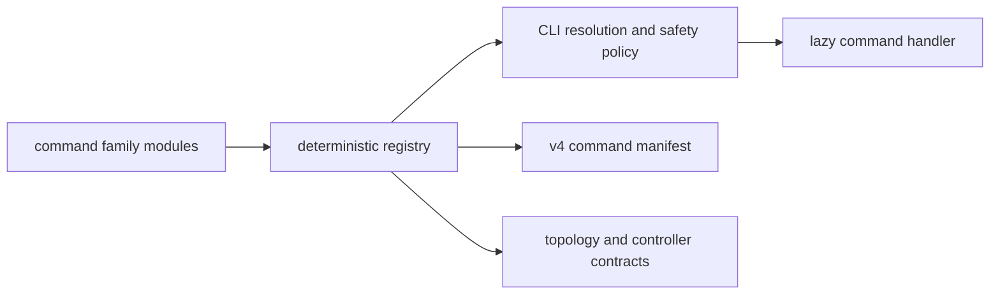
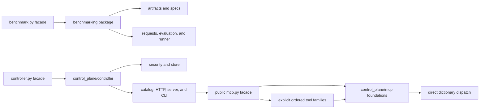

# Architecture

anvil-serving is a serving and benchmark substrate with a thin capability
gateway. It owns repeatable lifecycle and evidence around local model serves,
not semantic model selection.

```mermaid
flowchart LR
    C["client or harness"] --> A["authenticated front door"]
    A --> D["dialect translation"]
    D --> R{"explicit model alias"}
    R -->|"llm.primary"| H["configured primary-local tier"]
    R -->|"llm.voice"| F["configured voice tier"]
    R -->|"unknown"| X["404"]
    H --> S["SSE / normalized response"]
    F --> S
    S --> L["metadata-only DecisionLog"]
```

## Request boundary

The router accepts Anthropic Messages, OpenAI Chat Completions, and the
supported stateless Responses subset. It authenticates the caller, translates
the request and tools for the selected upstream dialect, enforces the selected
tier's context/tool/readiness/admission constraints, then relays ordinary or
SSE responses. There is exactly one selected tier per accepted chat request.

The front door also has deterministic purpose-model endpoints for embeddings
and reranking, plus normalized audio endpoints. They have separate
operator-configured route tables and never join the chat route vocabulary.

## Capability topology

Fakoli Dark exposes two equal RTX PRO 6000 Max-Q cards as stable UUID-backed
`dark-compute-a` and `dark-compute-b` resources. Split mode admits compatible
workloads independently on either role. `dual-gpu-exclusive` mode drains and
stops every GPU inference competitor, then grants both roles to one explicitly
configured TP=2 serve. The router and controller may remain online, but an
alias whose backing serve is offline returns unavailable and never substitutes
the TP=2 model. Fakoli Mini remains model-free; its loopback audio proxies
forward to Dark rather than hosting a model.

`serves` manages compose-backed model lifecycle and GPU reservations.
`eval preflight` and benchmark commands qualify a concrete endpoint. The
gateway can only expose a configured capability. It neither proves model
quality nor promotes a new recipe.

## Split-host controller

Fakoli Dark owns the execution plane. Its dedicated Linux controller image
contains Anvil Serving, the pinned Docker CLI and Compose plugin, and the
NVIDIA runtime view. It receives only the Docker socket, declared serving
manifests, and a durable operation-state volume. Host loopback URLs in those
manifests are rewritten to the explicit `host.docker.internal` alias inside
the container; ordinary native and router-container behavior is unchanged.

Fakoli Mini owns the client plane. `anvil-serving mcp serve` is the model-free
stdio bridge that authenticates to the Dark controller through host-owned
Tailscale Serve. The packaged bridge uses the official TypeScript MCP SDK:
its client-facing side negotiates either the initialize era through
`2025-11-25` or stateless `2026-07-28`, while its downstream client is pinned
to `2026-07-28`. OpenClaw can therefore launch it with its initialize-based
SDK without adding a legacy listener to Dark. The controller is published on
Dark's Windows loopback only, so neither the container port nor Docker socket
is directly reachable from the tailnet.

```mermaid
flowchart LR
    O["Legacy or modern MCP client on Fakoli Mini"] --> P["TypeScript SDK stdio bridge"]
    P -->|"MCP 2026 only"| T["Tailscale Serve /anvil-controller on Fakoli Dark"]
    T --> C["controller container on 127.0.0.1:8765"]
    C --> D["Docker Desktop socket"]
    C --> H["Dark host endpoints"]
    D --> S["router and declared serves"]
```

The controller runs non-root with a read-only root filesystem, dropped Linux
capabilities, and an explicit operation allowlist. Docker-socket membership is
still host-equivalent authority over Docker, so the token, loopback publish,
tailnet ACL, restricted tool catalog, and absence of home/SSH/GitHub mounts are
the actual security boundary. Git and SSH credentials are deliberately not
available in the image.

## Operator command architecture

The public CLI is assembled from explicit command families under
`anvil_serving/commands/`. Each family module owns the paths, dispatch target,
safety class, topology metadata, and controller-operation mapping for one
cohesive area such as `serves`, `models`, or `voice`.

The `@command_family` decorator attaches the root-help category to a
module-local factory. `commands/registry.py` imports an explicit family list,
validates it, and orders the public roots deterministically. It does not scan
the filesystem or import operational handlers. Handlers remain lazy and are
imported only when dispatch or explicit validation resolves them.

```mermaid
flowchart LR
    F["command family modules"] --> R["deterministic registry"]
    R --> C["CLI resolution and safety policy"]
    R --> M["v4 command manifest"]
    R --> T["topology and controller contracts"]
    C --> H["lazy command handler"]
```

The registry contains only machine-relevant command facts. Leaf `argparse`
parsers own detailed argument help, while the family documentation owns
workflows, examples, configuration precedence, and behavioral guidance. The
v4 manifest intentionally omits prose copies of that documentation.

## Evaluation and control-plane composition

The benchmark and control-plane public modules are stable compatibility
facades. Responsibilities live in directed internal packages so callers keep
their supported imports while persistence, security, protocol, and tool-family
code remain independently reviewable.

```mermaid
flowchart LR
    B["benchmark.py facade"] --> BP["benchmarking package"]
    BP --> BA["artifacts and specs"]
    BP --> BR["requests, evaluation, and runner"]

    C["controller.py facade"] --> CP["control_plane/controller"]
    CP --> CS["security and store"]
    CP --> CH["catalog, HTTP, server, and CLI"]
    CH --> M["public mcp.py facade"]

    M --> MF["control_plane/mcp foundations"]
    M --> MT["explicit ordered tool families"]
    MT --> MF
    MF --> D["direct dictionary dispatch"]
```

`anvil_serving/benchmark.py`, `anvil_serving/controller.py`, and
`anvil_serving/mcp.py` preserve their documented imports, command entrypoints,
and compatibility trampolines. Internal modules do not scan the filesystem,
load entry points, or dynamically discover handlers. The MCP catalog is built
once from an explicit family tuple, rejects duplicate family and tool names,
and dispatches through one dictionary lookup.

Benchmark artifact validation is owned by `benchmarking/artifacts.py`. MCP
adapts its domain errors to the MCP error contract rather than carrying a
second path-validation implementation. Controller internals consume the public
MCP catalog/call surface, while MCP foundations and tool families do not import
controller internals.

The Dark controller uses the `2026-07-28` stateless request contract
exclusively. `server/discover`, `tools/list`, and `tools/call` are the only
JSON-RPC methods served at `/mcp`; `initialize` is intentionally absent.
Request metadata and the matching `MCP-Protocol-Version`, `Mcp-Method`, and
conditional `Mcp-Name` HTTP headers are validated before dispatch. The
Mini-side bridge is the only dual-era boundary. The SDK pins one era per stdio
connection, converts both client eras to a modern authenticated controller
client, validates the controller identity and dynamic tool schemas, and
returns the result in the caller's negotiated wire format.

## Deliberate non-components

The gateway has no workload classifier, intent presets, quality profile,
policy engine, residency selector, verification chain, circuit-breaker
fallback, cloud route, or routing calibration loop. A selected tier that cannot
serve returns an error rather than changing the request's capability.

## Evidence and observability

`DecisionLog` records routing metadata without request/response content:
normalized alias, selected tier, timing, token counters where available, and
terminal outcome. It provides audit evidence, not a feedback signal for future
routing. Benchmark results and preflight artifacts remain the source of truth
for changes to the configured mapping.
