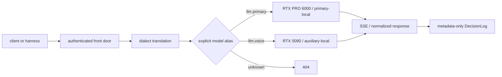
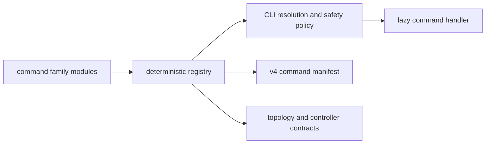

# Architecture

anvil-serving is a serving and benchmark substrate with a thin capability
gateway. It owns repeatable lifecycle and evidence around local model serves,
not semantic model selection.

```mermaid
flowchart LR
    C["client or harness"] --> A["authenticated front door"]
    A --> D["dialect translation"]
    D --> R{"explicit model alias"}
    R -->|"llm.primary"| H["RTX PRO 6000 / primary-local"]
    R -->|"llm.voice"| F["RTX 5090 / auxiliary-local"]
    R -->|"unknown"| X["404"]
    H --> S["SSE / normalized response"]
    F --> S
    S --> L["metadata-only DecisionLog"]
```

## Request boundary

The router accepts Anthropic Messages, OpenAI Chat Completions, and the
supported stateless Responses subset. It authenticates the caller, translates
the request and tools for the selected upstream dialect, enforces the selected
tier's context/tool/readiness/admission constraints, then relays ordinary or
SSE responses. There is exactly one selected tier per accepted chat request.

The front door also has deterministic purpose-model endpoints for embeddings
and reranking, plus normalized audio endpoints. They have separate
operator-configured route tables and never join the chat route vocabulary.

## Capability topology

The reference split assigns primary LLM candidates to the RTX PRO 6000 and
low-latency voice LLM, STT/TTS, embeddings, reranking, and optional ComfyUI to
the RTX 5090. Fakoli Mini remains model-free in the reference voice topology;
its loopback audio proxies forward to Dark rather than hosting a model.

`serves` manages compose-backed model lifecycle and GPU reservations.
`eval preflight` and benchmark commands qualify a concrete endpoint. The
gateway can only expose a configured capability. It neither proves model
quality nor promotes a new recipe.

## Operator command architecture

The public CLI is assembled from explicit command families under
`anvil_serving/commands/`. Each family module owns the paths, dispatch target,
safety class, topology metadata, and controller-operation mapping for one
cohesive area such as `serves`, `models`, or `voice`.

The `@command_family` decorator attaches the root-help category to a
module-local factory. `commands/registry.py` imports an explicit family list,
validates it, and orders the public roots deterministically. It does not scan
the filesystem or import operational handlers. Handlers remain lazy and are
imported only when dispatch or explicit validation resolves them.

```mermaid
flowchart LR
    F["command family modules"] --> R["deterministic registry"]
    R --> C["CLI resolution and safety policy"]
    R --> M["v4 command manifest"]
    R --> T["topology and controller contracts"]
    C --> H["lazy command handler"]
```

The registry contains only machine-relevant command facts. Leaf `argparse`
parsers own detailed argument help, while the family documentation owns
workflows, examples, configuration precedence, and behavioral guidance. The
v4 manifest intentionally omits prose copies of that documentation.

## Deliberate non-components

The gateway has no workload classifier, intent presets, quality profile,
policy engine, residency selector, verification chain, circuit-breaker
fallback, cloud route, or routing calibration loop. A selected tier that cannot
serve returns an error rather than changing the request's capability.

## Evidence and observability

`DecisionLog` records routing metadata without request/response content:
normalized alias, selected tier, timing, token counters where available, and
terminal outcome. It provides audit evidence, not a feedback signal for future
routing. Benchmark results and preflight artifacts remain the source of truth
for changes to the configured mapping.
