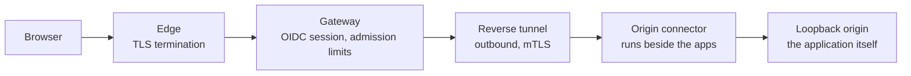

# Why Anvil Connect

Anvil Connect is the browser gateway for the surfaces you build with Anvil
Serving. It answers one question: how do you open a model dashboard, an agent
UI, or a family chat page from any browser — without port-forwarding an
unhardened application, without giving every application its own login system,
and without handing the routing problem to a hosted vendor.

## The access problem it removes

A homelab or workstation server that serves real capability normally faces a
bad set of choices:

- **Expose ports directly** and every local application becomes internet-
  facing with whatever authentication it happens to have.
- **Stay VPN-only** and every browser needs the VPN, per device, per person.
- **Adopt a hosted tunnel product** and move identity, admission, and audit
  for your own services onto someone else's terms.

Each application also tends to grow its own accounts, sessions, and password
reset flows, which is how one homelab becomes six credentials.

## What Connect gives you instead

- **One credential.** Browsers authenticate once, through the OpenID Connect
  provider you already operate, and every published resource accepts that
  session. Applications that support federated login can use the same
  provider directly.
- **Zero application changes.** Published applications stay bound to the
  loopback interface. Exposure is a declaration in one closed manifest, not a
  change to the application.
- **Identity that cannot be spoofed.** Client-supplied identity and
  forwarding headers are stripped at the edge. Applications that need a user
  identity receive a signed, keyed handoff instead of a raw header.
- **Bounded exposure.** Each resource declares its host, path, methods, and
  admission limits — concurrency, request size, idle and duration ceilings —
  and the gateway enforces all of it per request.
- **Isolation by construction.** The gateway, identity provider, edge, and
  each connector run as separate service identities. Origins never bind
  wider than loopback.

## The request path

The connector dials out; no inbound port is opened for it. The gateway learns
a connector through a redeemable invitation and a human fingerprint approval,
so a resource goes live only after an explicit enrollment and approval chain.

## What an operator does

1. **Declare** the resource — one host, one path prefix, one origin URL, one
   method list, one admission budget — in the deployment manifest.
2. **Render and review** the derived edge, identity, gateway, and connector
   configuration as a validated plan.
3. **Activate** through the managed transaction, which rolls back on any
   failed readiness check.
4. **Enroll and approve** a new connector identity when the declaration adds
   one, using the invite, redeem, and fingerprint-approval flow.

The [application access guide](ANVIL-CONNECT.md) walks the full sequence with
the real commands, and the [CLI reference](cli/connect.md) lists every verb.

## Where the boundary sits

Connect publishes applications; it does not promote or substitute anything
behind them. It adds no inference behavior, no model routing, and no cloud
escalation. A resource that is not declared, rendered, activated, and enrolled
does not exist at the edge.

## Maturity, stated plainly

Connect is operated daily against production surfaces. Three gaps are known
and tracked rather than hidden:

- **Extending one connector's resource set** requires a re-enrollment ordering
  rather than a single in-place command. The sequence is documented and
  ticketed for a managed single-path fix.
- **Extra relying parties** on the bundled identity provider are added by a
  recorded configuration edit until the release supports more than the
  gateway's own client natively.
- **Tunnel establishment and renewal failures** are not yet surfaced as
  distinct, loud events. The colocated fast path under review in
  [ADR-0043](adr/0043-colocated-tunnel-fast-path.md) also removes the public
  tunnel leg for local access entirely.

None of these gaps change what is published today; they are the operation
log of a component moving from *works* to *operated*.