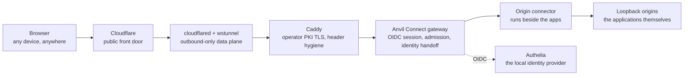

# Anvil Connect

Anvil Connect is the newest product family in Anvil Serving, alongside Model
Serving, the Capability Gateway, Evaluation & Evidence, Anvil Voice, Anvil
Media, and the Control Plane. It is the browser gateway for the surfaces you
build and run on your own workstation: model dashboards, agent UIs, chat
frontends, and anything else that speaks HTTP on a loopback port.

It exists to answer one question. Hosted tools give you a phone view of work
that runs in their cloud — open the app from anywhere, pick up where you left
off, no setup between devices. Anvil Connect gives you the same convenience for
work that runs on *your* machine: open your own services from any browser,
anywhere, without port-forwarding an unhardened application, without a VPN
client on every device and person, and without handing identity, admission, or
audit for your own services to a hosted vendor.

## The access problem it removes

A workstation or homelab server that serves real capability normally faces a
bad set of choices:

- **Expose ports directly** and every local application becomes internet-
  facing with whatever authentication it happens to have.
- **Stay VPN-only** and every browser needs the VPN, per device, per person.
- **Adopt a hosted tunnel product** and move identity, admission, and audit
  for your own services onto someone else's terms.

Each application also tends to grow its own accounts, sessions, and password
reset flows, which is how one homelab becomes six credentials.

## What Connect gives you instead

- **One credential.** Browsers authenticate once, through the OpenID Connect
  provider you already operate, and every published resource accepts that
  session. Applications that support federated login can use the same
  provider directly.
- **Zero application changes.** Published applications stay bound to the
  loopback interface. Exposure is a declaration in one closed manifest, not a
  change to the application.
- **Identity that cannot be spoofed.** Client-supplied identity and
  forwarding headers are stripped at the edge. Applications that need a user
  identity receive a signed, keyed handoff instead of a raw header.
- **Bounded exposure.** Each resource declares its host, path, methods, and
  admission limits — concurrency, request size, idle and duration ceilings —
  and the gateway enforces all of it per request.
- **Isolation by construction.** The gateway, identity provider, edge, and
  each connector run as separate service identities. Origins never bind
  wider than loopback.

## How the pieces fit

Anvil Connect is deliberately composed from proven parts, each owning one
narrow responsibility:



- **Cloudflare** is the public front door: DNS for each published host and
  the first TLS hop with abuse protection. It terminates nothing private —
  it forwards to a tunnel that only exists because your own connector dialed
  out to build it.
- **cloudflared and wstunnel** are the data plane. Every connection is
  established outbound by your own infrastructure; the server side accepts
  only connectors that present credentials from a redeemed invitation. No
  inbound port is opened on the application host.
- **Caddy** terminates edge TLS with a certificate authority that *you* issue
  and own — not a vendor — and enforces header hygiene: spoofable identity
  and forwarding headers are deleted at ingress, so no browser can claim an
  identity by header.
- **The Anvil Connect gateway** is the policy core. It runs the OpenID
  Connect login flow, issues opaque, host-only session cookies, enforces each
  resource's admission budget per request, and provides signed identity
  handoff for applications that verify a user.
- **Authelia** is the local identity provider the whole family leans on:
  passkeys, TOTP, and your existing user directory. The same provider fronts
  the edge gate and any federated application you register with it.
- **The origin connector** runs beside the applications under its own service
  identity, pulls traffic from the gateway, and forwards to loopback-only
  origins. It holds no secrets beyond its own enrollment state.
- **The applications** are unchanged. They keep binding to `127.0.0.1` and
  never learn that the internet exists.

## One identity, three ways

Every published application takes identity one of three ways, and all three
come from the same login:

1. **Unmodified applications** — the Authelia session at the edge is the
   gate; the application sees ordinary local traffic.
2. **OIDC-native applications** — registered as relying parties of the same
   provider, they federate the same identity directly. One login covers the
   edge and the application.
3. **Identity-verifying applications** — they receive a signed, keyed handoff
   the gateway injects after authentication, never a raw client-controlled
   header.

That is the whole identity story: one provider, one credential, no per-
application accounts unless the application insists on them.

## What an operator does

1. **Declare** the resource — one host, one path prefix, one origin URL, one
   method list, one admission budget — in the deployment manifest.
2. **Render and review** the derived edge, identity, gateway, and connector
   configuration as a validated plan.
3. **Activate** through the managed transaction, which rolls back on any
   failed readiness check.
4. **Enroll and approve** a new connector identity when the declaration adds
   one, using the invite, redeem, and fingerprint-approval flow.

The [application access guide](ANVIL-CONNECT.md) walks the full sequence with
the real commands, and the [CLI reference](cli/connect.md) lists every verb.

## Publishing through Cloudflare

The data plane is outbound-only: the connector dials out and builds the tunnel,
so the edge needs two public things from Cloudflare — one DNS record per
published host and one ingress rule per host inside the tunnel's configuration.
Anvil Connect manages both from the same closed declaration:

1. **Create the tunnel once** in the Cloudflare dashboard (Zero Trust →
   Networks → Tunnels) and install the `cloudflared` agent on the edge host
   with the printed token, keeping the token in a protected environment
   reference — never in a tracked file.
2. **Declare the edge publishing config** — the private
   `connect/edge-cloudflare.json` carries the account id, zone, tunnel id, CA
   pool path, and the name of the environment variable holding an API token
   with *Zone DNS Edit* and *Account Cloudflare Tunnel Edit* scopes:

```json
{
  "schema": "anvil-connect.edge-publishing/v1",
  "account_id": "<32-hex-account-id>",
  "zone_name": "example.test",
  "tunnel_id": "<tunnel-uuid>",
  "api_token_env": "ANVIL_CLOUDFLARE_API_TOKEN",
  "origin_service": "https://127.0.0.1:19443",
  "ca_pool": "/etc/cloudflared/example-connect-ca.pem",
  "origin_server_name": "connect.example.test"
}
```

3. **Compare, then apply.** The plan derives every required record and rule
   from the deployment manifest, shows the exact difference, and the apply
   merges it into the live tunnel configuration — preserving rules it does
   not own, keeping the catch-all last:

```bash
anvil-serving connect edge-status --manifest <PATH> --edge-config <PATH>
sudo anvil-serving connect edge-apply --manifest <PATH> --edge-config <PATH> --confirm
```

A repeated apply converges without API writes; ingress rules for hosts not
declared in the manifest are preserved untouched, and the apply verifies the
tunnel is reporting an active connector before it reports success. API access
uses the environment reference only — the token value never appears in
configuration, output, or evidence.

## Where the boundary sits

Connect publishes applications; it does not promote or substitute anything
behind them. It adds no inference behavior, no model routing, and no cloud
escalation. A resource that is not declared, rendered, activated, and enrolled
does not exist at the edge.

## Maturity, stated plainly

Connect is operated daily against production surfaces. Three gaps are known
and tracked rather than hidden:

- **Extending one connector's resource set** requires a re-enrollment ordering
  rather than a single in-place command. The sequence is documented and
  ticketed for a managed single-path fix.
- **Extra relying parties** on the bundled identity provider are added by a
  recorded configuration edit until the release supports more than the
  gateway's own client natively.
- **Tunnel establishment and renewal failures** are not yet surfaced as
  distinct, loud events. The colocated fast path under review in
  [ADR-0043](adr/0043-colocated-tunnel-fast-path.md) also removes the public
  tunnel leg for local access entirely.

None of these gaps change what is published today; they are the operation
log of a component moving from *works* to *operated*.

Anvil Connect is one of the seven product families — see
[Product families and user journeys](PRODUCT-FAMILIES.md#anvil-connect) for
its authority boundary and ordered journey, or run
`anvil-serving product journey anvil-connect`.