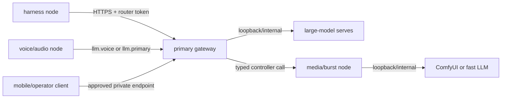

# Device topologies

Anvil Serving treats machine names as private deployment facts, not product
roles. The same architecture can span workstations, laptops, small edge
systems, and mobile clients when each process has one declared owner and the
devices have a reviewed private network path.

For the reference multi-device network, start with
[Private networking with Tailscale](TAILSCALE-NETWORKING.md). It explains how
Tailscale identity, grants, MagicDNS, and Serve project selected loopback
services without publishing raw model endpoints.

## Roles

| Role | Owns | Representative placement |
| --- | --- | --- |
| Primary inference node | Capability Gateway, controller, daily large-model serves, manifests, model cache, and decision evidence. | A high-memory GPU workstation. |
| Harness node | OpenClaw gateway, Codex/Claude Code or other harness runtimes, MCP stdio bridge, and harness-local restart/apply actions. | A small always-on system with no model serves. |
| Voice and audio node | Voice agent or Realtime proxy, microphone/speaker path, STT, and TTS. | A laptop or workstation selected for interactive audio. |
| Media and burst node | ComfyUI/media worker and an optional fast LLM for bounded or occasional workloads. | A separate GPU workstation. |
| Controller node | `anvil-serving controller serve` for typed remote operations on the resources that node owns. | Usually co-located with each resource owner. |
| Mobile or operator client | Browser, voice client, monitoring, and approved operator actions. | Any user-owned phone, tablet, or computer admitted to the private network. |

A device can hold several roles. The important boundary is ownership: run
lifecycle commands on the device that owns the process, config, manifest,
hardware reservation, and logs being changed. Network proximity does not
transfer that authority.

The representative distribution deliberately separates steady large-model
serving, lightweight harnesses, interactive audio, and on-demand media. It is
an architecture example, not a claim about an operator's current deployment.
Real device names and active assignments belong in private operator topology.

## Connectivity requirements

- Same-host URLs use `127.0.0.1`.
- The preferred cross-device pattern keeps the service on `127.0.0.1` and
  publishes only a reviewed path through Tailscale Serve on the owning device.
- Direct binding to a tailnet IP is an explicit alternative, not the default.
  A non-loopback bind still requires application authentication.
- Public interface exposure is outside the reference product contract and
  requires a separate threat model and human gate.
- Tailscale reachability is necessary but not sufficient. Use least-privilege
  grants (or existing ACLs) and the router/controller service token together.
- Credentials stay in environment variables. Config files and manifests name
  env vars such as `ANVIL_ROUTER_TOKEN` or `ANVIL_CONTROLLER_TOKEN`, never
  literal token values.
- MagicDNS names and tailnet addresses are private operator values. Public
  examples use synthetic names such as `primary.example.ts.net`.

There are two traffic planes:

| Plane | Examples | Cross-device rule |
| --- | --- | --- |
| Data plane | Capability Gateway, voice front door, and bounded media APIs. | Publish one authenticated front door; do not expose raw LLM, STT, TTS, or ComfyUI worker ports by default. |
| Control plane | MCP bridge, controller, and guarded lifecycle tools. | The resource-owning device runs the controller; clients reach its authenticated Tailscale Serve path. |

## Representative flows



### Harness to primary inference

The harness node is a client plane. It launches the local MCP stdio bridge and
calls the primary inference node's gateway/controller endpoints over the
tailnet. It does not need GPU runtimes or model weights.

On the primary inference node, keep the controller on loopback and project a
reviewed path with Tailscale Serve:

```bash
anvil-serving controller serve \
  --host 127.0.0.1 \
  --port 8765 \
  --auth-token-env ANVIL_CONTROLLER_TOKEN

tailscale serve --bg --set-path=/anvil-controller \
  http://127.0.0.1:8765
```

The harness-side bridge uses the private HTTPS name and the same token env-var
reference:

```bash
anvil-serving mcp serve \
  --controller-url https://primary.example.ts.net/anvil-controller/mcp \
  --auth-env ANVIL_CONTROLLER_TOKEN
```

Prefer the packaged controller deployment and managed configuration described
in [Operator playbooks](OPERATOR-PLAYBOOKS.md) for a durable installation.
SSH remains bounded bootstrap or recovery, not the normal remote transport.

### Voice and audio node

When the voice agent, STT, and TTS share one node, keep their internal URLs on
`127.0.0.1`. Point only the voice LLM stage at the authenticated primary
gateway:

```toml
[voice.llm]
base_url = "https://primary.example.ts.net/v1"
model = "llm.voice"
api_key_env = "ANVIL_ROUTER_TOKEN"
```

If an audio stage moves to another owner, mark it external on the voice node
and operate it locally—or through the controller—on the audio owner.
`lifecycle = "native"` starts a process on the device running the command; it
is not a remote-shell mechanism.

### Media and burst node

Keep ComfyUI and an optional fast LLM on loopback or an internal container
network. The primary gateway or a co-located resource controller reaches the
declared backend through the private network. Do not expose a raw model serve
merely because it is used occasionally.

Publishing the ComfyUI browser UI is a separate choice. If it is required,
scope a Tailscale Serve path and grants to the intended users, verify assets
and WebSockets end to end, and remember that ComfyUI does not provide the
router's bearer-token boundary. See [One tailnet endpoint](TAILNET-ENDPOINT-RUNBOOK.md).

### Mobile and external access

A phone or tablet joins as a user-owned Tailscale device and reaches the same
MagicDNS front door as a laptop. It needs no special public endpoint. Policy
still decides which nodes and ports that identity can reach.

For another person, invite them to the tailnet only when they need evolving
access to several resources. For a fixed narrow use case, share one machine.
Keep application tokens enabled in both cases; tailnet access alone does not
authorize an Anvil request.

## Operator checklist

Before adding or moving a role, record privately:

- The role or roles the device owns.
- Whether the node has user identity or reviewed service tags.
- Every local listener and whether it binds to loopback, a private address, or
  an internal container network.
- The exact Tailscale Serve paths and grants that make selected listeners
  reachable.
- Which env-var references provide application auth.
- Which controller owns lifecycle operations on that device.
- Which negative network test proves an unapproved identity is denied.
- Which Anvil validation proves the allowed path is ready: `router status`,
  `serves status`, `voice audio status`, `eval preflight`, a media workflow
  validation, or a real harness/client smoke.

Reachability, health, and exact served identity are separate facts. A device
does not become a qualified role owner merely because it appears in
`tailscale status` or accepts a TCP connection.
