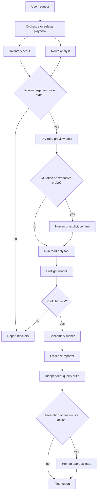

# Operator Skills And Sub-Agent Workflows

This document turns ADR-0013's "operator skill" layer into a concrete product
surface. The goal is to make most anvil-serving verbs useful to an agent without
asking that agent to rediscover the operational contract, scrape Docker output,
or guess which local model is safe for a workflow step.

The design has three layers:

1. Narrow MCP/controller tools for bounded structured operations.
2. Skills that choose a documented playbook and fill tool arguments.
3. A sub-agent workflow that lets small models handle deterministic slices while
   larger models or humans keep the policy and promotion gates.

The router remains the model data plane. These workflows operate the product.

## Resolved Direction

The most useful entry point is a portable workbench skill backed by the existing
MCP/controller tools, with harness-specific role files for Codex, Claude Code,
and OpenClaw.

The top recommendations are:

1. Ship checked-in skill files as the canonical playbook, and use
   `harness sync openclaw --skills` to render those skills and sub-agent roles into OpenClaw.
   Generated-only OpenClaw config would leave Codex and Claude Code without a
   repo-visible workflow surface; checked-in-only config would fail to preserve
   OpenClaw's provider/model allowlist and gateway ownership boundary.
2. Keep MCP/controller tools stratified. Read-only probes, bounded logs, route
   decisions, preflight, and benchmark probes belong in MCP. Destructive repair,
   cache deletion, cloud enablement, profile promotion, and public binds remain
   human-gated CLI operations or require a separate audited approval artifact,
   not only a caller-provided boolean.
3. Use small-model sub-agents for inventory, route analysis, command preview,
   preflight, benchmark, and evidence drafting. Use an independent stronger
   critic for promotion recommendations. The model being evaluated must not
   grade its own output.

The initial checked-in entry points are:

| Harness | Entry point | Purpose |
|---|---|---|
| Codex | `.agents/skills/anvil-serving-workbench/SKILL.md` | Repo-scoped portable workbench skill. |
| Codex | `.codex/agents/anvil-*.toml` | Custom sub-agent roles with model-tier hints. |
| Claude Code | `.claude/skills/anvil-serving-workbench/SKILL.md` | Project skill using the same workbench contract. |
| Claude Code | `.claude/agents/anvil-*.md` | Project sub-agents for orchestration, inventory, route analysis, serve/preflight/benchmark/evidence slices, and independent review. |
| OpenClaw | `examples/openclaw/skills/anvil-serving-workbench/SKILL.md` | Installable skill directory or `skills.load.extraDirs` source. |
| OpenClaw | `examples/openclaw/anvil-serving-workbench.example.json5` | Example skill/agent visibility fragment. |
| Shared source | `skills/anvil-serving-voice-ops/SKILL.md` | Specialized voice operations skill source for harness-specific installation. |

## Available Today Vs Planned Follow-Ups

| Surface | Available today | Planned follow-up |
|---|---|---|
| Portable skills | Checked-in `anvil-serving-workbench` for Codex, Claude Code, and manual OpenClaw example installs; `skills/anvil-serving-voice-ops` for voice workflow installation. | Split specialized readiness, model-catalog, serve-swap, harness-sync, promotion-evidence, and host-repair skills once their backing tools exist. |
| Sub-agent roles | Orchestrator, inventory scout, route analyst, serve operator, preflight runner, benchmark runner, evidence reporter, quality critic, and adversarial reviewer role files for Codex and Claude Code. | Add more harness-specific tuning only after real workflow traces show a gap. |
| OpenClaw install | `anvil-serving harness sync openclaw --skills` renders the workbench skill and Anvil role config; apply it with `--out <config>` or `--gateway-host <mini>`. Use workspace-installed skills, or pass `--skill-dir <gateway-visible-path>` for checkout-loaded skills. | Split additional specialized skills once their backing tools exist. |
| MCP/controller tools | Model inventory, status, guarded serve/router/voice lifecycle, bounded serve/router logs, decision summaries, route probes, OpenClaw config sync, gateway restart, preflight probes, bounded benchmark probes, benchmark artifact capture, external benchmark advisory reports/compares, and promotion preview. | Router token handling. |
| Result contract | `operator-workflow/v1` packet documented for skills and reviewers; `workflow_packet_validate` validates packet shape, promotion gates, and artifact paths; `tests/fixtures/operator_workflows/model_swap_promotion_evidence.json` covers the model-swap evidence path. | Broader packet fixtures from real multi-agent runs. |

## OpenClaw Smoke Result

The manual OpenClaw path was checked against Fakoli Mini with OpenClaw
`2026.6.11`. The captured evidence is summarized in
[`docs/findings/2026-07-06-openclaw-workbench-skill-smoke.md`](findings/2026-07-06-openclaw-workbench-skill-smoke.md).
The existing `openclaw-anvil-intent-router` plugin reported `status:"loaded"`
and `activated:true` with one `before_model_resolve` hook. The workbench skill
was installed with:

```bash
openclaw skills install /tmp/anvil-serving-workbench-skill --as anvil-serving-workbench
```

`openclaw skills info anvil-serving-workbench --json` then reported the skill
from `/Users/sdoumbouya/.openclaw/workspace/skills/anvil-serving-workbench` with
`eligible`, `modelVisible`, `userInvocable`, and `commandVisible` all `true`.

## Implemented Now

`anvil-serving mcp --list-tools` currently exposes:

| Need | Current tool | Status |
|---|---|---|
| Deployed router health | `router_status` | Implemented |
| Deployed router lifecycle | `router_manage` | Implemented |
| Bounded router logs | `router_logs` | Implemented |
| Recent decision summaries | `decision_summary` | Implemented |
| Promotion validation and preview | `router_promote` | Implemented; apply requires `confirm:true`, `dry_run:false`, and `human_approved:true` |
| Compose-defined serve health | `serves_status` | Implemented |
| Guarded serve lifecycle | `serves_manage` | Implemented |
| Bounded serve logs | `serves_logs` | Implemented |
| Guarded voice STT/TTS lifecycle | `voice_manage` | Implemented; applies to managed Docker audio serves and same-host native MLX Audio processes on Mini or other voice hosts |
| Environment and configured tier checks | `doctor_summary` | Implemented |
| Host WSL/Docker/GPU summary | `host_summary` | Implemented; read-only and non-mutating |
| Model inventory | `models_inventory` | Implemented |
| Cache prune plan | `cache_prune_plan` | Implemented; JSON plan and dry-run report only, no deletion path |
| Router decision probe | `route_decision` | Implemented |
| OpenClaw config preview/apply | `openclaw_sync` | Implemented |
| OpenClaw gateway restart | `openclaw_gateway_restart` | Implemented |
| Correctness gate probe | `preflight_probe` | Implemented |
| Bounded throughput probe | `benchmark_probe` | Implemented |
| Benchmark evidence artifact | `benchmark_artifact` | Implemented; writes `--json-out` only to the workspace or server-configured `ANVIL_BENCHMARK_EVIDENCE_DIR` / `ANVIL_EVIDENCE_DIR` roots |
| Workflow packet validation | `workflow_packet_validate` | Implemented; validates `operator-workflow/v1`, promotion proof, and bounded artifact paths |
| External benchmark source list | `external_bench_sources` | Implemented; advisory-only prior metadata |
| External benchmark row list | `external_bench_list` | Implemented; advisory-only normalized rows |
| External benchmark report | `external_bench_report` | Implemented; advisory-only structured report |
| External benchmark compare | `external_bench_compare` | Implemented; advisory-only deltas against a local benchmark artifact |

That is enough for status, route checks, host/cache planning, basic validation,
bounded benchmark probes, OpenClaw provider/model sync, and OpenClaw workbench
skill rendering. It is not yet enough to operate every verb as a structured
agent workflow.

## Proposed Gaps

| Gap | Proposed tool or workflow | Safety boundary |
|---|---|---|
| Router token handling | `router_token_status` | Report auth configured/unset without returning token values. |
| OpenClaw skills | `harness sync openclaw --skills` | Render/apply Anvil-owned keys only; preserve operator-owned config. |

## Verb Enablement Matrix

| Area | Verbs | Best enablement | Rationale |
|---|---|---|---|
| Front door | `serve` | Skill-only runbook | Long-running process; agents inspect it through `router_status`, `/healthz`, and `/v1/models`. |
| Router lifecycle | `router status/logs/up/down/restart/reload/promote/token` | MCP for status, bounded logs, guarded lifecycle, decision summary, and promotion preview/apply gate; token remains CLI-only | Promotion apply requires `confirm:true`, `dry_run:false`, and `human_approved:true`; token values are not exposed through MCP. |
| Serve lifecycle | `serves status/up/down/rm/adopt/logs` | MCP for status, bounded logs, and guarded up/down/rm/adopt; live mutation requires `confirm:true` and `dry_run:false` after preview | Serve start/stop is normal operation and should not require raw Docker. |
| Model inventory | `models sync`, `models pull`, `models recipe` | MCP for catalog inventory with sync preview/confirm; skill/CLI for pull and recipe read | Inventory is read-heavy. Pull is long-running, network/disk-heavy, and explicitly gated. |
| Bring-up generation | `init`, `doctor`, `deploy` | MCP preview/render plus CLI apply | Generated artifacts should be inspectable before write. |
| Environment repair | `host doctor`, `host wsl-config`, `host restart-docker`, `host reset-wsl` | `host_summary` for read-only MCP summary; human-confirmed CLI for disruptive repair | Restarting Docker/WSL and editing host config are high-disruption. |
| Correctness and capacity | `preflight`, `benchmark`, `eval preflight`, `eval benchmark` | MCP probes and artifact capture plus skill sequencing | Preflight must precede benchmark. Benchmark artifacts need explicit output paths validated under the workspace or server-configured evidence directory. |
| Quality profile | `eval bootstrap`, `calibrate`, `router promote` | MCP preview/status; skill evidence packet; human promotion gate | These change routing trust. Small models can collect evidence, but not promote. |
| External priors | `external-bench init/sources/import/list/report/export/compare` | MCP read/report/compare; skill marks advisory-only | External results are useful priors, not quality evidence. |
| Harness config | `harness sync/restart openclaw` | MCP for provider/model sync, workbench skill rendering, and restart | Keep router presets, model allowlists, skill visibility, and gateway config in lockstep. |
| Controller transport | `controller serve`, `mcp --controller-url` | Skill-only bootstrap plus health checks | Binding the controller is a deployment/security decision; tool calls happen after it is up. |
| Multiplexer | `multiplexer` | Skill runbook and endpoint probes | Long-running unauthenticated data-plane process; inspect through `/healthz`, `/v1/models`, preflight, and benchmark. |
| Voice | `voice up/down/start/stop/run/benchmark`, `voice-sidecar validate/command/compose` | `voice_manage` for guarded STT/TTS lifecycle; skill/CLI for foreground realtime server and benchmark sequencing | Native audio endpoints use `lifecycle = "native"` with manifest-declared commands, PID files, and logs on the host running `voice up`. |
| Local analytics | `profile`, `score`, `cache-prune` | Skill/CLI plus `cache_prune_plan` for MCP JSON planning | `profile` and `score` are offline analysis. `cache-prune` deletion stays CLI-only and human-gated. |

## Recommended Skills

The useful skill set is intentionally small. Each skill should be procedural and
tool-backed, not a new policy engine.

| Skill | Primary model tier | Status | Purpose |
|---|---|---|---|
| `anvil-serving-workbench` | orchestrator-selected | Seeded; Mini smoke linked | Choose the playbook, spawn bounded roles, and return the workflow packet. |
| `anvil-serving-readiness` | small | Planned specialization | Run inventory/status/doctor checks and report blockers before any operation. |
| `anvil-serving-model-catalog` | small | Planned specialization | Sync or read model inventory, recipes, external priors, and serve facts. |
| `anvil-serving-serve-swap` | small plus human confirm | Planned specialization | Start, adopt, or swap a serve, then run preflight before benchmark. |
| `anvil-serving-harness-sync` | small | Planned specialization | Preview/apply OpenClaw provider/model and workbench skill config after router preset or tier changes. |
| `anvil-serving-promotion-evidence` | small collector, stronger synthesizer | Planned specialization | Assemble preflight, benchmark, calibration, and config evidence without promoting. |
| `anvil-serving-host-repair` | strong or human-assisted | Planned specialization | Diagnose WSL/Docker/GPU issues and preview safe repairs. |
| `anvil-serving-voice-ops` | small for validation, strong for failures | Seeded skill-only | Validate sidecar manifests, render sidecar commands, and run bounded voice benchmarks as voice-pipeline evidence. |

## Voice Ops Skill

`skills/anvil-serving-voice-ops/SKILL.md` is the specialized voice operations
skill source. Install or copy it into the active harness skill store when the
operator wants a dedicated voice playbook. It intentionally uses the existing
`anvil-serving voice-sidecar validate`, `voice-sidecar command`,
`voice-sidecar compose`, `voice up`, `voice down`, `voice run`, and
`voice benchmark` verbs before proposing new MCP tools.

Voice benchmark output is voice-pipeline evidence, not router work-class promotion evidence.
Voice benchmark JSON should be attached with artifact kind `voice-benchmark`,
`evidence_scope: "voice-pipeline"`, and
`promotion_quality_evidence: false`. The workflow packet validator enforces
those fields for voice artifact kinds. Voice artifacts must not be counted as
router work-class promotion evidence, and packets should keep `promoted=false`
unless a separate human-approved router promotion result exists.

## OpenClaw `--skills` Render Contract

`anvil-serving harness sync openclaw --skills` renders the provider/model config
plus the Anvil-owned skill and sub-agent keys. It prints a preview by default;
to apply, pass `--out ~/.openclaw/openclaw.json` on the gateway host or
`--gateway-host <mini>` from a router host that can reach the gateway over ssh.
Without `--skill-dir`, it assumes the workbench skill was already installed into
OpenClaw's workspace skill store:

```bash
openclaw skills install ./examples/openclaw/skills/anvil-serving-workbench \
  --as anvil-serving-workbench
```

For checkout-loaded skills, pass a path that is valid on the OpenClaw gateway:

```bash
anvil-serving harness sync openclaw \
  --config configs/example.toml \
  --skills \
  --skill-dir /absolute/path/to/anvil-serving/examples/openclaw/skills \
  --out -
```

Replace `--out -` with `--out ~/.openclaw/openclaw.json` or add
`--gateway-host <mini>` when applying. Existing local or remote plain-JSON
targets are merged by default, with a best-effort backup before write; commented
JSON5 targets must be edited manually or overwritten intentionally with
`--overwrite`.

The rendered Anvil-owned keys are:

```json
{
  "agents": {
    "defaults": {
      "skills": ["anvil-serving-workbench"]
    },
    "list": [
      {
        "name": "anvil-orchestrator",
        "model": "anvil/planning",
        "skills": ["anvil-serving-workbench"]
      },
      {
        "name": "anvil-inventory-scout",
        "model": "anvil/chat-fast",
        "skills": ["anvil-serving-workbench"]
      },
      {
        "name": "anvil-route-analyst",
        "model": "anvil/chat-fast",
        "skills": ["anvil-serving-workbench"]
      },
      {
        "name": "anvil-serve-operator",
        "model": "anvil/chat-fast",
        "skills": ["anvil-serving-workbench"]
      },
      {
        "name": "anvil-preflight-runner",
        "model": "anvil/chat-fast",
        "skills": ["anvil-serving-workbench"]
      },
      {
        "name": "anvil-benchmark-runner",
        "model": "anvil/chat-fast",
        "skills": ["anvil-serving-workbench"]
      },
      {
        "name": "anvil-evidence-reporter",
        "model": "anvil/chat-fast",
        "skills": ["anvil-serving-workbench"]
      },
      {
        "name": "anvil-quality-critic",
        "model": "anvil/review",
        "skills": ["anvil-serving-workbench"]
      },
      {
        "name": "anvil-adversarial-reviewer",
        "model": "anvil/review",
        "skills": ["anvil-serving-workbench"]
      }
    ]
  }
}
```

If `planning` is absent in a custom router config, the orchestrator falls back
to `anvil/review`, then `anvil/chat`, then remains pinned to `anvil/planning`
rather than silently using a small-only preset. If `chat-fast` is absent,
operational small-model roles fall back to `anvil/chat`, then the first
configured preset. If `review` is absent, the quality critic and adversarial
reviewer fall back to `anvil/planning`, then `anvil/chat`, then remain pinned to
`anvil/review` rather than silently judging from a small-only preset. The sync
merge replaces current Anvil-owned role entries by name, drops the legacy
`anvil-probe-evidence-runner` OpenClaw entry when present, and appends
`anvil-serving-workbench` to existing default skills; unrelated providers,
agents, plugins, and checkout skill directories are preserved when the existing
OpenClaw config is plain JSON and the merge path can read it.

The seeded workbench skill should prefer MCP/controller tools when available.
When a tool is missing, it may call the CLI only through documented
anvil-serving verbs and should name the missing MCP wrapper as a product gap.

## Sub-Agent Workflow

Use a single orchestrator with bounded sidecar agents. The orchestrator owns the
user request, safety policy, and final recommendation. Sidecars own facts or
execution steps with explicit inputs and outputs.

| Role | Good model class | Inputs | Output | Gate |
|---|---|---|---|---|
| Orchestrator | strong/frontier | User request, repo docs, current tool list, role outputs | Playbook choice, fan-out plan, final packet and recommendation | Must stop for human gates. |
| Inventory scout | small/local | Router config, serves manifest, model catalog, MCP status | Current topology and candidate endpoints | No mutation. |
| Route analyst | small/local | Prompt/class, router route probe, decision log sample | Expected intent, tier, and risk class | No policy change. |
| Serve operator | small/local with confirm | Manifest target, serve name, endpoint, confirmation state | Dry-run plan, then confirmed start/adopt/down result | Requires exact target plus `confirm:true` and `dry_run:false` for mutation. |
| Preflight runner | small/local | Endpoint, model id, context, thinking settings | Pass/fail with failing checks | Benchmark blocked on fail. |
| Benchmark runner | small/local | Endpoint, model id, request shape, artifact path, preflight proof | JSON artifact and capacity summary | Requires preflight pass. |
| Evidence reporter | small/local | Status, preflight, benchmark, external priors, config diff | Promotion packet draft and validation result | Must mark external priors advisory-only. |
| Quality critic | strong, independent from candidate generator | Evidence packet, profile diff, acceptance thresholds | `promote`, `do_not_promote`, `needs_more_data`, or `blocked` recommendation | Never self-verifies model output. |
| Adversarial reviewer | strong, independent from implementer | Code/docs diff, packet, test output, README/CLAUDE constraints | Severity-ordered findings and residual risk | Does not implement fixes in the same pass. |
| Human approver | human | Critic recommendation and artifacts | Approve or reject live promotion/destructive action | Required for promotion, cloud enablement, host repair, public bind. |

## Role Contracts

Every role prompt in `.codex/agents/` and `.claude/agents/` carries the same
contract fields: inputs, outputs, allowed tools, forbidden actions, and
escalation triggers.

| Role | Allowed tools | Forbidden actions | Escalate when |
|---|---|---|---|
| Orchestrator | Workbench MCP/controller tools, read-only file inspection, Anvil state commands, bounded sub-agent delegation | Bypassing human gates, policy/profile promotion from priors alone, cloud enablement, public binds, destructive repair, self-verification | Ambiguous target, missing evidence, policy change, promotion, destructive action, public exposure |
| Inventory scout | Read-only status tools, file reads, grep/glob, read-only CLI previews | File mutation, serve/router lifecycle mutation, model pulls, cache deletion, profile promotion, host restarts | Missing config, stale status, unsafe URL, missing credentials, unavailable MCP/controller tools |
| Route analyst | `route_decision`, `decision_summary`, `router_status`, read-only config/log summaries | Routing policy changes, profile edits, promotion, cloud enablement, serve mutation | No available tier, profile/classifier contradiction, stale profile, residency conflict |
| Serve operator | `serves_status`, `serves_manage`, `serves_logs`, `doctor_summary`, manifest reads | Promotion, policy change, cloud enablement, host/cache repair, public binds, unbounded log follow, mutation without exact target and confirm | Ambiguous serve, manifest mismatch, Docker/GPU failure, missing confirm, failing post-mutation preflight |
| Preflight runner | `preflight_probe`, `doctor_summary`, route sanity probes, config reads | Benchmark before preflight pass, promotion, policy change, serve mutation, raw secrets, `localhost` URLs | Preflight failure, timeout, unsafe URL, missing endpoint/model, missing auth env, self-verification risk |
| Benchmark runner | `benchmark_probe`, `benchmark_artifact`, `external_bench_compare`, artifact reads | Benchmark without preflight pass, unbounded load, promotion, policy change, artifact writes outside approved roots | Missing preflight proof, missing artifact root, timeout, high-cost run, promotion request |
| Evidence reporter | `workflow_packet_validate`, read-only MCP results, external benchmark advisory tools, artifact reads | Creating new probes without approval, policy change, promotion, marking priors promotion-quality, hiding failed evidence | Validation failure, unsafe artifact path, missing advisory flags, contradictory evidence |
| Quality critic | Read-only evidence review, `workflow_packet_validate`, decision summaries, benchmark artifacts | Running `router_promote`, policy/profile edits, cloud enablement, treating priors as evidence, grading with the evaluated model | Self-verification risk, failed preflight, weak benchmark, stale profile, mismatched fingerprint, live promotion request |
| Adversarial reviewer | Read-only file/test/evidence inspection and git diff/status/log | Editing in the same pass, applying promotion, changing policy, host/cache repair, judging own work | Unsafe automation, broken gates, docs contradiction, secret leak, non-`127.0.0.1` local URL, failing evidence |

Small-model roles are explicitly barred from routing-policy changes and profile
promotion. The quality critic must be independent from the model being evaluated
and from the evidence drafter; this is the workbench's "never self-verify" rule
applied to model promotion.

Small models are useful where the task is mostly schema filling, status
summarization, command preview interpretation, or deterministic report drafting.
Use a stronger model when the workflow asks for ambiguous diagnosis, policy
changes, architecture changes, or synthesis across contradictory evidence.

The existing sizing code already points in this direction. `benchmark.py` uses
the measured sub-agent request distribution for its default benchmark shape, and
`_role_split.py` reports context coverage at 16K, 32K, 64K, 131K, and 262K
ceilings. Treat that as the operating principle: use smaller fast tiers for
bounded specialists and reserve large-context tiers for the main orchestrator or
long-context specialists.

## Canonical Flow



## Example: Swap Fast Tier And Produce Evidence

1. Orchestrator selects `anvil-serving-workbench` with the serve-swap playbook.
2. Inventory scout reads `serves_status`, `doctor_summary`, router config, and
   model catalog facts.
3. Serve operator previews `serves up <fast>` or the experiment compose target.
4. After explicit confirmation, serve operator starts or adopts the target serve.
5. Preflight runner calls `preflight_probe` against `http://127.0.0.1:<port>/v1`.
6. Benchmark runner calls `benchmark_probe` for a bounded probe, or
   `benchmark_artifact` when the promotion packet needs durable JSON evidence.
7. Evidence reporter writes the packet: model id, engine, quant, GPU, context,
   preflight result, benchmark metrics, external priors, and config diff.
8. Quality critic recommends `promote`, `do_not_promote`, or `needs_more_data`.
9. Human approval is required before `router promote`, profile path changes,
   cloud-tier enablement, or a non-loopback bind.

## Result Contract

Every skill or sub-agent workflow should return a structured packet. The packet
is versioned because downstream parsers and reviewers need to distinguish
evidence from intent.

```json
{
  "schema_version": "operator-workflow/v1",
  "request": "preflight and benchmark fast tier",
  "gate_state": "human_required",
  "targets": {
    "router_config": "./router.toml",
    "serves_manifest": "./serves.toml",
    "endpoint": "http://127.0.0.1:30001/v1",
    "model": "fast-local"
  },
  "tools_used": [
    {
      "name": "doctor_summary",
      "source_class": "mcp",
      "ok": true,
      "dry_run": false,
      "confirmed": false,
      "target": "current-host",
      "error": null
    },
    {
      "name": "preflight_probe",
      "source_class": "mcp",
      "ok": true,
      "dry_run": false,
      "confirmed": true,
      "target": "http://127.0.0.1:30001/v1",
      "error": null
    }
  ],
  "artifacts": [],
  "advisory_priors": [],
  "recommendation": "needs_more_data",
  "human_gate_required": true,
  "promoted": false
}
```

Required enums:

| Field | Allowed values |
|---|---|
| `schema_version` | `operator-workflow/v1` |
| `gate_state` | `not_required`, `confirm_required`, `human_required`, `blocked` |
| `tools_used[].source_class` | `mcp`, `controller`, `cli`, `manual`, `fixture` |
| `recommendation` | `promote`, `do_not_promote`, `needs_more_data`, `blocked` |

Packets that claim `promoted=true` must include a human-approved promotion tool
result. External benchmark priors must live in `advisory_priors`, not in the
promotion-quality evidence path.

Before a packet is used as promotion evidence, run `workflow_packet_validate`.
The validator normalizes `artifacts` entries that are either string paths or
objects with a `path` field, and rejects artifact paths outside the workspace or
server-configured evidence roots. Voice workflow artifacts are the exception:
they must be object entries with an explicit voice artifact `kind`,
`evidence_scope`, and `promotion_quality_evidence` so they cannot be mistaken
for router work-class promotion evidence.

`tests/fixtures/operator_workflows/model_swap_promotion_evidence.json` is the
canonical fixture for small-model workflow checks. It records readiness,
inventory, serve status, probe arguments, benchmark shape, advisory priors, and
an independent critic recommendation. The fixture test drives the real MCP
`preflight_probe` and `benchmark_artifact` handlers with faked command seams,
asserts the rendered commands carry the fixture arguments, validates the final
packet with `workflow_packet_validate`, lets `benchmark_artifact` materialize
JSON only after path validation under a configured evidence root, and asserts
that the workflow ends with `promoted=false` plus `human_gate_required=true`.

## Implementation Priorities

1. Keep the portable workbench skill files and role definitions in the repo so
   Codex, Claude Code, and OpenClaw can all discover the same workflow.
2. Add MCP/controller wrappers for read-heavy status and inventory gaps:
   model inventory, bounded logs, recent decision summaries, and benchmark
   artifact capture.
3. Add guarded lifecycle wrappers for `serves` and `router` mutation with
   dry-run plus `confirm`, while keeping profile promotion behind a stronger
   human approval artifact.
4. Continue expanding the checked-in role set now that
   `harness sync openclaw --skills` renders the seed workbench role config.
5. Keep promotion, cloud enablement, destructive cache pruning, host repair, and
   public/non-loopback binds behind human gates.
