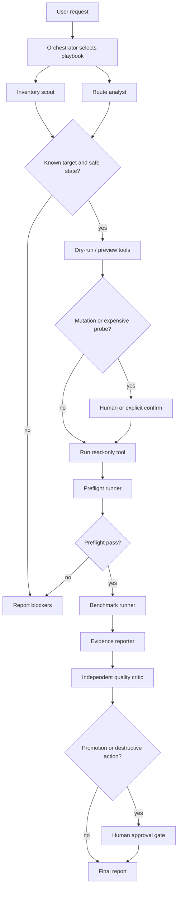

# Operator Skills And Sub-Agent Workflows

This document turns ADR-0013's "operator skill" layer into a concrete product
surface. The goal is to make most anvil-serving verbs useful to an agent without
asking that agent to rediscover the operational contract, scrape Docker output,
or guess which local model is safe for a workflow step.

The design has three layers:

1. Narrow MCP/controller tools for bounded structured operations.
2. Skills that choose a documented playbook and fill tool arguments.
3. A sub-agent workflow that lets small models handle deterministic slices while
   larger models or humans keep the policy and promotion gates.

The router remains the model data plane. These workflows operate the product.

## Resolved Direction

The most useful entry point is a portable workbench skill backed by the existing
MCP/controller tools, with harness-specific role files for Codex, Claude Code,
and OpenClaw.

The top recommendations are:

1. Ship checked-in skill files as the canonical playbook, then let
   `harness sync openclaw --skills` render or register those skills in OpenClaw.
   Generated-only OpenClaw config would leave Codex and Claude Code without a
   repo-visible workflow surface; checked-in-only config would fail to preserve
   OpenClaw's provider/model allowlist and gateway ownership boundary.
2. Keep MCP/controller tools stratified. Read-only probes, bounded logs, route
   decisions, preflight, and benchmark probes belong in MCP. Destructive repair,
   cache deletion, cloud enablement, profile promotion, and public binds remain
   human-gated CLI operations or require a separate audited approval artifact,
   not only a caller-provided boolean.
3. Use small-model sub-agents for inventory, route analysis, command preview,
   preflight, benchmark, and evidence drafting. Use an independent stronger
   critic for promotion recommendations. The model being evaluated must not
   grade its own output.

The initial checked-in entry points are:

| Harness | Entry point | Purpose |
|---|---|---|
| Codex | `.agents/skills/anvil-serving-workbench/SKILL.md` | Repo-scoped portable workbench skill. |
| Codex | `.codex/agents/anvil-*.toml` | Custom sub-agent roles with model-tier hints. |
| Claude Code | `.claude/skills/anvil-serving-workbench/SKILL.md` | Project skill using the same workbench contract. |
| Claude Code | `.claude/agents/anvil-*.md` | Project sub-agents for inventory, probes, and review. |
| OpenClaw | `examples/openclaw/skills/anvil-serving-workbench/SKILL.md` | Example skill directory for `skills.load.extraDirs`. |
| OpenClaw | `examples/openclaw/anvil-serving-workbench.example.json5` | Example skill/agent visibility fragment. |

## Implemented Now

`anvil-serving mcp --list-tools` currently exposes:

| Need | Current tool | Status |
|---|---|---|
| Deployed router health | `router_status` | Implemented |
| Compose-defined serve health | `serves_status` | Implemented |
| Environment and configured tier checks | `doctor_summary` | Implemented |
| Router decision probe | `route_decision` | Implemented |
| OpenClaw config preview/apply | `openclaw_sync` | Implemented |
| OpenClaw gateway restart | `openclaw_gateway_restart` | Implemented |
| Correctness gate probe | `preflight_probe` | Implemented |
| Bounded throughput probe | `benchmark_probe` | Implemented |

That is enough for status, route checks, basic validation, bounded benchmark
probes, and OpenClaw sync. It is not yet enough to operate every verb as a
structured agent workflow.

## Proposed Gaps

| Gap | Proposed tool or workflow | Safety boundary |
|---|---|---|
| Model inventory | `models_inventory` | Read-only by default; explicit sync preview before writes. |
| Bounded logs | `router_logs`, `serves_logs` | Tail-limited, redacted, no prompt dumps. |
| Recent routing decisions | `decision_summary` | Summaries only; no full prompt or secret material. |
| Serve lifecycle | `serves_manage` | Exact target plus dry-run before `confirm=true`. |
| Router lifecycle | `router_manage` | Status/logs/reload preview first; promotion remains human-gated. |
| Benchmark artifacts | `benchmark_run` | Separate artifact-producing tool; keep `benchmark_probe` quick and bounded. |
| External priors | `external_bench_report` / `external_bench_compare` | Always `advisory_only=true`; cannot decide promotion. |
| Host/cache work | `host_summary`, `cache_prune_plan` | Plans only until a separate human-gated mutation path exists. |
| OpenClaw skills | `harness sync openclaw --skills` | Render/apply Anvil-owned keys only; preserve operator-owned config. |

## Verb Enablement Matrix

| Area | Verbs | Best enablement | Rationale |
|---|---|---|---|
| Front door | `serve` | Skill-only runbook | Long-running process; agents inspect it through `router_status`, `/healthz`, and `/v1/models`. |
| Router lifecycle | `router status/logs/up/down/restart/reload/promote/token` | MCP for status/logs/reload/promote preview; human-gated CLI for live promotion | Promotion and lifecycle need dry-run, audit, and explicit approval. |
| Serve lifecycle | `serves status/up/down/rm/adopt/logs` | MCP for status/logs/up/down/adopt with dry-run and confirm | Serve start/stop is normal operation and should not require raw Docker. |
| Model inventory | `models sync`, `models pull`, `models recipe` | MCP for inventory and recipe read; skill/CLI for pull | Inventory is read-heavy. Pull is long-running, network/disk-heavy, and explicitly gated. |
| Bring-up generation | `init`, `doctor`, `deploy` | MCP preview/render plus CLI apply | Generated artifacts should be inspectable before write. |
| Environment repair | `host doctor`, `host wsl-config`, `host restart-docker`, `host reset-wsl` | MCP summaries and dry-run repair preview; human-confirmed CLI for disruptive repair | Restarting Docker/WSL and editing host config are high-disruption. |
| Correctness and capacity | `preflight`, `benchmark`, `eval preflight`, `eval benchmark` | MCP probes plus skill sequencing | Preflight must precede benchmark. Benchmark artifacts need explicit output paths. |
| Quality profile | `eval bootstrap`, `calibrate`, `router promote` | MCP preview/status; skill evidence packet; human promotion gate | These change routing trust. Small models can collect evidence, but not promote. |
| External priors | `external-bench init/sources/import/list/report/export/compare` | MCP read/report/compare; skill marks advisory-only | External results are useful priors, not quality evidence. |
| Harness config | `harness sync/restart openclaw` | Existing MCP plus skill workflow | Keep router presets, model allowlists, and gateway config in lockstep. |
| Controller transport | `controller serve`, `mcp --controller-url` | Skill-only bootstrap plus health checks | Binding the controller is a deployment/security decision; tool calls happen after it is up. |
| Multiplexer | `multiplexer` | Skill runbook and endpoint probes | Long-running unauthenticated data-plane process; inspect through `/healthz`, `/v1/models`, preflight, and benchmark. |
| Voice | `voice up/down/run/benchmark`, `voice-sidecar validate/command/compose` | MCP render/validate/status later; skill-only now | Useful follow-up, but outside the core coding-router workflow. |
| Local analytics | `profile`, `score`, `cache-prune` | Skill/CLI, with JSON where available | `profile` and `score` are offline analysis. `cache-prune` is destructive and keeps its confirmation gate. |

## Recommended Skills

The useful skill set is intentionally small. Each skill should be procedural and
tool-backed, not a new policy engine.

| Skill | Primary model tier | Status | Purpose |
|---|---|---|---|
| `anvil-serving-workbench` | orchestrator-selected | Seeded | Choose the playbook, spawn bounded roles, and return the workflow packet. |
| `anvil-serving-readiness` | small | Planned specialization | Run inventory/status/doctor checks and report blockers before any operation. |
| `anvil-serving-model-catalog` | small | Planned specialization | Sync or read model inventory, recipes, external priors, and serve facts. |
| `anvil-serving-serve-swap` | small plus human confirm | Planned specialization | Start, adopt, or swap a serve, then run preflight before benchmark. |
| `anvil-serving-harness-sync` | small | Planned specialization | Preview/apply OpenClaw config sync after router preset or tier changes. |
| `anvil-serving-promotion-evidence` | small collector, stronger synthesizer | Planned specialization | Assemble preflight, benchmark, calibration, and config evidence without promoting. |
| `anvil-serving-host-repair` | strong or human-assisted | Planned specialization | Diagnose WSL/Docker/GPU issues and preview safe repairs. |
| `anvil-serving-voice-ops` | small for validation, strong for failures | Planned specialization | Validate voice sidecar manifests and run bounded voice benchmarks. |

The seeded workbench skill should prefer MCP/controller tools when available.
When a tool is missing, it may call the CLI only through documented
anvil-serving verbs and should name the missing MCP wrapper as a product gap.

## Sub-Agent Workflow

Use a single orchestrator with bounded sidecar agents. The orchestrator owns the
user request, safety policy, and final recommendation. Sidecars own facts or
execution steps with explicit inputs and outputs.

| Role | Good model class | Inputs | Output | Gate |
|---|---|---|---|---|
| Orchestrator | strong/frontier | User request, repo docs, current tool list | Playbook choice, fan-out plan, final recommendation | Must stop for human gates. |
| Inventory scout | small/local | Router config, serves manifest, model catalog, MCP status | Current topology and candidate endpoints | No mutation. |
| Route analyst | small/local | Prompt/class, router route probe, decision log sample | Expected intent, tier, and risk class | No policy change. |
| Serve operator | small/local with confirm | Manifest target, serve name, endpoint | Dry-run, then confirmed start/adopt/down result | Requires exact target and confirm for mutation. |
| Preflight runner | small/local | Endpoint, model id, context, thinking settings | Pass/fail with failing checks | Benchmark blocked on fail. |
| Benchmark runner | small/local | Endpoint, model id, request shape, artifact path | JSON artifact and capacity summary | Requires preflight pass. |
| Evidence reporter | small/local | Status, preflight, benchmark, external priors, config diff | Promotion packet draft | Must mark external priors advisory-only. |
| Quality critic | strong, independent from candidate generator | Evidence packet, profile diff, acceptance thresholds | `promote`, `do_not_promote`, or `needs_more_data` recommendation | Never self-verifies model output. |
| Human approver | human | Critic recommendation and artifacts | Approve or reject live promotion/destructive action | Required for promotion, cloud enablement, host repair, public bind. |

Small models are useful where the task is mostly schema filling, status
summarization, command preview interpretation, or deterministic report drafting.
Use a stronger model when the workflow asks for ambiguous diagnosis, policy
changes, architecture changes, or synthesis across contradictory evidence.

The existing sizing code already points in this direction. `benchmark.py` uses
the measured sub-agent request distribution for its default benchmark shape, and
`_role_split.py` reports context coverage at 16K, 32K, 64K, 131K, and 262K
ceilings. Treat that as the operating principle: use smaller fast tiers for
bounded specialists and reserve large-context tiers for the main orchestrator or
long-context specialists.

## Canonical Flow



## Example: Swap Fast Tier And Produce Evidence

1. Orchestrator selects `anvil-serving-workbench` with the serve-swap playbook.
2. Inventory scout reads `serves_status`, `doctor_summary`, router config, and
   model catalog facts.
3. Serve operator previews `serves up <fast>` or the experiment compose target.
4. After explicit confirmation, serve operator starts or adopts the target serve.
5. Preflight runner calls `preflight_probe` against `http://127.0.0.1:<port>/v1`.
6. Benchmark runner calls `benchmark_probe` for a bounded probe, or CLI
   `benchmark --json-out` until `benchmark_run` exists.
7. Evidence reporter writes the packet: model id, engine, quant, GPU, context,
   preflight result, benchmark metrics, external priors, and config diff.
8. Quality critic recommends `promote`, `do_not_promote`, or `needs_more_data`.
9. Human approval is required before `router promote`, profile path changes,
   cloud-tier enablement, or a non-loopback bind.

## Result Contract

Every skill or sub-agent workflow should return a structured packet. The packet
is versioned because downstream parsers and reviewers need to distinguish
evidence from intent.

```json
{
  "schema_version": "operator-workflow/v1",
  "request": "preflight and benchmark fast tier",
  "gate_state": "human_required",
  "targets": {
    "router_config": "./router.toml",
    "serves_manifest": "./serves.toml",
    "endpoint": "http://127.0.0.1:30001/v1",
    "model": "fast-local"
  },
  "tools_used": [
    {
      "name": "doctor_summary",
      "source_class": "mcp",
      "ok": true,
      "dry_run": false,
      "confirmed": false,
      "target": "current-host",
      "error": null
    },
    {
      "name": "preflight_probe",
      "source_class": "mcp",
      "ok": true,
      "dry_run": false,
      "confirmed": true,
      "target": "http://127.0.0.1:30001/v1",
      "error": null
    }
  ],
  "artifacts": [],
  "advisory_priors": [],
  "recommendation": "needs_more_data",
  "human_gate_required": true,
  "promoted": false
}
```

Required enums:

| Field | Allowed values |
|---|---|
| `schema_version` | `operator-workflow/v1` |
| `gate_state` | `not_required`, `confirm_required`, `human_required`, `blocked` |
| `tools_used[].source_class` | `mcp`, `controller`, `cli`, `manual`, `fixture` |
| `recommendation` | `promote`, `do_not_promote`, `needs_more_data`, `blocked` |

Packets that claim `promoted=true` must include a human-approved promotion tool
result. External benchmark priors must live in `advisory_priors`, not in the
promotion-quality evidence path.

## Implementation Priorities

1. Keep the portable workbench skill files and role definitions in the repo so
   Codex, Claude Code, and OpenClaw can all discover the same workflow.
2. Add MCP/controller wrappers for read-heavy status and inventory gaps:
   model inventory, bounded logs, recent decision summaries, and benchmark
   artifact capture.
3. Add guarded lifecycle wrappers for `serves` and `router` mutation with
   dry-run plus `confirm`, while keeping profile promotion behind a stronger
   human approval artifact.
4. Implement `harness sync openclaw --skills` as a render/apply path for the
   skill and agent configuration that points OpenClaw at the right sub-agent
   roles and preset tokens.
5. Keep promotion, cloud enablement, destructive cache pruning, host repair, and
   public/non-loopback binds behind human gates.
