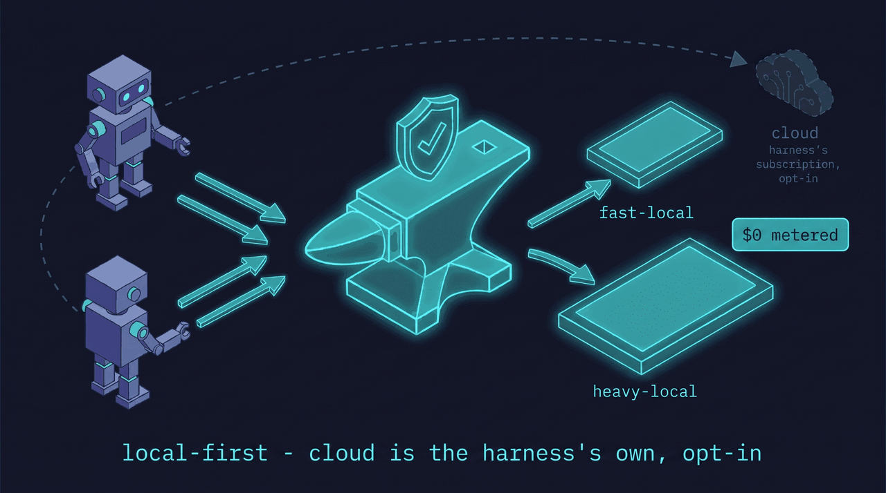
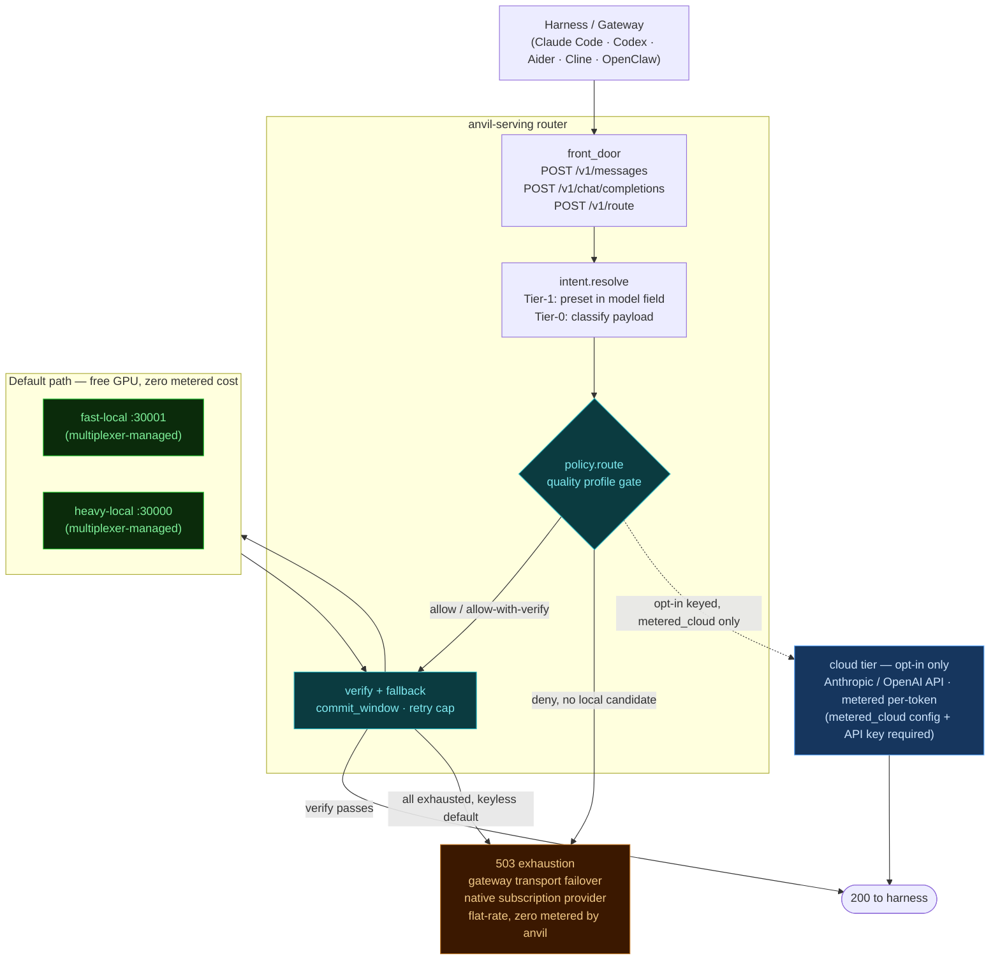
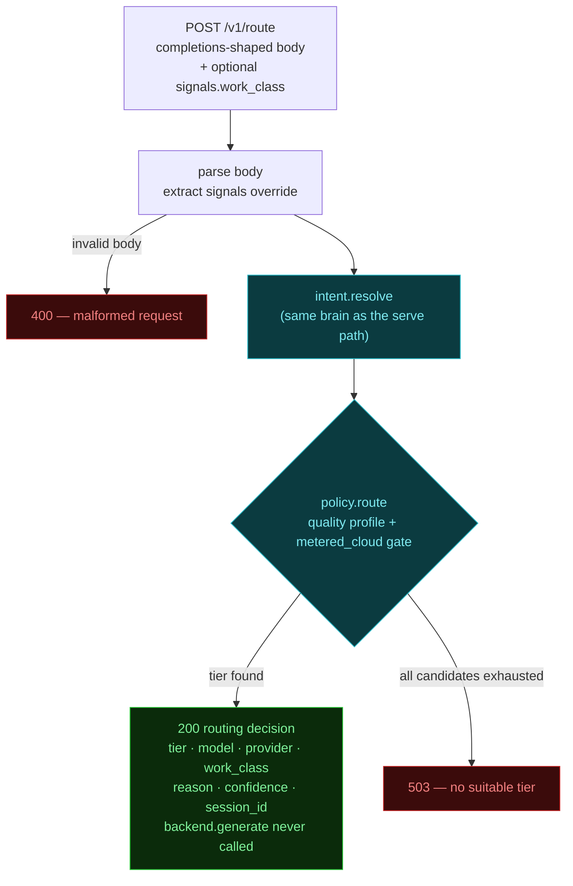
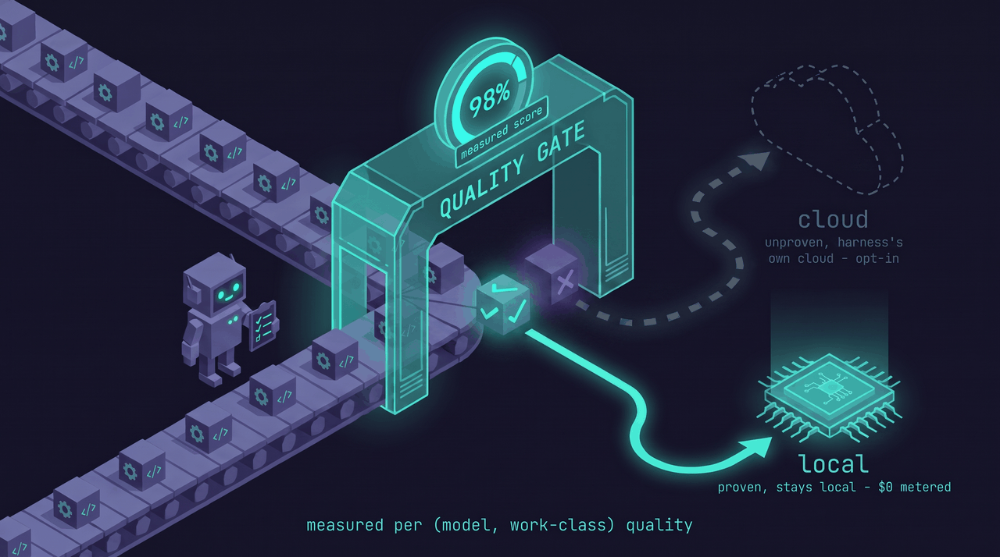
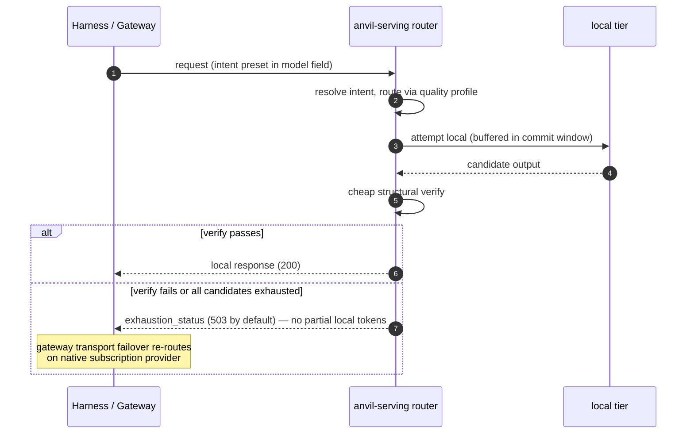
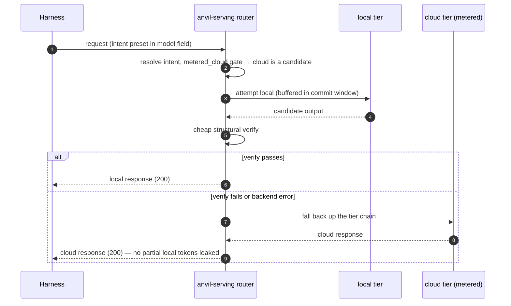

# anvil-serving as a harness product: the quality-gated router

> **Status:** shipped (v0.4.1) — design reference, rev 2026-06-30. Sets the product direction for anvil-serving
> as a **harness-facing** tool (Claude Code, Codex, Cline, Aider, Continue, any OpenAI/Anthropic
> client) rather than an anvil-coupled serving tier.
> **Grounded in** (full findings in the companion notes repo `fakoli/anvil-serving-notes`):
> the integration-point audit (the integration point is the runtime, not anvil),
> the planning-capability eval (local quality is work-class-dependent and *measurable*), and
> the harness-intent-routing research (what harnesses can actually carry on the wire — verified).

## 1. Thesis

> anvil-serving is the **workload-aware, correctness-gated local-model router** for coding
> harnesses. **Local where it's been proven, cloud where it hasn't — verified, with automatic
> fallback.**

A coding harness points at one anvil-serving endpoint. Per request, anvil-serving decides which
**tier** (fast-local / heavy-local / cloud) should serve it, based on a **measured per-(model,
work-class) quality profile**; cheaply **verifies** the result; and **falls back** to the next
tier (ultimately cloud) when the local answer fails. The harness sees one reliable endpoint and
never eats a silent local-quality failure mid-run.

## 2. Why this is the wedge (and not "another proxy")

Transport is commodity (LiteLLM, claude-code-router, Ollama, OpenRouter). None of them know
**whether local can actually do *this* work** — they route by static rules (model name, cost,
regex). The planning eval is the proof that the missing primitive exists and is buildable:

- local output is ~100% **structurally** valid but ~**2/5** on dependency reasoning — a dumb proxy
  sends that to local and silently corrupts a long agent run.
- the gap is **per-work-class and measurable**, so routing can be **evidence-based**.

The defensible asset is therefore **not** the proxy — it's the **quality profile** (per model ×
work-class, measured on the user's own workload) plus the **verify-and-fallback loop**.
Competitors can copy transport in a weekend; they can't copy "we measured that `gpt-oss-20b` is
safe for bounded edits but unsafe for dependency planning on *your* repos."

## 3. Intent addressing: callers name a use-case, not a model

The API surface is the product. Callers declare an **intent** (a capability/use-case preset like
`planning`, `quick-edit`, `review`, `chat`, `long-context`) — **not a model name**. The router owns
intent → (model, tier, params). This is what turns the quality profile from a hidden table into the
product: the caller says "give me a planning-grade answer, local if it qualifies," and our measured
knowledge of which model clears that bar *is* the value. Models become a fungible backend pool;
clients never change when models churn (re-point an intent centrally instead).

**Decision — the descriptor is a closed enum of named presets, carried in the `model` field**
("model-name-as-intent"). Verified rationale (harness-intent-routing findings, `fakoli/anvil-serving-notes`):
unmodified harnesses expose exactly one operator-controllable routing channel — the `model` string,
which is required in both wire schemas, forwarded verbatim, and free-form (only the *genuine*
upstream validates model names; a router behind the base_url may reinterpret them). Shipping
gateways already do this (OpenRouter slugs, LiteLLM aliases, Cloudflare `dynamic/<route>`). A single
flat string can only carry a preset name, so the wire vocabulary **must** be a closed preset enum;
richer multi-axis intent does not belong in the string.

- **Presets are the wire vocabulary; dimensions are the internal expansion.** Each preset resolves
  internally to hard constraints (context length, privacy=local-only, tool/structured-output
  support, cost ceiling) that *filter* the candidate pool, plus a quality intent that *ranks* the
  survivors via the profile. **Filter, then rank.**
- **Keep a `model:` override escape hatch** — some callers must pin a model (repro, debugging).
  Intent is the default/recommended surface; pinning stays available.

## 4. Architecture



```
          ┌──────────────────── anvil-serving router ───────────────────┐
harness → │ front door → resolve intent → route → [verify] → return     │ → harness
(CC/Codex)│  (Anthropic   (preset in        (filter by    │  on fail ↘          │
          │   +OpenAI      model field, else  constraints, │  fall back to       │
          │   dialects)    infer work-class)  rank by       │  next tier / cloud  │
          │                                   quality profile)                   │
          └───────────────────────────────┬──────────────┴────────────────────┘
                                           ▼
                fast-local :30001   heavy-local :30000   cloud (Anthropic/OpenAI)
                  (multiplexer-managed)                    (user's existing key/sub)
```

**Control plane (slow, offline):** `profile` → shadow-eval → **routing table** (the quality
profile). Refreshed on demand and continuously calibrated from sampled production traffic.

**Data plane (fast, per-request):** resolve intent → route → optional inline verify → fallback.
Must add negligible latency and must stream.

### Routing topology

The diagram below shows the full component topology: what modules exist, how they chain, and — most
importantly — where the **default path** ends (local tiers) vs. the **opt-in** and **escape** branches.



Key reads:
- **Solid green (local tiers):** the default path — a `deny`-free, quality-gated request never leaves the GPU box.
- **Dashed blue arrow → cloud:** only drawn when `[router].metered_cloud` is set and an API key is present; absent from `configs/example.toml`.
- **Amber (503 / escape):** the keyless-default path — anvil exhausts local, returns 503 with no local tokens committed; the upstream gateway (e.g. OpenClaw) treats this as a transport failure and re-runs on its native flat-rate subscription.

### `POST /v1/route` decision flow

`POST /v1/route` exposes the routing brain as a **decision-only endpoint** — the same `intent.resolve`
+ `policy.route` pipeline as the serve path, but it returns a JSON decision and **never calls
`backend.generate`**. The OpenClaw plugin uses it in authoritative mode; any other client can query it
to preview tier selection without incurring inference cost.



Status codes: **200** (decision made, even when `tier: cloud`), **400** (malformed / missing `model`
field), **503** (no tier survives the quality + metered-cloud gate).

## 5. The quality profile (the moat)



A table keyed `(model, work-class)` → `{quality_score, sample_n, last_measured, decision}` where
`decision ∈ {allow, allow-with-verify, deny}`. Populated by:

1. **Bootstrap** from the shadow-eval harness already built (eval data in `fakoli/anvil-serving-notes`):
   replay representative requests per work-class to each local tier, grade against cloud
   (deterministic checks + blind/LLM judge), emit the table. Generalize that harness from
   "planning" to arbitrary work-classes.
2. **Calibrate** continuously: async-sample a small % of production responses, grade with cloud
   off the hot path, update scores. The table tracks model/quant/serve changes over time.
3. **Right-size** from the user's real usage via existing `profile` (which work-classes dominate
   *their* traffic — focus measurement where it matters).

This is what makes routing *evidence-based* instead of vibes.

## 6. Routing signal: the graceful-degradation tier ladder

Intent resolution degrades gracefully to the **highest tier the originating harness can reach**.
The classifier is **not optional** — it is the universal floor, because most requests arrive on a
single session model string with no declared intent (verified: harnesses pin the model across a
small fixed set of slots per session and do not vary it per work-class within the main loop).

| Tier | Mechanism | What it unlocks | Available on |
|---|---|---|---|
| **0 — Infer** | classify work-class from raw payload (token count, `thinking` flag, tool types, image content, system-prompt fingerprint) | per-request intent **with no caller cooperation** — the default operating mode | every harness that reaches the endpoint |
| **1 — Named presets in `model` field** | caller/config sets a preset token; router maps preset → tier | caller-declared **coarse** (session-slot) intent; removes guesswork for those slots | Claude Code, Codex, Aider, Cline, Continue — **not** Cursor/Amp/Devin |
| **2 — extra_body / header dimensions** | optional structured hints (budget, latency, verifier policy) | multi-axis intent beyond the flat string — config-level, not per-request | Codex, Continue; Aider (config). Not Claude Code/Cursor |
| **3 — Native intent field** | a first-class per-request intent field | true per-request multi-axis intent | **none today** — needs a standard/harness change |

**Taxonomy v0** (start coarse; the eval shows class matters more than precision):
`chat/Q&A`, `bounded-edit`, `multi-file-refactor`, `planning/decomposition`, `review/critique`,
`long-context-retrieval`. Bias ambiguous classifications toward the safer/cloud tier and log for
calibration. (claude-code-router is the production existence proof for Tier 0+1.)

**Client-side classification (the hook-plugin pattern).** A harness with an in-process
model-resolution hook can declare per-request intent *itself*, escaping the session-coarse limit
without any wire-schema change. **OpenClaw** is the live example: its `before_model_resolve` hook
runs per turn, so a small client plugin classifies the turn and emits an anvil preset id as the
`modelOverride`. The router then receives a *declared* per-request intent (verbatim in the model
field) and needs no new field — it just needs a stable preset vocabulary. This is the preferred
shape where available: push Tier-0 classification to the client (cheaper, better-informed; it sees
full turn context) and keep the router a clean executor. Closed harnesses (Claude Code, Codex) lack
the hook, so the router's own Tier-0 classifier remains their floor.

## 7. Verify-and-fallback: two modes (contract C4)

Contract C4 has two operating modes depending on whether a metered cloud tier is configured.
Full rationale: [ADR-0001](adr/0001-cloud-cost-and-subscription-auth.md) ·
[`docs/PLAN-advise-and-defer.md`](PLAN-advise-and-defer.md).

### Mode 1 — Keyless (default)

**The default config (`configs/example.toml`) holds no cloud API key.** All candidate tiers are
local; a cloud tier is never in the routing pool.



When an `allow-with-verify` response fails the structural verify gate, `route_with_fallback`
exhausts all candidates (returning `FallbackResult(exhausted=True)`); the serving layer
(`RoutingBackend.generate`) then raises `NoAvailableTierError`. The front door maps this to
**`exhaustion_status`** (default 503, configurable via `[router].exhaustion_status` to match the
gateway's transport-failover trigger). The **commit window** guarantees no partial local tokens
reach the harness before the error response — the harness sees an unambiguous availability signal,
not a corrupt partial response.

For a gateway like OpenClaw that fronts the harness, the 503 triggers native transport failover
("overloaded" category), which re-runs the request on the gateway's native subscription provider —
the flat-rate subscription the operator already holds. anvil holds **no cloud key**; the metered
surface is absent from the default path. **$0 metered API billing.**

> **Live-validation caveat (T005 — pending):** that anvil's exhaustion-503 maps to OpenClaw
> 2026.6.6's "overloaded" failover category is confirmed by reading `run.ts` but has not yet
> been validated against a live OpenClaw install. If it does not trigger failover, set
> `[router].exhaustion_status` to the status code that does. See Phase 1 in
> [`docs/PLAN-advise-and-defer.md`](PLAN-advise-and-defer.md).

### Mode 2 — Opt-in keyed (metered cloud tier)

An operator who explicitly configures a cloud tier and maps specific work-classes to it via
`[router].metered_cloud` gets **router-internal escalation**: a verify failure escalates to the
cloud tier and returns a **200** with the cloud response, without the harness seeing an error.



This mode requires:
1. A `[[router.tiers]]` entry with `privacy = "cloud"` and `auth_env` naming the API key env var.
2. `[router].metered_cloud = ["work-class", ...]` — the **explicit per-intent opt-in list**.
   Empty/absent = cloud is never a routing candidate, even if a cloud tier is declared.

See `configs/example-with-cloud.toml` for the full opt-in config. Cost fields
(`cost_input_per_mtok`, `cost_output_per_mtok`) on the tier drive the decision log + metrics.

> **Billing note:** routing through a metered cloud tier incurs per-token API billing on every
> cloud-served request. This is **not** the flat-rate subscription — it is the raw
> `api.anthropic.com` / `api.openai.com` metered surface. Prefer Mode 1 (keyless + gateway
> transport failover) wherever the gateway supports it; use Mode 2 only for single-endpoint
> harnesses that cannot route cloud themselves.

### The `allow`-path tradeoff: latency vs. error quality

The quality profile assigns each `(model, work-class)` pair one of three decisions:
`allow`, `allow-with-verify`, or `deny`. This decision carries an inherent latency
vs. error-quality tradeoff for any request that reaches a local tier:

- **`allow` (fast-path):** tokens are streamed directly to the harness as they arrive —
  no commit window, minimum latency. If the backend fails mid-stream (dropped connection,
  OOM-kill, truncated output), partial tokens have already been written. There is no
  clean fallback: the harness sees a truncated stream rather than an unambiguous HTTP
  error.

- **`allow-with-verify`:** the response is buffered in the commit window before any
  token is released to the harness. Verification runs on the buffered output. A failure
  — whether a backend error or a failed verifier — triggers a clean fallback with zero
  partial tokens delivered (the C3 guarantee). The harness sees either a complete,
  verified response or an unambiguous exhaustion status (503 by default).

This asymmetry is inherent to the `allow` fast-path's latency benefit. It is a deliberate
per-(model, work-class) decision: use `allow` only where a tier is proven reliable enough
that mid-stream failure is operationally acceptable; use `allow-with-verify` where clean
fallback matters — structured output that downstream tooling must parse, multi-file edits,
or any class where a partial result is worse than no result. The quality profile's
calibration loop (§5) provides the evidence base for that decision.

### Verification tiers (both modes)

Inline LLM-grading every response would defeat the purpose (cost + latency). So **most "quality
control" is routing done ahead of time** (§3–6); verification is a cheap safety net, tiered:

1. **Prevent (primary):** never send a `deny` work-class to local. Free; catches the biggest risks
   (e.g. dependency planning → cloud/gateway, always).
2. **Cheap structural verify (inline):** near-zero-cost checks that caught real failures in our
   eval — empty/truncated content (thinking-budget starvation), tool-call JSON that doesn't
   validate, code that doesn't parse, a diff that doesn't apply, malformed format. Fail → fallback.
3. **Confidence signals (inline, where available):** logprob/entropy thresholds, refusal/uncertainty
   markers.
4. **Async LLM-judge (off hot path):** sampled cloud grading that feeds the profile (§5.2), not a
   blocking gate.

**Fallback policy:** on verify-fail / error / timeout / low-confidence → retry next candidate in
the ordered tier list. Guardrails: cap retries, prevent thrash, make fallback idempotent for the
harness (especially mid-stream — see §13), and **log every fallback** (a fallback is a profile
signal: that class may need to be downgraded to `deny`).

## 8. Harness integration + the per-harness reality

One front door speaking two dialects so it's zero-config for the major harnesses:
- **Anthropic Messages API** → Claude Code via `ANTHROPIC_BASE_URL` / `ANTHROPIC_AUTH_TOKEN`;
  honor `CLAUDE_CODE_SUBAGENT_MODEL` / `ANTHROPIC_DEFAULT_HAIKU_MODEL` slot semantics.
- **OpenAI Chat Completions** → Codex / Cline / Aider / Continue / generic clients.
- Translate dialects + absorb backend quirks (thinking-default models need generous `max_tokens`
  and can't take `chat_template_kwargs` over some paths; the sm_120 engine/quant matrix). **Absorbing
  this friction is itself a feature.**

Verified support grid (full detail + citations in the finding):

| Harness | base_url? | arbitrary model string? | per-request hook / extra fields | intent slots/session | tier |
|---|---|---|---|---|---|
| **OpenClaw** | ✅ per-provider `baseUrl` | ✅ self-allowlisted, verbatim | ✅ **`before_model_resolve` hook → `modelOverride` per turn** (no header/body channel) | per-agent + per-turn override | **1→2 (routing)** |
| **Hermes Agent** | ✅ `provider: custom`+`base_url` | ✅ verbatim | ❌ over wire (hooks inject user-msg text only) | main + ~11 aux + fallback/MoA/subagents | **1 (rich)** |
| Claude Code | ✅ env | ✅ (`ANTHROPIC_CUSTOM_MODEL_OPTION` skips validation; sent as-is) | ❌ (only fixed opaque `metadata.user_id`) | ~3–4 (main/haiku/subagent/advisor) | **1** |
| OpenAI Codex CLI | ✅ config.toml | ✅ free-form | ⚠️ config-level `http_headers`/`query_params` | 1 + subagent | **1 (+2)** |
| Aider | ✅ env | ✅ `openai/<token>` | ⚠️ config-level | ~3 (main/editor/weak) | **1** |
| Cline | ✅ field | ✅ free-text | ❓ undocumented | ~1–2 | **1** |
| Continue.dev | ✅ `apiBase` | ✅ free string | ✅ `requestOptions.headers` (config) | role-based | **1 (+2)** |
| Cursor | ⚠️ backend-mediated + Verify gate | ⚠️ fragile | ❌ | server-side auto | **0 / unusable** |
| Amp / Devin / closed SaaS | ❌ backend-locked | — | — | — | **none** |

**Scope qualification (important):** **Cursor, Amp, and Devin are out of scope** for self-hosted
routing — Cursor mediates through its own backend (Verify-gated), and Amp/Devin can't be repointed
at a custom endpoint at all. The README's "any OpenAI/Anthropic client" claim must be qualified to
"any client that allows a custom base URL **and** a free-form model string."

**OpenClaw is the one in-scope client that crosses into per-request routing** (open-source TS Plugin
SDK; its `before_model_resolve` hook runs *per turn* and can set `modelOverride`/`providerOverride`).
**Hermes Agent** (open-source MIT) is a clean, *rich* Tier-1 consumer — notably more model slots than
Claude Code — but its hooks can't alter the outgoing request, so it stays Tier-1 short of a fork
(OpenClaw/Hermes customization findings in `fakoli/anvil-serving-notes`).

**Beachhead decision — OpenClaw-first (focus, not couple).** anvil-serving concentrates integration
*depth* on OpenClaw as the first-class client, because it's the one harness that unlocks per-request
intent (the `before_model_resolve` hook → the client-side classification pattern in §6), it's
open-source (we can ship a reference plugin and patch upstream), and one OpenClaw integration reaches
the many chat surfaces it already bridges. **This is focus, not coupling:** the core router stays
protocol-standard (Anthropic + OpenAI dialects), so every other harness still gets Tier 0/1 for free,
and the OpenClaw piece is a **thin, swappable adapter/plugin** — if OpenClaw stalls, the core survives
and another hook-capable harness takes the beachhead. (Same lesson as not coupling to Anvil:
integrate at a standard seam, focus effort at one client.) This is anvil-serving's choice and does
**not** affect Anvil-the-ledger's harness-agnostic mandate — different products, different mandates.
Risk to manage: OpenClaw is young and the extension surface is churning (medium risk) — verify the
plugin/provider API hands-on before over-investing. Buildable spec + the validate-first gaps:
[`OPENCLAW-INTEGRATION-SPEC.md`](OPENCLAW-INTEGRATION-SPEC.md).

## 9. Preset vocabulary, discovery, and transparent responses

- **Vocabulary = a closed enum sized to harness slots.** Don't over-design. A handful of presets
  mapping onto taxonomy v0 (§6) and the slots harnesses actually emit (main / background / subagent).
  Flat — no multi-axis encoding in the string.
- **Discovery via `/v1/models`.** Serve a `/v1/models` listing the preset tokens with human-readable
  names/descriptions, so presets are first-class in the harness UI. Claude Code populates its
  `/model` picker from a gateway's `/v1/models` when `CLAUDE_CODE_ENABLE_GATEWAY_MODEL_DISCOVERY=1`;
  `ANTHROPIC_CUSTOM_MODEL_OPTION` is the single-entry alternative.
- **Transparent response.** The abstraction is on the *request*; the *response* stays honest — set
  the response `model` to the **real** model/tier that served (OpenRouter does this), and log the
  `(declared-or-inferred intent → tier → verify result → fallback?)` decision. Hiding what ran kills
  debuggability and the local-first trust story.
- **Session stickiness + mapping versioning.** Don't swap models mid-conversation unless
  quality/health forces it (turn-level switch boundaries). The same intent may route differently as
  the profile recalibrates — surface a mapping version and allow pinning for reproducibility.

## 10. Extensibility / plugin seams

The router is a pipeline, so "plugin architecture" mostly means **naming its stages as typed seams**
(`typing.Protocol` + a small in-process registry), not a framework. Split:
- **Internal seams — now:** Protocols + registry so maintainers drop in implementations without
  touching the core. Nearly free; good structure for M0–M2. The multiplexer already proves the
  pattern (per-engine SGLang+vLLM dispatch behind one interface).
- **Public third-party plugin SDK — defer to M3+:** `importlib.metadata` entry points (stdlib — no
  plugin lib, preserves "stdlib-only by design"), a versioned contract, a capability manifest, trust.
  Publishing a plugin API too early freezes interfaces still in flux.

| Seam (`Protocol`) | swaps | plane | early? |
|---|---|---|---|
| **`Intent`/preset** | a use-case (its constraints + quality req + candidate pool + verifiers) | control | **headline extension point** |
| `Dialect` (front door) | Anthropic / OpenAI / future protocols | data | yes (M0 needs 2) |
| `Classifier` | request → work-class | data | yes |
| `RoutingPolicy` | (intent, profile, health) → ordered tier list | data | yes |
| `Backend` | tier → inference engine | data | **exists** (multiplexer) |
| `Verifier` | response → pass/fail/score (cheap, **chainable**) | data | yes |
| `Grader` | async quality grading for calibration | control | yes |
| `ProfileStore` | where the quality table lives | control | maybe |
| `Observer`/hook | logging, metrics, fallback events | cross | yes |

**Contract rules from day one:** (1) **failure isolation = fallback** — a plugin that throws/times
out is treated as another fallback trigger (composes with the wedge; wrap + circuit-break); (2)
**latency budget** — data-plane plugins declare & respect a budget, heavy work goes async; (3)
**versioned contracts** — registry refuses incompatible plugins (why the public SDK waits); (4)
**trust** — plugins run arbitrary code in the request path (fine for local-first/own; signing/allowlist
for third-party). Don't build dynamic loading or a manifest spec until a seam has a real second impl.

## 11. Reuse map — most of this exists

| Capability | Module | Status |
|---|---|---|
| Right-size from real usage | `profile` | exists |
| Per-model serving facts / sane defaults | `models sync`, `analyze` | exists / designed |
| Bring up + on-demand model swap on one GPU | `multiplexer` (multi-engine, single-resident) | exists |
| Correctness gate | `preflight` | exists |
| Throughput / capacity measurement | `benchmark` | exists |
| Per-work-class quality measurement | shadow-eval harness | **built** (generalize) |
| **Front door + intent-resolve + route + verify + fallback** | new `router` module | **the build** |

The genuinely-new surface is the router data plane + the quality-profile control plane. The serving
substrate is already here.

## 12. MVP milestones

- **M0 — front door:** Anthropic + OpenAI endpoints, pass-through to one backend, streaming. Makes
  anvil-serving drop-in for Claude Code today. Define the `Dialect` and `Backend` Protocol seams.
- **M1 — Tier 0 + Tier 1 together:** the classifier (Tier 0, the floor) **and** preset parsing from
  the `model` field (Tier 1) — *not Tier 1 alone*, because most traffic arrives without a declared
  intent. Tier rules over the multiplexer (bounded→fast, long-ctx→heavy, planning/review→cloud);
  hand-authored table. Serve `/v1/models` preset discovery.
- **M2 — the wedge:** cheap structural verify + verify-gated fallback (streaming commit window;
  cloud escalation is the opt-in keyed mode — the keyless default returns an exhaustion-503 for
  gateway handoff) **and transparent responses** (echo the served model/tier). First release
  delivering the unique promise.
- **M3 — measured table + plugin SDK:** generalize the shadow-eval to populate the quality profile
  per work-class; replace the hand-authored table; add async calibration; expose public plugin entry
  points. The moat turning on.

Ship M0–M2 to be *useful and unique*; M3 makes it *defensible*.

## 13. Risks / open questions

- **Per-request granularity is capped by the harness** (verified constraint): a harness configured
  with one model can't declare different intents per call within the main loop — the **classifier is
  load-bearing, not optional**. Design around it; don't assume callers can tag every request.
- **Classification accuracy** — wrong class → wrong route. Mitigation: coarse taxonomy, bias
  ambiguous→safer tier, log+calibrate. (Eval shows class matters more than precision.)
- **Streaming + mid-stream fallback** — the hardest engineering problem: both APIs stream via SSE
  (OpenAI data-only chunks; Anthropic named events), and verify-before-deliver fights low-latency
  streaming. Likely need a short non-streamed "commit window" for fail-prone classes, or speculative
  buffering. **Spike this early.**
- **Verify cost/latency** — must stay structural/cheap inline; anything heavier goes async.
- **Fallback thrash / cost blowups** — caps, circuit-breakers, per-session budget awareness.
- **Stateful agents** — switching tiers mid-conversation must preserve context; turn-level boundaries.
- **Profile staleness** — model/quant/serve swaps invalidate rows; key the table on a serve
  fingerprint and re-measure on change.
- **Privacy** — async cloud calibration sends sampled local traffic to a cloud grader; opt-in and
  redactable (a selling point for the local-first crowd, so get it right).

## 14. Success metrics

- **% of agent traffic safely served local** (the capacity/cost win) at a **bounded rework rate**
  (the quality guarantee) — the two numbers that define the product.
- **Silent-failure rate ≈ 0** (verify+fallback catches local misses before the harness does).
- **Cloud tokens saved** vs all-cloud, holding accept-rate constant.
- **Drop-in time** (minutes from `pip install` to a harness running through it).

## Appendix — config recipes (how to carry intent today)

**Claude Code** (intent preset per slot):
```bash
export ANTHROPIC_BASE_URL="https://anvil.local"
export ANTHROPIC_AUTH_TOKEN="…"                  # → Authorization header
export ANTHROPIC_MODEL="planning"                # main-loop intent, sent verbatim
export ANTHROPIC_DEFAULT_HAIKU_MODEL="quick-edit" # background/utility intent
export CLAUDE_CODE_SUBAGENT_MODEL="review"       # subagent-class intent
export ANTHROPIC_CUSTOM_MODEL_OPTION="long-context"   # optional: surface a preset in /model
export CLAUDE_CODE_ENABLE_GATEWAY_MODEL_DISCOVERY=1   # optional: enumerate router presets
# enterprise fleets: add the preset tokens to availableModels if that allowlist is set
```

**Aider** (preset rides in the model string; `openai/` prefix forces compat routing):
```bash
export OPENAI_API_BASE="https://anvil.local/v1"
export OPENAI_API_KEY="…"
aider --model openai/planning --editor-model openai/quick-edit --weak-model openai/chat
# the "model … not familiar with" warning is cosmetic; routing works
```

**Cline / Continue.dev** — select "OpenAI Compatible"; Base URL `https://anvil.local/v1`, Model (ID)
= a preset token. Continue can attach Tier-2 hints via `requestOptions.headers`.

**OpenAI Codex CLI** (`~/.codex/config.toml`) — Tier 1 + optional Tier 2 side-channel:
```toml
model = "planning"
model_provider = "anvil"

[model_providers.anvil]
base_url = "https://anvil.local/v1"
wire_api = "chat"                                  # third-party gateways commonly use "chat" (version-dependent)
http_headers = { "x-anvil-intent" = "planning" }   # optional Tier-2 dimension
```

**Cursor / Amp / Devin** — not supported for self-hosted routing (backend-mediated / backend-locked).
