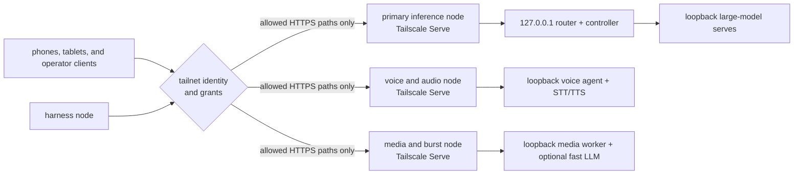

# Private networking with Tailscale

Anvil Serving is local-first: model engines, STT/TTS processes, ComfyUI, the
router, and the controller can all remain bound to `127.0.0.1` on the device
that owns them. For a multi-device deployment, the reference network uses a
[Tailscale tailnet](https://tailscale.com/docs/concepts/tailnet) to make a
small number of reviewed front doors reachable without publishing the raw
services to the public internet.

Tailscale is optional for a single-host installation. It is the recommended
prerequisite for the documented multi-device shape because Anvil Serving's
`edge` commands manage Tailscale Serve mappings directly. Another private
network can provide reachability, but it does not provide that managed edge
integration.

## The idea in one diagram



The important boundary is where the request terminates. A URL such as
`https://primary.example.ts.net/v1/models` reaches the Tailscale daemon on the
primary inference node. Tailscale Serve then proxies that request to the
router on `http://127.0.0.1:8000`. The router and all raw model ports can stay
on loopback; callers never connect to those model ports directly.

`127.0.0.1` is host-relative. A harness cannot use its own
`127.0.0.1:8000` to reach a router on another device. It uses the reviewed
MagicDNS endpoint, and the owning device completes the final loopback hop.

## A role-based deployment

Machine names and active assignments are private operator state. Public
configuration should describe roles instead:

| Device role | Typical ownership | Tailnet exposure |
| --- | --- | --- |
| Primary inference node | Capability Gateway, controller, and the large models used for normal work. | Authenticated gateway and controller paths only; never raw model-engine ports. |
| Harness node | OpenClaw, Codex, Claude Code, MCP stdio bridges, and other client runtimes. | Usually none. It initiates calls to resource-owning nodes. |
| Voice and audio node | Voice agent or Realtime proxy plus STT and TTS processes. | Only the authenticated voice front door required by approved clients. |
| Media and burst node | ComfyUI/media worker and an optional fast LLM used for bounded workloads. | Anvil gateway/controller paths; expose the ComfyUI UI only as a separate reviewed choice. |
| Mobile or operator device | Browser, voice client, monitoring, and approved operator actions. | No inbound service by default; user identity controls what it may reach. |

One device can own several roles, and a role can move without changing the
caller-facing capability contract. The private topology records the real
owner and MagicDNS name. The public product documentation does not.

## What Tailscale owns—and what Anvil still owns

The two products enforce different layers of the connection:

| Layer | Authority | What it proves |
| --- | --- | --- |
| User and device admission | Tailscale identity provider login, node identity, and optional user/device approval | The user and device are admitted to the tailnet. |
| Network reachability | Tailscale grants or legacy ACLs | This source identity may connect to this destination and port. |
| Private naming and transport | MagicDNS plus WireGuard-encrypted direct or relayed connections | The approved device can find and privately reach the destination node. |
| Loopback publication | Tailscale Serve | A selected tailnet HTTPS path proxies to one service on the owning device's loopback interface. |
| Application authentication | Anvil router/controller token | The caller is authorized to use the Anvil protocol surface. |
| Operational authority | Anvil topology, typed tools, dry-run/confirm gates, and audit evidence | The request targets the declared owner and is allowed to perform that operation. |

Tailnet membership is not application authentication. Keep
`ANVIL_ROUTER_TOKEN` and `ANVIL_CONTROLLER_TOKEN` enabled on published Anvil
surfaces even when Tailscale grants restrict who can reach them. Conversely, a
valid Anvil token does not create a network path through a grant that denies
the connection.

Tailscale Serve can add identity headers to proxied requests, but Anvil
Serving does not treat those headers as its authentication contract. This
avoids accidentally replacing application auth with an unreviewed proxy-header
trust boundary.

## Identity and least privilege

Tailscale associates a human login with each user-owned phone, tablet, or
laptop and establishes a separate node identity for the device. For dedicated
non-human servers, use [tags](https://tailscale.com/docs/features/tags) as the
device identity. Do not tag a personal user device merely to label it: a
Tailscale node has either user ownership or tag ownership, and applying a tag
removes the user ownership association.

New tailnets begin with permissive access so the first devices can connect.
Before treating the tailnet as the Anvil security boundary, replace that
default with least-privilege policy. Tailscale recommends
[grants](https://tailscale.com/docs/reference/syntax/grants) for new policy;
first-generation ACLs remain supported.

The following HuJSON is a starting shape, not an operator policy to copy
unchanged:

```json
{
  "groups": {
    "group:anvil-operators": ["operator@example.com"],
  },

  "tagOwners": {
    "tag:anvil-primary": ["group:anvil-operators"],
    "tag:anvil-harness": ["group:anvil-operators"],
    "tag:anvil-voice": ["group:anvil-operators"],
    "tag:anvil-media": ["group:anvil-operators"],
  },

  "grants": [
    {
      "src": ["group:anvil-operators"],
      "dst": ["tag:anvil-primary", "tag:anvil-voice", "tag:anvil-media"],
      "ip": ["tcp:443"],
    },
    {
      "src": ["tag:anvil-harness", "tag:anvil-voice"],
      "dst": ["tag:anvil-primary"],
      "ip": ["tcp:443"],
    },
    {
      "src": ["tag:anvil-primary"],
      "dst": ["tag:anvil-media"],
      "ip": ["tcp:443"],
    },
  ],
}
```

Adapt the identities and exact ports, add policy tests, and prove that a denied
identity cannot connect. Do not grant access to raw inference ports simply
because the machines share a tailnet.

## Publish a loopback service

On the resource-owning device:

1. Install Tailscale and join the intended tailnet.
2. Enable MagicDNS. Tailscale Serve over HTTPS also requires tailnet HTTPS
   certificates to be enabled.
3. Keep the Anvil service bound to `127.0.0.1` and configure its application
   token by environment-variable name.
4. Preview the exact managed mappings, inspect live state, then apply only the
   reviewed paths:

   ```bash
   anvil-serving edge render --config <edge.toml>
   anvil-serving edge status --config <edge.toml>
   anvil-serving edge up --config <edge.toml> --dry-run
   anvil-serving edge up --config <edge.toml> --confirm
   anvil-serving edge status --config <edge.toml>
   ```

5. From an allowed peer, call the MagicDNS HTTPS endpoint with the Anvil
   token. From a deliberately denied peer or identity, verify that the network
   policy blocks the connection.

`anvil-serving edge down` removes only mappings that still match its managed
targets. It does not use `tailscale serve reset`, so unrelated operator-owned
Serve configuration remains intact. Read [One tailnet endpoint](TAILNET-ENDPOINT-RUNBOOK.md)
for the exact route-map contract and rollback procedure.

Directly binding the router or controller to a Tailscale IP remains possible,
but it expands the process's listener beyond loopback. Prefer the
Serve-to-loopback shape unless a protocol or measured performance requirement rules it
out. Any non-loopback bind still requires Anvil application authentication.

## Stable names, changing placement

[MagicDNS](https://tailscale.com/docs/features/magicdns) gives each node a
tailnet DNS name. Use the name reported by Tailscale instead of recording a
real tailnet IP or DNS suffix in public files. Private operator configuration
can map a stable role to the current node name and change that mapping when a
workload moves.

Machine names are still device names, not capability aliases. Moving
`llm.primary` to another serve remains a reviewed Anvil topology and promotion
change; changing a MagicDNS record or Tailscale tag does not prove the new
model is qualified.

## Phones, tablets, and other people

Tailscale clients are available for desktop and mobile platforms. A phone or
tablet joins with its user's identity, is admitted like any other device, and
can reach only the nodes and ports allowed by policy. That makes the same
private gateway or voice endpoint usable away from the local LAN without
opening a public port.

For another person, choose the smallest collaboration boundary:

- Invite them to the tailnet when they need evolving access to several
  resources, then constrain that identity with grants.
- [Share one machine](https://tailscale.com/kb/1084/sharing) when they need
  access to a fixed node without joining the whole tailnet. Review every port
  reachable on that node; sharing is a machine boundary, not an Anvil path
  permission.
- Keep Anvil application tokens and protocol-level authorization in either
  case. Do not use Tailscale Funnel for this private deployment; Funnel is a
  public-internet exposure feature.

## “Ephemeral” has a specific meaning

This architecture creates a portable private overlay, but its long-lived
inference, voice, media, and harness nodes are not Tailscale
[ephemeral nodes](https://tailscale.com/docs/features/ephemeral-nodes).
Ephemeral nodes are intended for short-lived containers, functions, and CI
workers; they are automatically removed after inactivity and can return with
a different IP. Use ordinary approved nodes for stable Anvil roles. Use an
ephemeral auth key only for a genuinely short-lived worker with a narrow tag
and grant.

## Verification checklist

- Every raw model, STT, TTS, ComfyUI, router, and controller listener has an
  explicit owner and bind address.
- Only reviewed front-door paths are projected with Tailscale Serve.
- MagicDNS and HTTPS are read from the live tailnet, not hardcoded publicly.
- Human devices retain user identity; dedicated service nodes use reviewed
  tags.
- Grants deny traffic that is not explicitly required, and policy tests cover
  expected allow and deny cases.
- Published Anvil surfaces still require their router or controller token.
- A real allowed client passes health, exact identity, and functional smoke
  checks; network reachability alone is not qualification.
- External users receive the smallest useful invitation or machine share and
  can reach nothing else.

## Further reading

- [Tailscale identity](https://tailscale.com/docs/concepts/tailscale-identity)
- [Tailscale Serve](https://tailscale.com/docs/features/tailscale-serve)
- [Tailscale connection types](https://tailscale.com/docs/reference/connection-types)
- [Tailscale device approval](https://tailscale.com/docs/features/access-control/device-management/device-approval)
- [Device topologies](DEVICE-TOPOLOGIES.md)
- [Security policy](https://github.com/fakoli/anvil-serving/blob/main/SECURITY.md)
- [Public product and private operator state](OPERATOR-PRIVACY.md)
