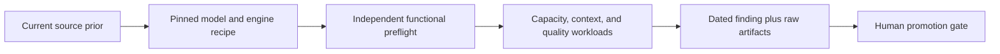

# Benchmark methodology and evidence rules

The benchmark guide is designed to grow without turning unlike measurements
into a misleading leaderboard. This page defines the vocabulary, comparison
classes, execution pipeline, and minimum publication record.

## Evidence and decision labels

Every published run carries one or more evidence labels:
`external-prior`, `compatibility-only`, `functional`, `capacity`, `quality`,
and `historical-invalid`. The decision is recorded separately as `current`,
`rollback`, `challenger`, `no-promotion`, or `rejected`.

The measured GPU is the card that executed the workload.
`protected/co-resident` means another card or service remained available during
the run; `topology-only` means the hardware was described but not exercised.
Neither is measurement evidence. In particular, the July 28 ASR qualification
measured the RTX 5090 while protecting the RTX PRO 6000.

## Measurement classes

| Label | What it measures | What it does not establish |
|---|---|---|
| **Functional gate** | Endpoint health, short generation, structured JSON, long-context needle, and tool-call fan-out | General intelligence or sustained throughput |
| **Short capacity** | TTFT, end-to-end latency, completion rate, and aggregate output tok/s for a fixed prompt set and concurrency | Controlled decode speed when answers are short |
| **Controlled decode** | Output tokens per decode interval on a sufficiently long, fixed generation workload | Prefill speed, reasoning quality, or tool reliability |
| **Protocol-v3 quality** | Visible-answer correctness under an explicit reasoning-headroom budget, with truncation, finish-reason, and repeated-attempt accounting | Broad leaderboard quality beyond the small retained slices |
| **Long-context validation** | A needle or equivalent correctness check at a stated token length | The model-card maximum, multiple simultaneous maximum windows, or useful recall at every length |
| **External prior** | Current official recipe, model-card claim, or dated community lead used to choose candidates | A local RTX PRO 6000 result |
| **Historical invalid** | A retained run whose protocol flaw prevents the claimed comparison | Promotion evidence; it remains useful for diagnosing the harness |

Only rows with the same label, hardware, workload, and material recipe settings
should be ranked directly.

## Metric dictionary

**Time to first visible token (TTFT).** Time from request start until the first
non-empty streamed content delta. For a model without a separate reasoning
channel, it includes queueing, prefill, and first-token work. For a reasoning
model, hidden reasoning can occur before this point, so TTFT is a user-visible
latency measure and must not be treated as a prefill boundary.

**Time to first output (TTFO).** Time from request start until the first
non-empty streamed reasoning or content delta. `capacity-v4-reasoning` records
TTFO separately from TTFT so hidden reasoning is not mislabeled as prefill.
For a non-reasoning response, TTFO and TTFT are the same event.

**End-to-end latency (E2E).** Time from request start until the response
finishes. Always publish output-token counts or workload identity beside it.

**Standalone prefill throughput.** Prompt tokens divided by an isolated prefill
interval. Do not derive this from TTFT unless the harness separately records the
queueing and first-token components. When that evidence is absent, publish the
long-context TTFT as a labeled prefill-latency proxy and leave prefill tok/s
blank.

**Effective client-observed prefill rate.** Prompt tokens divided by the
protocol's first-output boundary: TTFT in `capacity-v3`, TTFO in
`capacity-v4-reasoning`. This includes queueing, scheduling, prompt processing,
and first-output work, so it is useful for matched end-to-end A/Bs but is not
standalone or kernel-only prefill throughput. Both protocols label the field
`effective_prefill_tok_s`; the protocol identity is therefore required before
comparison.

**Generation duration.** Client-observed E2E minus the protocol's first-output
boundary. In `capacity-v3` that is TTFT. In `capacity-v4-reasoning` it is TTFO,
so the interval includes reasoning and visible generation. The reasoning-aware
protocol also retains `visible_generation_ms` from first visible content to the
end of the response.

**Controlled decode rate.** For a long-generation workload, approximately:

```text
(output tokens - 1) / generation seconds
```

The harness should retain its direct timing fields and token counts. Avoid this
derived rate for very short outputs, where timer and scheduling overhead dominate.
When usage completion tokens include reasoning tokens, the reasoning-aware
protocol's rate describes the combined completion stream, not visible-only
decode.

**Mean inter-token latency.** Generation duration divided by
`output tokens - 1`. This is a per-request mean interval, not a raw timestamp
trace for every token.

**Aggregate output throughput.** Total output tokens across all requests divided
by wall time. This is useful for batch capacity at a stated concurrency, but it
is not interchangeable with per-request controlled decode.
The local harness uses `usage.completion_tokens` when the endpoint returns it.
Under capacity measurement protocol `capacity-v3`, usage is required for exact
token throughput, effective prefill, decode, and mean inter-token metrics.
When usage is absent, exact token-derived values are null and streamed content
chunks are retained only as a diagnostic rate. Each successful request retains
its planned context, request index, prompt/output token counts, TTFT, generation
duration, E2E, effective prefill, decode rate, and mean inter-token latency.
Comparison tooling treats different capacity measurement protocols as a
workload mismatch. `capacity-v4-reasoning` additionally retains TTFO,
first-visible TTFT, reasoning-chunk count, and a generation interval beginning
at first output. Failed reasoning-only completions remain failures rather than
being silently converted into visible latency samples.

**Percentiles.** Capacity summaries use the nearest-rank method over successful
samples. Sort the values, compute `ceil(percentile * sample_count / 100)`, and
select that one-based rank. Failed requests are reported separately rather than
inserted as synthetic latency values.

**Concurrency.** The number of active requests driven by the harness. Report it
separately from the engine's admission cap (`max_num_seqs`). Prefix caching or
RadixAttention changes results when prompts share prefixes, so publish cache
policy and prompt independence.

**Served context.** The configured engine limit. **Validated context** is the
largest length that passed a retained correctness check. **Advertised context**
is only a model-card claim. Never substitute one for another.

**Reasoning headroom.** The allowance added to a separate visible-answer
allocation. Protocol v3 sends their sum as the endpoint's single completion cap;
it cannot hard-partition hidden and visible channels. A 4,096-token headroom plus
the standard 256-token visible allocation therefore sends `max_tokens=4352`.
A wrong visible answer and a truncated/no-visible-answer attempt are different
failure modes and must be counted separately.

**Stable quality.** An item is stable only when every retained repeat is correct.
Publish both stable items and total correct attempts, such as `8/10 stable,
23/30 attempts`.

**Sampled context plan.** Capacity sampling uses measured cumulative context
buckets and a recorded pseudorandom seed. The full plan is resolved before
workers are submitted, so thread scheduling cannot change which context lengths
the run attempts. Prefix-cache bursts share a byte-identical bounded prefix and
retain a unique request suffix.

## Evaluation pipeline


```mermaid
flowchart LR
    A["Current source prior"] --> B["Pinned model and engine recipe"]
    B --> C["Independent functional preflight"]
    C --> D["Capacity, context, and quality workloads"]
    D --> E["Dated finding plus raw artifacts"]
    E --> F["Human promotion gate"]
```

1. **Research.** Prefer current official sources and recent hardware-matched
   community data. External evidence selects a candidate; it never supplies a
   local pass.
2. **Pin.** Record the model commit, engine version and image digest, parser,
   quantization, KV format, context limit, speculative decoding, cache policy,
   and admission settings.
3. **Preflight.** Run the exact final endpoint through independent correctness,
   context, and tool gates.
4. **Measure.** Keep capacity, controlled decode, and quality as separate
   workloads. Rerun the same suite across candidates before ranking them.
5. **Publish.** Add a dated narrative under `docs/findings/`, link raw JSON rather
   than copying it, update the findings index, and update the maintained guide
   when a recommendation or comparison changes.
6. **Decide.** Promotion, residency, and router calibration require an explicit
   human gate after evidence review.

## Required publication record

Every new benchmark finding should preserve:

| Area | Required fields |
|---|---|
| Identity | model repository, served name, immutable revision, license/source type |
| Hardware | host role, GPU model/count, architecture, relevant driver/runtime versions |
| Engine | engine and version, image tag and digest, attention backend, parsers, engine-specific patches |
| Memory recipe | weight quantization, KV dtype, GPU utilization, served context, KV capacity, admission cap |
| Generation recipe | sampling settings, thinking control, reasoning headroom, visible-answer allowance, MTP/speculative settings |
| Workload | suite revision, prompt length, request count, concurrency, cache policy, expected answer protocol |
| Results | completion count, TTFT, effective prefill, generation duration, decode rate, mean inter-token latency, E2E, token counts, throughput class, quality attempts, truncations and failures |
| Provenance | observed date, source dates, age class, raw artifact links, checksums or run lineage when available |
| Decision | candidate role, caveats, gate status, and whether any human-approved promotion occurred |

Use `127.0.0.1` in local endpoint examples. Credentials belong in environment
resolution only and must be redacted from artifacts.

## Source freshness

Record both the date a source was observed and its publication/update date:

| Age class at observation | Treatment |
|---|---|
| Current, 0–60 days | Valid recipe or candidate prior when relevant |
| Aging, 61–120 days | Useful with a drift warning |
| Stale, over 120 days | Historical lead only unless current official material or local measurement corroborates it |

A model card is primary evidence for its own format and advertised limits. An
engine cookbook is primary evidence for that engine's recipe. Reddit and forum
posts are discovery leads unless the publisher owns the post and local testing
corroborates it. [`llmrequirements.com`](https://llmrequirements.com/select-llm?build=rtx-pro-6000-blackwell-96)
is an advisory fit prior, not hardware-matched local benchmark evidence.

## Known invalid comparisons

The earlier fixed 256–384-token deterministic planning suite allowed hidden
reasoning to consume the entire completion budget. The resulting Qwen3.5-122B
`1/5`, Nemotron Puzzle `0/5`, and GPT-OSS-120B `0/5` scores are retained as
historical-invalid evidence, not cross-model quality rankings. Protocol v2
repairs this by separating reasoning headroom from the visible-answer contract
and recording truncation explicitly.

Similarly, a conventional short benchmark can report a much lower aggregate
tok/s value than a controlled long-generation run without contradiction. The
workloads answer different questions.

## Adding a result

Inventory and compare retained evidence through the supported read-only surface:

```bash
anvil-serving eval benchmark evidence list --root docs/findings --model MODEL --format json
anvil-serving eval benchmark evidence show ARTIFACT.json --format json
anvil-serving eval benchmark evidence compare FIRST.json SECOND.json --format json
```

This summary surface omits prompts, full responses, reasoning text, and arbitrary
stored command/method text; bounds recursive scans and artifact sizes; and flags
material workload differences before displaying rows.
It replaces ad hoc `find`/`rg` plus JSON extraction for routine evidence
navigation. Comparison is fail-closed: missing controls or provenance make the
result non-comparable, and the command exits non-zero unless the operator passes
`--allow-mismatch` for exploratory reporting. Quality-suite identity requires
an immutable source SHA-256. Engine, recipe, and method differences are retained
as separate implementation-provenance warnings so a same-workload cross-model
comparison remains expressible without hiding how it was served. A speculative
A/B method hash remains a blocking workload field, and malformed numeric or
thinking-control values make the artifact invalid for comparison.

Use the durable CLI surfaces for repeatable operations:

```bash
anvil-serving models pull OWNER/REPO --revision COMMIT_SHA --confirm
anvil-serving serves up SERVICE --manifest examples/fakoli-dark/serves.toml --recreate --confirm
anvil-serving eval preflight --base-url http://127.0.0.1:PORT/v1 --model SERVED_NAME --confirm
anvil-serving eval benchmark quality --base-url http://127.0.0.1:PORT/v1 \
  --model SERVED_NAME --suite-file SUITE.json --candidate-id CANDIDATE \
  --config-id CONFIG --output quality.json --confirm
```

Then:

1. Put raw evidence in a dated `docs/findings/YYYY-MM-DD-topic-evidence/`
   directory and retain immutable source revisions.
2. Add the dated narrative and update `docs/findings/README.md`.
3. Update the appropriate table in [the benchmark guide](index.md) and the
   recipe notes in [the model guide](models.md).
4. Update the [chronological archive](../BENCHMARKS.md) if the reference
   deployment, recommendation, or comparison history changed.
5. Run the strict documentation build and link checker, then request an
   adversarial review before publication.

The benchmark guide should summarize evidence, never silently upgrade its
confidence. A one-pass calibration stays one-pass; an operator-observed result
without a retained artifact stays incomplete; a failed load remains a failure.
