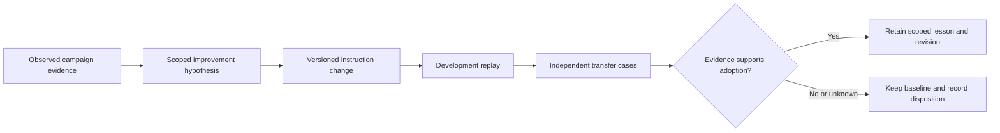

# Evidence-driven improvement for Astra-led benchmarking

## Recommendation

Extend the existing LLM qualification skill with a small, conditional
improvement loop. Use the campaign's retained failures and successful recoveries
to propose changes to the agent's instructions, then evaluate those changes
independently. Keep one canonical source of workflow rules, one evidence store,
and one owner of live experiments. A separate self-improvement plugin is not
justified until a second actual workflow needs the same lifecycle.

This is an engineering recommendation based on external research and the
existing skill structure. It is not a claim that Astra has become more capable,
that its weights have changed, or that the proposed process has already reduced
operational token consumption. The intended improvement is narrower: fewer
repeated process mistakes, more defensible decisions, and less avoidable work.
The local qualification system must still establish model quality and capacity.

The proposed sequence is:

The decision is deliberately asymmetric. It is inexpensive to propose a lesson
and more demanding to establish that it should become a persistent rule.
Instructions influence many later actions, so a plausible explanation of one
failure should not automatically become a global constraint.

## What the research establishes

### Reflection has useful applications

Self-Refine uses iterative feedback and revision without additional model
training. Its experiments report improvements across several tasks and model
families available at the time. That supports trying a feedback step on a
bounded problem; it does not establish that every extra critique improves an
answer or that a newer model benefits equally. Its mechanism primarily refines
outputs within a task. Persistent changes to an operational skill introduce a
separate transfer problem. [1](https://arxiv.org/abs/2303.17651)

Reflexion connects task feedback with compact textual lessons used in later
attempts. The transferable idea is that feedback should be tied to what
actually happened, rather than to an ungrounded instruction to think harder.
The paper's results concern its evaluated agents and tasks. Its reported coding
scores are not predictions for Astra or for a local serving campaign.
[2](https://arxiv.org/abs/2303.11366)

For this workflow, a useful lesson has a causal boundary. For example, a
request-timeout lesson should identify the layer that timed out, the workload
that exposed it, and the observation that verified the repair. “Always increase
timeouts” discards that boundary. It may conceal future crashes or create
unnecessary waits. “Inspect the owning component before changing a deadline”
is broader, but still needs evidence that the prior instruction caused a bad
decision and that the revised one behaves better in relevant cases.

### Self-criticism is not a reliable acceptance test

Huang and colleagues study intrinsic self-correction: revision without external
feedback. They find that it can fail to improve reasoning and can degrade
answers. This limits claims about unaided reflection; it does not establish
that compiler feedback, independent tests, or evidence-backed revision are
useless. The distinction matters because the benchmark workflow already has
external signals that a bare conversational self-critique lacks.
[3](https://arxiv.org/abs/2310.01798)

The operational consequence is to separate proposal from acceptance. Astra
can explain a suspected failure and draft a narrow instruction change. That
explanation remains provisional. A separate check must establish whether the
change produces the desired decision, retains correct behavior elsewhere,
and respects the same authority boundaries. A confident judge or agreement
among several agents cannot replace an observable result.

For deterministic outcomes, executable checks are preferable to stylistic
judgment. For decisions such as whether to continue configuration research,
an independent rubric can score the next action and the evidence used. The
rubric should allow “insufficient evidence”; forcing every comparison to name
a winner turns uncertainty into artificial progress.

### Optimization benefits depend on the evaluator and task

GEPA uses execution traces and textual feedback to propose and evaluate prompt
changes, maintaining useful alternatives rather than relying only on a single
rewrite. Its revised paper reports improvements in its evaluated settings.
The useful transfer here is trace-informed proposal generation with explicit
selection. Importing its full search machinery would be a separate engineering
project, and its results do not validate this particular skill or model.
[4](https://arxiv.org/abs/2507.19457)

Revisiting OPRO reports limitations when smaller models act as optimizers,
including sensitivity to setup and substantial optimization cost. It cautions
against assuming that a cheap optimizer is automatically economical overall.
A lower cost per call can be offset by worse proposals, more trials, or more
expensive validation. [5](https://arxiv.org/abs/2405.10276)

The practical starting point is therefore one focused proposal round, not an
evolutionary search over every sentence. A larger optimizer is warranted only
when measured benefit can repay the extra work and there is enough remaining
budget to finish the actual campaign. The skill should record the combined
cost of research, reflection, failed candidates, evaluation, and accepted
work, rather than reporting only the cheapest successful response.

### Evaluation must represent the intended behavior

OpenAI's evaluation guidance emphasizes task-specific tests, explicit success
criteria, representative and difficult cases, and calibration of model judges.
It identifies response-order and verbosity biases in model-based grading.
These are relevant to a panel workflow: the longest explanation or first
answer should not win merely because of presentation.
[6](https://developers.openai.com/api/docs/guides/evaluation-best-practices)

A skill evaluation should test decisions the skill controls. Appropriate
outcomes include whether an agent preserves a failed run, researches supported
settings, distinguishes an engine defect from insufficient evidence, avoids
unauthorized live work, and completes an authorized task without needless
approval pauses. A test that searches the skill file for the word “research”
checks text presence, not any of those behaviors.

There are two distinct baselines. The model benchmark baseline controls the
served checkpoint, quantization, runtime, context, and workload. The skill
baseline controls instructions, agent model and effort, tools, input history,
and evaluation cases. Changing both at once may be useful operationally, but
it prevents attributing the outcome to the skill edit alone. Evidence should
identify both layers rather than merging them into an ambiguous “improved”
configuration.

## What is specific to Astra

OpenAI's Astra guide identifies sensitivity to instructions in skills and
repository files, less delegation than some workflows want, possible
clarification pauses, and overly broad verification on smaller coding tasks.
It recommends explicitly calibrating those behaviors. These observations
support auditing instruction conflicts and making delegation and verification
boundaries clear. They are product guidance, not local comparative results.
[7](https://developers.openai.com/api/docs/guides/latest-model?model=gpt-6-astra)

The repository already selects Astra for lead work and economical agents for
bounded execution, with independent review of Astra-authored changes. That
arrangement should remain the default. A self-improvement addition should not
silently change global model selection, provider settings, or reasoning effort.
Any proposed effort change is another experimental variable, whose benefit
must be measured through the actual host's supported controls.

The most useful Astra adaptation is a short retrospective checklist tied to
observed behavior: whether a stop rule ended an investigation too early,
whether a worker received enough context, whether repeated verification had
a reason, and whether a new instruction conflicted with an existing one.
The purpose is to identify one consequential edit, not to produce an essay
about the entire session at every turn.

No study reviewed here measures a controlled before-and-after improvement for
this Astra-led benchmarking skill. The implementation can accurately be called
Astra-oriented because it addresses documented behavior and existing project
roles. Calling it empirically optimized requires later paired workload evidence.

## Reuse inventory and implementation choice

The existing qualification workflow already separates diagnostic trials from
final qualification. The publication skill already maintains a friction log,
a source registry, evidence identities, and durable follow-up. Adding a second
state store or an autonomous optimizer service would duplicate those roles.

| Existing component | Reuse | Boundary |
|---|---|---|
| LLM qualification skill | Baseline identity, diagnosis, configuration trials, final gates | Served-model experiments remain distinct from skill experiments |
| Benchmark documentation skill | Friction, source, decision, and evidence records | Reflection does not convert incomplete evidence into qualification |
| `skill-creator` | Small scoped edits and independent behavioral testing | Frontmatter validation is only a structural check |
| `session-retro` | Existing local session accounting when deeper cost analysis is warranted | A usage report does not establish causality |
| Optional learning helper | Capture a compact evidence-linked lesson if available | An unavailable helper must not block campaign closure |

This inventory favors an integrated reference. The main skill needs only an
entrypoint describing when to load it. The reference can own the lesson and
validation lifecycle, while the research report remains optional reading.
This keeps ordinary benchmarking prompts smaller than embedding a literature
review or a general-purpose self-improvement manual in every invocation.

The OpenAI prompt optimizer is another existing implementation of feedback-led
prompt revision. Its documentation warns that optimized prompts can regress
on particular inputs and calls for evaluation before production use. The
current guide also marks the dataset-backed service for deprecation. Its
methodological lessons are useful, but it is not a suitable new dependency for
this native workflow. [8](https://developers.openai.com/api/docs/guides/prompt-optimizer)

## The proposed improvement contract

### Trigger on evidence, not on every interaction

A repeated failure, a verified high-impact mistake, a substantial operator
correction, or measured repeated waste can trigger the loop. A campaign with
no actionable friction should finish without inventing a lesson. The first
question is whether the cause belongs to the skill. Runtime bugs, corrupted
artifacts, invalid grading, and service configuration problems have their own
owners and should be repaired there.

The trigger should identify the decision that was wrong. “The candidate failed”
is too broad. “The agent treated a supported setting error as a terminal model
defect despite available diagnostic evidence” can support a process hypothesis.
The distinction protects both engineering efficiency and the integrity of the
model comparison.

### Keep the lesson scoped and versioned

A useful record contains the observation, evidence pointer, causal hypothesis,
applicable revisions and workload, proposed instruction change, disconfirming
conditions, evaluation result, and expiry trigger. Store it in the existing
friction record or linked evidence. These fields do not require a new database
or native benchmark schema.

Freeze the instruction version used by an experiment. Editing a skill while a
qualification cell is running makes the run difficult to reproduce and can
mix different decision policies under one result. Start a new instruction
version at a clear boundary, retaining previous hashes and outcomes.

Authorization remains separate from evidential quality. Existing permission
for a skill update can cover a concrete, reversible edit within that scope.
It does not authorize changing a live route, rewriting account-wide memories,
weakening a benchmark's success criteria, or updating unrelated instructions.
If the proposed change is outside current authority, preserve the proposal
without labeling it installed or validated.

### Test the trigger and the boundary

The smallest useful development set contains the triggering situation, a
previously successful situation, and a situation where the new rule should
not apply. A rule that improves one known failure but breaks normal behavior
has not established a useful improvement. Final transfer cases should be
prepared independently after the candidate is frozen.

Use fresh agent contexts for paired baseline and candidate runs. Keep the
question, available evidence, tools, model/effort, and budget comparable. Judge
the actual outputs or actions, preferably without knowing which variant
produced them. Preserve ties, failures, and partial outputs. Repeat noisy or
consequential cases before drawing a performance conclusion.

Once a holdout result is used to guide an edit, it is development evidence for
that next version. The old result remains valid history, but the next result
cannot be called unseen generalization. New cases are needed for that claim.
This is especially important when a capable agent can easily adapt instructions
to the exact wording of a revealed scenario.

### Adopt narrowly and retire deliberately

Adopt a scoped correction when independent behavioral evidence supports it
and relevant regression gates remain satisfied. A clearer instruction may be
worth retaining even when the measured behavior ties; report that as clarity
or maintainability, not as increased capability. Preserve the older version
when regressions remain unexplained.

Lessons should carry invalidation conditions. A parser workaround may expire
when the runtime changes. A timeout rule may stop applying under streaming.
A context assumption may need requalification after a different KV format or
concurrency setting. Retrieve only lessons relevant to the current task, and
replace superseded advice rather than appending contradictory rules forever.

## Efficiency and stopping rules

The default improvement round should be small enough that the campaign still
has time and account budget for its primary outcome. One proposal and one
paired comparison are a starting operational policy, not a research-proven
optimum. Additional rounds need new evidence and remaining budget. A repeated
critique that yields no distinct hypothesis should stop.

Parallel research can shorten elapsed time when there are genuinely independent
questions or competing hypotheses. It still consumes several agents' context,
reasoning, and outputs. Use the existing three-answer policy only when the
uncertainty could change the next experiment. Routine checks stay with the
lead, and a narrow disagreement goes back to the relevant worker rather than
restarting the entire panel.

Cost evidence should distinguish total input, reasoning/output, cached input,
wall time, retries, discarded candidates, and qualification work where those
measurements are available. Subscription-window percentages and API dollar
estimates describe different things and should not be conflated. Missing token
accounting remains unknown; response word count is not a substitute.

An apparent gain should also be compared with the simpler explanation that
more attempts were made. For a consequential optimization study, compare the
proposed loop against equal-budget repeated attempts or a simpler baseline.
If the extra reflection adds no transferable benefit, remove it. This control
is a recommended future measurement, not something established by the static
skill checks.

## Validation and unresolved questions

Structural validation establishes that the skill can be discovered and its
references followed. Focused repository tests establish compatibility with
existing document and artifact contracts. Independent process scenarios can
show whether the instructions lead to defensible decisions under controlled
inputs. None of these alone proves better real-world model selection, shorter
overnight campaigns, or lower total token use.

An initial offline comparison on 2026-09-13 used six independently prepared
synthetic scenarios, frozen instruction snapshots, fresh agents with the same
inherited lead model/effort, and an independent Sol reviewer blinded to variant
identity. The baseline scored 31/39 and the candidate 38/39; three cases tied,
and neither variant had a critical regression. The difference concerned more
explicit evaluation controls and attribution, not better primary safety
decisions. Both omitted one requested budget detail in the same case. Cases,
rubric, snapshot hashes, responses, and grading were retained in the operator's
protected evidence directory. No instruction change followed the revealed
results.

This single replay supports adopting the scoped instruction clarification;
it does not establish statistical significance, unseen generalization, live
campaign improvement, or token savings. The grader scored explicit rubric
coverage, which can favor more complete answers. Repeated paired workload
trials and a counterbalanced second review would be needed for stronger
claims. Structural and repository validation also passed, including 8,710
tests with 39 skipped; those checks establish compatibility, not behavioral
superiority. Quality and reliability precede speed and token counts. Sample
size and repeat count should reflect consequence and observed variance rather
than an invented universal minimum.

Open questions remain: how often a lesson transfers to a new model family,
how much independent review pays for itself, whether lower-effort workers
preserve decisive counterevidence, and whether the routine should run after
every campaign or only after material friction. Retained observations should
answer those questions over time. The improvement mechanism should remain
editable and modest while that evidence accumulates.

## Sources

External sources were inspected on 2026-09-13. Research results below concern
their published tasks and models; applicability to this workflow is an explicit
engineering inference.

1. Madaan et al. **Self-Refine: Iterative Refinement with Self-Feedback.**
   Submitted 2023-03-30; revised 2023-05-25.
   [Paper](https://arxiv.org/abs/2303.17651).
   Used for bounded output refinement and limits on transferring its results.
2. Shinn et al. **Reflexion: Language Agents with Verbal Reinforcement Learning.**
   Submitted 2023-03-20; revised 2023-10-10.
   [Paper](https://arxiv.org/abs/2303.11366).
   Used for task-feedback-linked textual lessons across attempts.
3. Huang et al. **Large Language Models Cannot Self-Correct Reasoning Yet.**
   Submitted 2023-10-03; revised 2024-03-14; ICLR 2024.
   [Paper](https://arxiv.org/abs/2310.01798).
   Used for limits of correction without external feedback.
4. Agrawal et al. **GEPA: Reflective Prompt Evolution Can Outperform
   Reinforcement Learning.** Submitted 2025-07-25; revised 2026-02-14.
   [Paper](https://arxiv.org/abs/2507.19457),
   [version examined](https://arxiv.org/pdf/2507.19457v2).
   Used for trace-informed prompt proposals and explicit candidate evaluation.
5. Zhang, Yuan, and Avestimehr. **Revisiting OPRO: The Limitations of Small-Scale LLMs as
   Optimizers.** Submitted 2024-05-16; revised 2024-07-19.
   [Paper](https://arxiv.org/abs/2405.10276).
   Used for optimizer limitations and the need to account for search cost.
6. OpenAI. **Evaluation best practices.** Continuously maintained documentation.
   [Guide](https://developers.openai.com/api/docs/guides/evaluation-best-practices).
   Used for representative cases, explicit criteria, and grader bias.
7. OpenAI. **Model guidance: GPT-6 Astra.** Continuously maintained documentation.
   [Guide](https://developers.openai.com/api/docs/guides/latest-model?model=gpt-6-astra).
   Used for bounded adaptations to documented agent behavior.
8. OpenAI. **Prompt optimizer.** Continuously maintained documentation.
   [Guide](https://developers.openai.com/api/docs/guides/prompt-optimizer).
   Used for the feedback/validation pattern and current integration limitations.
9. Maintained project sources: `skills/anvil-serving-llm-qualification/SKILL.md`,
   `skills/anvil-serving-benchmark-docs/SKILL.md`, and
   `docs/OPERATOR-SKILLS-AND-SUBAGENTS.md`. Local skill interfaces inspected:
   `skill-creator` and `session-retro`. Used for the reuse inventory and
   implementation ownership; these are local source observations, not research
   evidence of performance gains.
