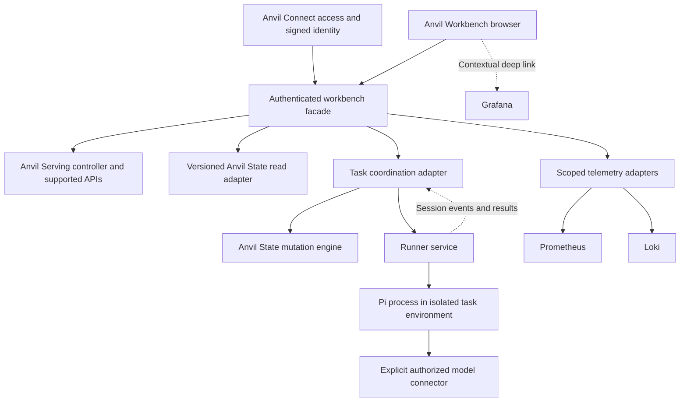

# Anvil Workbench — design proposal

September 10, 2026 · Concept 03 · Working name · For human design review

This is a proposal and interactive design study, not a shipped product contract.
The current Observatory, router, controllers, and project state are unchanged.
All prototype records, model names, measurements, PRDs, and actions are synthetic.

## Product decision

Build a workspace for doing local AI research and project work: select a model
recipe, ask questions, run controlled experiments, understand the machine,
and carry evidence into an Anvil task. Include Pi coding agent sessions in
isolated environments. The default landing page prioritizes experiments and
active work, with fleet health available throughout.

Use **Anvil Workbench** as a descriptive working name. “Observatory” describes
only one part of the experience; “Console” is broader but less specific to work.
Naming remains open until the workflows settle.

The navigation follows jobs, not CLI command families:

| Area | Primary question | Main action |
| --- | --- | --- |
| Workbench | Does this model behave correctly under this workload? | Create an experiment; follow deterministic phases; inspect, compare and retain evidence |
| Playground | What happens when I ask this exact model? | Select connector, recipe/model and preset; send and inspect |
| Models & recipes | Which reproducible setup can I use? | Inspect availability; review managed loading/configuration |
| Anvil work | Which project requirement does this work satisfy? | Read PRDs, open a task, use its Pi conversation and inspect evidence |
| Observability | Why is a model or machine behaving this way? | Inspect fleet, models, GPUs, hosts, benchmark history, logs and monitoring health |
| Compute | What is running on each host, and how do I operate it? | Select a workload; inspect runtime identity, logs and configuration; review start/stop or open scoped exec |
| Settings | How is this workspace configured and administered? | Workspace preferences, service connections, Pi environment defaults, Connect access and data ownership |
| Documentation | How does this part of Anvil work? | Read contextual concepts and versioned source documentation |

The production shell also needs a project selector, workspace search, and
connection settings. Concept 03 shows one fixed sample project. Settings sits
at the bottom of the main rail; Connect access is its administrator-only
**Access & sessions** section. Pi is an embedded component of Anvil work, not a
separate top-level destination.

### Settings composition

The Settings page has a local section rail and one main content column. General
contains workspace name, starting page, density and HUD visibility. Connections
shows service ownership and configured/unconfigured state. Pi environments holds
defaults for the next reviewed session proposal. Access & sessions retains the
existing Connect grants, disable/enable and cascading revocation controls. Data
& evidence describes record ownership and future owner-backed retention settings.

Editable sections keep drafts across navigation, with explicit Save/Discard and
unsaved indicators. General preferences affect the preview shell; Pi resource
defaults appear in the task environment review. Connections and retention are
read-only until their real owner adapters exist. No saved preference implicitly
changes an active serve, session, claim or access grant. Settings omits the HUD
and uses the same single document scroll owner as the rest of the portal.

## Visual direction

A quiet instrument panel using the modern Serving documentation palette:
navy background `#0b1118`, surfaces `#101923` / `#14202b`, cyan `#28c7d7`,
light text `#f4f7f9`, muted text `#aab8c2` and amber `#f5ad35`. These are
adapted from `docs/stylesheets/extra.css`; this is not a MkDocs application.
The separate Anvil State Material configuration currently uses deep orange;
the modern Serving documentation theme is the reference selected for this revision.
Barlow supplies interface text and Barlow Condensed supplies compact readouts.

The desktop has a navigation rail, one document scroll owner and a compact
sticky instrument strip. Remove the independently scrolling right-hand HUD.
Show compute and target selection, owner availability, timestamped GPU/memory
observations, deterministic runner activity and Pi activity. A moving light
indicates a known active demo operation, never arbitrary background animation.
Reduced motion disables the pulse; text carries the same meaning.

Detailed fleet metrics live in Observability; workload controls live in Compute. Historical run charts retain their
own target and time window as the compute selector changes. NVIDIA devices and
Apple Silicon unified memory need different labels; MacBook is a first-class
compute location. All capacities and deployments in the concept are synthetic.
The private routing configuration declared laptop speech endpoints at inspection;
this design did not prove their live health or copy private network identity.

At narrow widths the strip wraps and loses stickiness; the document still owns
vertical scrolling. Local horizontal scrolling is allowed for dense tables and
navigation. Dialogs may scroll within the viewport.

Move long explanations into contextual detail. Keep actionable failure reasons
visible beside their controls. Loading, empty, offline, stale, unsupported,
permission-denied and incomplete states need designed layouts, not generic errors.

## Core journeys

### 1. Select a recipe and ask a question

Choose an authorized connector → choose an available model or recipe → select a
request preset → inspect effective settings → send a request → inspect response,
timing, token usage, structured output, and tool-call arguments.

Keep four concepts distinct:

- **Connector:** how an authorized client reaches a declared service/provider.
- **Recipe:** pinned model/runtime configuration, launch requirements, and resources.
- **Served target:** the exact ready deployment or alias receiving the request.
- **Preset:** named request instructions, parameters and permitted tools.

A recipe in the catalog is not necessarily loaded. Choosing an offline recipe
offers a separate load review showing conflicts, resources and impact. Clicking
Send must never start a model, silently select another model, or fall back to a
different provider. Changing a preset changes the next request; it does not edit
the runtime recipe. Each effective parameter should show whether it came from
the connector, model, preset, or session override.

The full playground should support streaming text, cancel, regenerate, request
and response inspection, system instructions, schema/tool definitions, preset
save/edit, and conversion of a session into a test case. Raw views must redact
credentials. Tool-call inspection is distinct from executing a tool. Execution
requires a declared tool grant or an approved Pi environment.

Conversation and tool content are private data. Existing Observatory projections
exclude prompts/responses: add an explicit session store with deletion/retention
policy and per-project access instead of putting content into telemetry records.

### 2. Run an experiment and understand the result

Select a recipe revision → choose preflight, throughput, context, quality or
tool/protocol suite → set bounded workload → review impact → run → inspect →
compare → attach retained evidence to a task.

Show the model revision, recipe/image/config fingerprints, quantization, hardware,
context, concurrency, input/output constraints, warm state, seed, suite revision,
sample count, and correctness gates in one run record. The test runner captures
client-observed TTFT, end-to-end latency, token counts and request errors. Keep
engine-reported throughput/KV/admission metrics separately attributed.

Workbench absorbs experiment detail with Overview, Run flow, Compare, Evidence,
Events and All runs. There is no separate Experiments navigation destination.
A new submitted plan retains its own run identity; historical evidence remains
visibly associated with the retained run. Explain why results
cannot be directly compared. Show partial and failed runs alongside successful
ones. Do not rank a faster run that failed correctness. A graph must specify per
request versus aggregate throughput, observation source, units and sample window.
Aggregate a TP=2 serve once while displaying both physical GPUs.

Annotated charts align benchmark phases with logs and resource observations.
Historical source gaps remain gaps. Data tables supply a readable alternative.
Grafana opens with the same authorized host, serve and time range for deeper work.

The deterministic runner resolves an exact target, executes independent preflight,
runs fixed measurement phases, collects evidence and stops for review. It consumes
no agent tokens to decide routine next steps. Failures stop dependent phases and
retain partial evidence. A cloud Codex/Claude/Pi operator may help design a plan;
the target local model must not be its own orchestrator or judge. Scheduling must
also account for resource contention with any local agent session.

Recipe editing saves a new candidate before a separate managed load review.
Production editing must round-trip the complete canonical schema, preserve secret
references, validate runtime/location compatibility and detect revision conflicts.
The concept edits only context, concurrency and compatible placement; it makes no
claim to be a full recipe authoring implementation.

### 3. Open a PRD and execute a task with Pi

Select the project → resolve its exact checkout/workspace identity → read open
PRDs and approval revisions → inspect dependencies and ready tasks/bundles →
review an execution plan → acquire an Anvil lease → provision an isolated
workspace → start Pi with the canonical work packet → stream progress → retain
diff/tests/artifacts → submit evidence for independent review.

“Execute PRD” means an explicitly bounded task/bundle workflow with dependency,
claim and review gates. It is not an unchecked shell invocation over the entire
PRD. A draft PRD stays readable but is not executable until approved. A newly
selected checkout reporting uninitialized state must trigger identity/recovery
inspection, never automatic creation of competing project state.

Pi appears inside **Anvil work → selected task → Agent session**. The embedded
panel follows Pi Web's project/folder and conversation-thread layout: a compact
conversation rail beside the chat, model/thinking controls, inline collapsed tools,
and a message composer. Thread creation, selection and branching preserve separate
transcripts and drafts. Folder grouping is task-scoped conversation organization,
not an editable host filesystem. Secondary session/extension/change controls belong
in menus, not a second dashboard of environment and activity cards.

Anvil supplies the task's Overview and Evidence views around that panel. Reuse
the corresponding Pi Web surfaces where the integration spike proves them.
Provide steering, cancellation, reconnection and explicit
recovery. Closing a browser tab does not stop the runner. Agent text saying
“tests passed” is not evidence; capture actual test output and exit state, and
use Anvil's independent review/acceptance process.

### 4. Administer access and consult documentation

Connect access uses the existing `/_anvil-connect/access` facade. It edits allowed
resources for existing users, toggles access while retaining identity, and revokes
issued browser/terminal sessions. It does not introduce another account database
or administrator-membership editor. Preserve generation checks, idempotency and
the final enabled administrator safeguard. Browser-session revocation cascades to
terminal sessions it approved; already executing upstream work may continue.
See [the current contract](../../ANVIL-CONNECT-ACCESS.md).

The documentation destination currently renders curated summaries linked to the
Anvil/Serving README, benchmark documentation and Connect access guide. Production
should render versioned packaged documents through a safe markdown renderer, with
search, source version, code-copy controls and normal deep links. Keep recipe/run
context while opening help. Curated prototype text is not a live documentation sync.

### 5. Observe the fleet and operate its compute

Observability and Compute are separate workspaces. Compute is the last operational
navigation item, followed by the separated Documentation utility and Settings.
The legacy `#system` bookmark resolves to Observability / Fleet.

Observability composes seven dashboard groups from the existing Grafana dashboard
inventory: Fleet overview, Model performance, Physical GPUs, Host resources,
Benchmark history, Container logs and Monitoring health. Existing provisioned
panel titles informed this grouping; private queries, network identities and
Grafana credentials were not copied into the public prototype. It provides the
important operational projections, not complete Grafana panel or alert-rule parity.

The dashboard shell retains location, sample time range, source and collection
state. Fleet and monitoring are explicitly fleet-wide; model/GPU/host/log detail
follows the selected location. Benchmarks retain independent run windows. Missing
series never inherit another host's measurements. The demo time control switches
illustrative fixture series and filters fixture log records; it does not query
Grafana. Its context dialog proposes the destination/filters without inventing a
configured Grafana URL. Live embedding must preserve Grafana authorization.

Compute projects the owner's declared workloads, including stopped candidates and
unavailable owners, and distinguishes Docker containers from native processes.
Each workload exposes its exact container/process name, state, Logs, Configuration
and Exec. Model lifecycle uses the same recipe/deployment records as Models and
Playground. Saving a recipe changes a candidate; starting requires a separate
review of the exact recipe revision and owner. Stops update deployment state,
not retained historical benchmark observations.

The concept console accepts literal text, retains drafts/output per host and
workload, and labels submissions as not executed. The production exec contract
must resolve an authorized workload ID at its resource owner, constrain session
lifetime and output buffering, audit admission and distinguish container exec
from native-process facilities. The browser does not gain raw Docker control or
arbitrary host administration. Workloads without an exec capability should expose
that unavailability. Start/stop remain managed lifecycle intents through Serving;
model promotion and project acceptance keep their independent gates.

## Ownership and architecture

**Recommendation:** establish a distinct application boundary and identity now;
initially keep its source and build beside the current facade in this repository.
The public product remains Anvil Serving until a separate product decision is
accepted. Keep frontend adapters free of internal Python-module and database
coupling. Separating the repository is a later packaging decision, not a condition
for designing this experience.

Serving continues to own recipes, lifecycle, topology, routing and benchmark
operations. Anvil State owns PRDs, claims, work packets and acceptance. Telemetry
services own metrics/log storage. A runner owns process/container sessions and
worktrees. The workbench owns the UI, authorized projections, request presets,
user session records and correlation. It never edits the Anvil database directly.

Evaluation & Evidence owns canonical benchmark run records and immutable
artifacts, including failed and interrupted outcomes. Workbench retains only
references and its private conversation/preset/correlation state. Anvil State
owns task-to-evidence links accepted through its supported mutation engine;
links identify the run, artifact digest and producing authority. The runner owns
Pi session artifacts until submitted through that task/evidence contract.

Use one task-coordination adapter to acquire, renew and release claims and submit
completion evidence. The runner receives the exact claimed work packet and a
scoped session capability, then reports events/results to that coordinator. It
must not maintain an independent competing claim/evidence implementation.

Anvil Connect supplies authenticated transport, signed identity and resource/
method admission. Signed identity does not carry native role/action grants;
Workbench and Anvil still enforce their own authorization. Connect does not
become the State engine. Preserve the existing
[identity handoff contract](../../ANVIL-CONNECT-IDENTITY.md), native CSRF and
session revocation behavior while its separate owner develops it.

Reuse existing session/CSRF/access machinery and the durable preview/intent
journal for controls. Preserve expiring previews, owner rechecks, typed actions,
conflict enforcement and idempotency. An unknown execution result must reconcile
by operation ID instead of resubmitting. A successful operation and verified
postcondition remain different states. Human promotion stays separate.

The existing Python runtime stays stdlib-only. A production component frontend
can compile into static assets served by the facade; its build dependencies need
not become Python runtime dependencies. Choose the frontend implementation after
the design review and a small component/state-management spike. This HTML/CSS/JS
study is intentionally disposable UI code, not the production architecture.

### Pi integration

First test third-party Pi Web reuse for the conversational surface; see
[PI-REUSE.md](PI-REUSE.md) for inspected sources, remaining seams and the bounded
spike. Keep its session UI/service ownership explicit. If reuse requires broad
internal patches, use Pi's headless RPC or supported SDK behind a thin adapter. The current
[Pi RPC documentation](https://github.com/earendil-works/pi/blob/main/packages/coding-agent/docs/rpc.md)
describes structured commands, correlated responses, event streaming and steering.
RPC offers a useful process boundary; its documented JSONL framing needs an
adapter, not terminal-output scraping. Pin the version and prove cancellation,
reconnect, request acceptance versus completion, and session recovery.

Before the broad implementation slices, run the isolated lifecycle spike in
[RUNNER-CONTRACT.md](RUNNER-CONTRACT.md) using fake State and runner adapters.
This validates the riskiest contract without touching concurrent Connect code.

Run environments should use per-task worktrees, bounded CPU/RAM/process/disk/time
budgets, no privileged mode, no host Docker socket, no GPU devices by default,
restricted mounts, and explicitly allowed network destinations. Do not inherit
the host's broad credentials or package extensions automatically. Install a
reviewed, pinned Pi environment and scope its model credential to the selected
connector. Authentication and isolation are different controls; a container
alone does not establish the latter. Prove mount/egress/credential limits in an
isolated acceptance fixture before enabling real project execution.

The user explicitly requested Pi as the coding harness. Integrate that harness
through its interface; do not add direct Anthropic SDK calls in the workbench.
Keep the user's independently selected cloud development providers separate from
local serving recipes. Runner placement is configured by the operator; the UI
does not presume the inference host has spare CPU/RAM capacity.

## Open WebUI: integrate, fork, or build?

The user is open to a fork. The decision should be based on how much of the final
workflow it replaces, not on whether it already has a polished chat box.

| Option | What we reuse | What we still build | Assessment |
| --- | --- | --- | --- |
| Extend existing Observatory | Auth, metrics/log adapters, controls, intents, deployment | Rich playground, coherent workflow, State/runner adapters | Strong backend starting point; UI needs restructuring |
| Dedicated Anvil frontend + Pi Web | Anvil backends, scope rules and Pi conversation/session UI | Run workspace, recipes, fleet, State correlation and integration glue | Best match for the revised workflows; recommended spike |
| Workbench + unmodified Open WebUI | Mature conversations, model presets, connector/tool integrations | Cross-app identity/context handoff plus all Anvil work areas | Credible companion; test before forking |
| Fork Open WebUI | Its existing frontend, backend, chat and settings | Experiment/recipe lifecycle, HUD, Anvil claims, Pi runner, evidence and upstream maintenance | Attractive if rich chat becomes the dominant product; not yet demonstrated |

Open WebUI's [workspace model presets](https://docs.openwebui.com/features/workspace/)
already combine a base model with instructions, parameters and tools. Its
[plugin system](https://docs.openwebui.com/features/extensibility/plugin/)
provides integration mechanisms. These are useful starting points for connector
and chat experiments; they do not establish a supported slot for replacing the
whole navigation, experiment workspace or task runner. Prove that in a spike.

Its current [source manifest](https://github.com/open-webui/open-webui/blob/main/package.json)
and [backend manifest](https://github.com/open-webui/open-webui/blob/main/pyproject.toml)
also represent a separate application stack to maintain. A fork would be a
separate deployment, not a dependency inside Anvil Serving's stdlib runtime.

The current [upstream license](https://github.com/open-webui/open-webui/blob/main/LICENSE)
contains a branding condition and exceptions, including deployments with no more
than 50 end users in a rolling 30-day period. Record the chosen revision and
check the intended deployment/distribution against those exact terms before
adopting a renamed fork. This is a decision input, not a reason to rule it out.

**Decision test before a fork:** make one recipe-backed model accessible, select
a preset, send an inspectable request, associate its result with an Anvil task,
and launch a fake Pi session through the proposed adapter. Compare this against
the dedicated shell for navigation continuity, changes outside extension seams,
session/access duplication, dependency footprint and replay safety. Do not
commit to a fork based solely on chat screenshots. No fork or upstream code
import was performed for this study.

## Existing capabilities and gaps

Source inspection used the current checkout, including
`anvil_serving/observability/dashboard/console.py`, `controller_adapter.py`,
`contracts.py`, `static/observatory.js`, `static/views/experiments.js`, and
`docs/observatory/`. Exact-checkout Anvil status resolved initialized historical
state. It was read for orientation; no planning, claiming or state mutation ran.

| Capability | Current evidence | Required work |
| --- | --- | --- |
| Fleet/serve reads, metrics, logs | Scoped facade and existing UI | Contextual HUD and clearer hierarchy |
| Configuration operations | Typed controls, previews, durable intents | Integrate into recipe/detail workflows |
| Experiments | Declared bounded tests, parameter descriptors, evidence | Run-centric navigation and richer comparison |
| Prompt playground | Current experiments explicitly prohibit browser-supplied prompts/models | New bounded authorized model-session contract |
| Connectors/presets | Serving routes exist; full web preset management is absent from inspected console | Explicit catalog, grants, precedence and revisions |
| Anvil PRDs/tasks | Separate Anvil CLI/MCP and versioned reads exist | Project adapter; no direct SQLite coupling |
| Pi environments | Upstream RPC/SDK and third-party Pi Web documented | Reuse spike, pinned session service and isolation/claim lifecycle |
| Connect access | Existing administrator grants/session facade and revocation contract | Compose current controls without duplicating account ownership |
| Recipe editor | Managed registry/lifecycle exists | Full schema round-trip, candidate revisions, compatible placement and preview |
| Documentation | README and documentation sources exist | Versioned reader/search; concept has curated summaries |

New contracts should be versioned and independently tested. Include exact
project/model/recipe identity, operation/run/session IDs, timestamps, source
status, partial-result and error states. The browser submits typed intents and
resource IDs; backend adapters resolve paths, endpoints and commands.

## Performance and accessibility acceptance

Use a shared query cache keyed by project, resource, time window and access
scope. Incrementally update measurements rather than replacing the whole page
on a timer. Keep form drafts, scroll and keyboard focus stable. Bound charts,
tables, log payloads and session event buffers; use cursor pagination for long
histories. Pause background polling and coalesce subscriptions. Resume with a
fresh owner snapshot and explicit event cursor when reconnecting.

Suggested budgets to validate, not current measurements: usable authenticated
shell within 2 seconds on the local network; navigation from cached data within
150 ms; idle visible workspace under one coalesced refresh per 5 seconds; no
background polling while hidden. Stream active run events separately and bound
consumer backpressure. Measure overhead without adding inference traffic.

Require keyboard completion of recipe selection, experiment review, evidence
attachment and Pi plan review. Test 320px reflow, 200% zoom, reduced motion,
forced colors, chart data alternatives, color-independent status, modal focus,
session expiry and draft retention. Do not claim accessibility compliance based
on automated checks alone.

Grafana recommends purposeful dashboard hierarchy and avoiding excessive
information on one screen; that supports progressive detail with a stable HUD.
See its [dashboard design guidance](https://grafana.com/docs/grafana/latest/visualizations/dashboards/build-dashboards/best-practices/).

## Delivery slices

0. **Contract spike:** fake Pi runner and fake State coordinator exercise lost
   acceptance, cursor reconnect, checkpoint resume, cancellation, cleanup and
   lease loss. Establish one mutation owner before wiring real sessions.

1. **Read workspace:** shared navigation, model detail, run detail/comparison,
   HUD/log context and read-only PRDs on exact project identity. Preserve current
   auth and scope tests. Outcome: inspect a failed experiment without losing its
   model, time window or linked work.
2. **Playground:** explicit connector/model/preset, streamed requests, effective
   configuration, cancellation and private session storage. Outcome: ask a
   model and create a reproducible test case without changing deployment.
3. **Experiment controls:** typed job creation, preflight, resource/impact review,
   durable submission, reconnect, artifacts and task linking. Outcome: a repeat
   run has comparable dimensions and independently recorded gates.
4. **Pi execution:** approved work packet, lease, isolated checkout, bounded
   runner, tool events/diff/tests, cancellation and evidence submission. Outcome:
   closing the browser does not lose a session or accidentally replay execution.
5. **Package and migrate:** choose same-repo or standalone release, retain old
   links, preserve journals/access policy, validate rollback and live clients.
   Follow the repository's release-readiness workflow before deployment.

## Token efficiency and continuation

The user explicitly expects long-running development and Pi work to survive
context exhaustion. Treat this as both a development workflow and a product
requirement:

- Keep the selected goal, approved work packet, exact revision, operation/session
  IDs, completed steps, unresolved findings and next action in a durable checkpoint.
  Store artifact references and short conclusions rather than repeated raw logs.
- Use deterministic CLI/API reads for state and telemetry. Routine dashboard
  refreshes and chart rendering must not consume model tokens.
- Give sub-agents one bounded task, explicit files/ownership, acceptance criteria,
  and a small context packet. Use one implementation owner per surface. Delegate
  independent work or review, not overlapping exploration of the same files.
- Use deeper reasoning for architecture, uncertain failures and review boundaries.
  Use the repository's cheaper focused roles for mechanical work once contracts
  are fixed. Report issues and evidence references back, not full transcripts.
- Surface provider-reported input/output and cached tokens, available context,
  budget remaining and checkpoint/compaction events in Pi sessions. Label
  estimates and unavailable usage explicitly. Token counters are not spend
  counters unless the selected provider's pricing is known.
- At context boundaries, update the checkpoint before compacting. On resume,
  read that packet, reconcile owner/session state and Anvil leases, inspect the
  relevant diff, and continue the next unfinished step. Do not re-run accepted
  tests or replay operations merely because the conversation was compacted.
- An explicit session token/time/resource budget is part of the Pi execution
  review. No numeric goal token budget was supplied for this design task.

The current development checkpoint is [CHECKPOINT.md](CHECKPOINT.md). It is a
project artifact, not a change to personal memory. The independent design review
is bounded and read-only while the lead owns prototype edits and browser checks.

## Concurrent Anvil Connect work

Another process is actively working on Anvil Connect. This design phase owns only
`docs/design/workbench/`; it does not change `connect/`, authentication adapters,
router/controller code, private operator state, edge configuration or deployment.
Treat Connect identity/access as a dependency with its own owner. Before any
implementation touching it, inspect the latest branch/interface changes, agree
on the shared contract and use an isolated worktree. Do not duplicate account
management inside the new workbench or overwrite concurrent changes.

The user authorized disruption where necessary, but no service interruption is
needed for this phase. Production change authority remains separate from model
promotion and Anvil acceptance gates.

## Design decisions still open

- Confirm the default desk and navigation density after using this prototype.
- Prove Pi Web embedding, identity and extension compatibility before choosing
  reuse versus a thin RPC client. Open WebUI remains an optional companion.
- Define the initial Pi task/tool grants, runner placement and lifecycle limits.
- Decide conversation retention and whether presets are personal or project-wide.
- Keep the final name and repository extraction decision until those choices settle.

No estimates or performance measurements are inferred from this prototype.
Sources above were checked September 10, 2026; upstream default branches can move.
