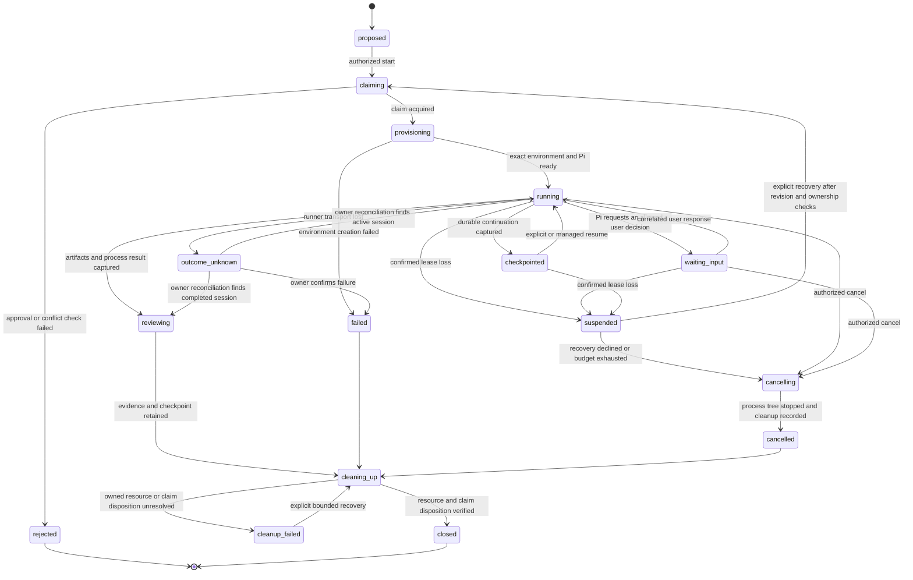

# Pi session contract sketch

Proposal for an early isolated spike, not a shipped API. Use fake State and
runner adapters first. Anvil Connect remains the transport/identity integration
owned by the concurrent workstream.

Revision 2 proposes reusing Pi Web for the conversational session UI; see
[PI-REUSE.md](PI-REUSE.md). UI reuse does not replace this lifecycle contract.
The session service remains a separate runtime from the stdlib Serving facade.

## Conversation and deterministic evaluation

Pi owns conversational turns, model/thinking selections, persisted sessions,
branching, tool events and extension UI. The runner exposes those supported
controls rather than reducing a Pi session to independent shell-test buttons.
Correlate extension select/confirm/input/editor responses to the exact pending
request. Unsupported terminal components must not imply a completed interaction.

The evaluation runner owns a different fixed plan: resolve target, preflight,
measurement, evidence collection, independent review. Its target identity and
resource location are separate from the cloud model used by the agent. Routine
phase transitions need no language model. Retain original input/output and gate
provenance; a plan-producing agent cannot supply its own acceptance proof.
Changing the UI target does not alter an existing run or active Pi session.

## Authorities

The task coordinator owns workflow correlation and invokes Anvil State for
approval/dependency checks, claims, renewals, evidence submission and release.
The runner owns the Pi process, isolated environment and session artifacts.
The browser owns neither. A claimed canonical work packet is the runner's input;
an agent-generated rewrite of the PRD is not an execution authority.

## Session record

Version the eventual schema. Required fields include session ID, actor, exact
project/workspace identity, PRD/source revision, task/bundle and claim IDs,
work-packet digest, runner/environment revision, chosen model connector and
target, operation idempotency key, lifecycle state, event cursor, start/update
times, checkpoint reference, budgets and usage provenance. Expose protected
reference IDs instead of secrets or arbitrary host paths.

Store input/output/cached tokens only with provider/runner attribution. Unknown
usage is unknown; do not estimate it from UI string length. Budget settings must
be explicit in the execution review. The current user did not set a numeric
token budget for this design goal.

## State transitions

These are runner workflow states. They do not replace Anvil task states.
`reviewing` means retained execution evidence is available for Anvil review;
it never automatically means accepted, merged or promoted. Lease disposition
after evidence submission follows Anvil's canonical semantics.
`closed` preserves the execution outcome and evidence-review state separately;
it describes session resource/claim reconciliation, not project acceptance.
Retained worktrees and artifacts are recorded resources, not cleanup failures.

## Commands and events

Typed commands: preview/start, read status, read events from cursor, steer,
respond to a correlated decision, cancel, resume from checkpoint, and read
artifacts. No browser-supplied shell command or container/image/host path is
accepted as a runner lifecycle request. Pi's allowed coding tools execute within
the reviewed environment policy; tool-call content is private session data.

A start key binds the exact task, packet, connector, environment and budgets.
Repeated start requests return the same session. A lost start response triggers
lookup, never another launch. Request acceptance is not execution completion.

Events carry monotonic cursor, session ID, source, timestamp, type and bounded
payload. Handle tool start/update/end, message delta, process result, checkpoint,
usage, decision request, lease status and cleanup outcome. Limit buffers, provide
cursor pagination and a resync snapshot when history expires. Reconnecting the
browser neither replays commands nor duplicates tool events.

## Cancellation, lease loss and recovery

Cancel is idempotent. Stop new work, interrupt Pi, then stop remaining subprocesses
within a bounded grace period. Preserve the final checkpoint, changes and tool
results before recording cleanup. Distinguish cancel requested, process stopped,
workspace retained and resources released. Do not report success before the
owner confirms the relevant state.

The coordinator renews claims and records lease failures. On confirmed loss,
stop new tool work and suspend/terminate the session according to policy; do not
reacquire a claim behind another actor. Resume checks exact task/source revision,
claim ownership, environment compatibility and credential validity. A browser
reload alone does not authorize a resume or a new claim.

Keep useful worktrees/artifacts according to a bounded retention policy.
Cleanup must never delete a shared checkout or a workspace not owned by this
session. Failed cleanup is a visible recoverable state with exact owned resource
references. Removing a container does not remove Anvil history or evidence.

## Fake-adapter acceptance matrix

| Scenario | Required observation |
| --- | --- |
| Duplicate start | One claim and one environment; same session returned |
| Start response lost | Lookup finds original session; no second Pi process |
| PRD revision changes before start | Refused before provisioning |
| Competing claim | Readable conflict; no environment created |
| Provisioning failure | Owned resources reconciled; canonical claim release recorded |
| Browser closes | Runner continues; reopening reads current state and cursor |
| Event stream gap | Explicit resync; no replay of commands |
| Context boundary | Checkpoint captures next action and artifact refs; bounded resume packet |
| Lease lost | No new tool work; visible suspension/recovery requirement |
| Cancellation during tool execution | Tool process tree stopped; final artifacts/cleanup retained |
| Expired/revoked web access | Reads/actions denied; runner policy determines ongoing work separately |
| Agent claims test success | Acceptance uses captured test exit/output and independent review |
| Prompt/response includes markup | Literal safe rendering; no executable UI content |
| Unsupported RPC or environment version | Explicit refusal; no silent alternate model/harness |

This matrix specifies future tests. It has not been executed against real Pi or
Anvil State during the prototype phase.
