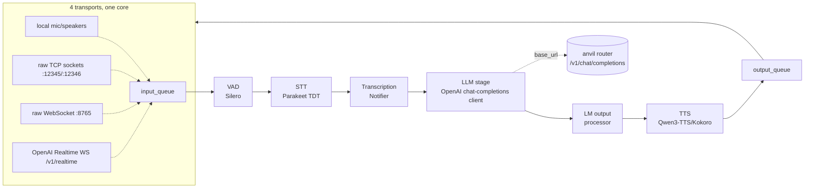

# Architecture review — `huggingface/speech-to-speech` (2026-07-04)

> Input to the **`voice-pipeline`** anvil PRD (build our own S2S in anvil's style). Produced from
> an 8-agent parallel review of the repo at commit `4d5cf80` (2026-07-03) plus 2026 SOTA + sm_120
> web research. Supersedes the "wrap the HF image" direction of the done `speech-to-speech-openclaw`
> PRD (PR #124).

---

## 1. What it is, and how mature

A **low-latency, fully modular voice-agent pipeline** — `VAD → STT → LLM → TTS` — exposed over an
**OpenAI Realtime-compatible WebSocket API**. Apache-2.0, PyPI `speech-to-speech` v0.2.10
(self-labeled Alpha), Python 3.10+. Actively maintained (last commit 2026-07-03) and a genuine
production system: the README states it runs as the conversation backend for **thousands of Reachy
Mini robots**.

Every stage is a swappable handler running on its own thread, wired by queues. The defining bet —
the same one anvil makes — is that the **LLM slot is protocol-decoupled, not model-coupled**: it
speaks OpenAI `chat-completions` / `responses` and points at any `base_url` (hosted OpenAI, HF
Inference, OpenRouter, or a self-hosted vLLM/llama.cpp server). It is **heavyweight**
(FastAPI/uvicorn/websockets/torch/transformers/openai SDK) — the polar opposite of anvil's
stdlib-only ethos — but well-engineered on packaging, CI, and release hygiene (OIDC trusted
publishing, cross-platform install-smoke matrix, `archive/` deprecation pattern).

## 2. Architecture at a glance

- **Thread-per-stage spine.** Each stage subclasses `BaseHandler`, whose `run()` is a blocking
  `queue.get(timeout=0.1)` → `process()` generator → `queue.put()` loop on its own non-daemon
  thread (`ThreadManager`). Stages never call each other; the only coupling is **typed Pydantic
  messages** on thread-safe queues. The 0.1s poll is what lets a stage notice `stop_event`.
- **Four transports, identical core.** `connections/` provides in-process audio (sounddevice),
  raw TCP sockets, a raw WebSocket, and — the flagship — the OpenAI Realtime server. They differ
  only in which adapter fills `input_queue` and drains `output_queue`.
- **Two shutdown modes.** `PIPELINE_END` (a `b"END"` sentinel) breaks a stage's blocking get and
  cascades to the next queue (thread exit); `SESSION_END` is a *soft* reset that clears per-session
  state (VAD counters, chat) **without** killing threads, and is watched all the way to the output
  queue so a session's chain is known to be fully drained.

## 3. The crown jewel: barge-in + speculative turns

This is the hardest and most valuable part, and the piece most worth lifting conceptually. Two
**orthogonal staleness axes** are threaded through *every* message, and every stage boundary drops
output if *either* is stale:

1. **`cancel_generation` (hard interrupt / barge-in)** — a **lock-free generation counter**
   (`CancelScope`). `cancel()` just increments an int and sets a `discarding` bool, relying on
   CPython GIL atomicity for one-writer/many-reader (no lock in the hot path). Handlers capture the
   generation at turn start and compare `is_stale(gen)` as their stream advances.
2. **`(turn_id, turn_revision)` (speculative reopen)** — a `SpeculativeTurnTracker`. A soft-ended
   turn stays *reopenable* for a grace window (~1s, up to ~7s if unanswered), so a mid-sentence
   pause **resumes the same turn** instead of spawning a new one or hard-cutting. Two-phase
   reservation (begin/confirm/cancel a candidate revision N+1) with the audio prefix stitched so
   the reopened turn re-transcribes the full utterance.

**Barge-in choreography** (the async send loop): text-events are drained *before* audio each
iteration, so a VAD `SpeechStarted` is seen first; if a response is in flight it calls
`cancel_scope.cancel()`, flushes both queues **preserving terminal sentinels and user-side events**,
and clears playback. In-flight LLM generation then self-aborts at its next stream-iterator check.

**The one real weakness:** barge-in **cannot abort a blocked LLM read** — `is_stale` is only checked
when the httpx stream iterator advances, so an in-flight blocking request is bounded only by
`request_timeout_s` (default 20s). *This is precisely where anvil adds value:* sitting in front, the
router can enforce a tight TTFT budget + fast-tier-first routing so interruption isn't hostage to a
20s timeout.

Other spine limitations: polling (not event-driven) at every boundary adds baseline latency across
~6 threads/unit; the speculative subsystem is a ~418-line high-cognitive-load module; correctness
leans on GIL atomicity (documented, non-portable); heavy dependency footprint.

## 4. Stage by stage

### VAD + STT (audio-in)
- **VAD:** Silero (pulled at runtime via `torch.hub`), wrapped in a streaming `VADIterator` with a
  triggered/temp_end state machine, ±0.15 hysteresis, and a pre-speech pad. End-of-turn is
  **purely acoustic** (silence duration; `min_silence_ms` default **64ms** — very aggressive),
  gated by a `min_speech_ms` (384ms) active-speech requirement + short-segment stitching so brief
  coughs don't open turns. It already speaks the OpenAI Realtime `turn_detection` (server_vad)
  contract and live-updates from `RuntimeConfig`.
- **STT:** one `--stt` enum over a shared `BaseSTTHandler`. Default **Parakeet TDT 0.6B v3**
  (device-adaptive: nano-parakeet pure-PyTorch on CUDA, MLX on Mac) — small, multilingual (25
  langs, auto-detect), no NeMo/vLLM. Progressive transcription runs *while* the user speaks
  (`SmartProgressiveStreamingHandler`: growing window → fixes completed sentences → only
  re-transcribes the active tail).
- **Traps flagged:** three of six backends are Apple-Silicon/MLX-only (dead weight on CUDA);
  `paraformer_handler.py` and `lightning_whisper_mlx_handler.py` call `torch.mps.empty_cache()`
  unconditionally (latent crash on a CUDA box); faster-whisper (CTranslate2) needs an sm_120
  preflight.

### LLM (the anvil seam)
- Four backends via `--llm_backend`: `transformers` + `mlx-lm` (in-process) and two HTTP backends —
  `responses-api` (default) and **`chat-completions`** — both subclassing
  `BaseOpenAICompatibleHandler` (the official `openai` SDK against an arbitrary `base_url`/`api_key`).
- The base class owns all the speech-specific logic: normalize each provider's stream to a 4-event
  vocabulary (TextDelta/AssistantMessage/ToolCall/Usage), **NLTK sentence-batching** into TTS-sized
  chunks (`stream_batch_sentences=3`; set to 1 for lowest latency), `remove_unspeechable`
  char-stripping, tool-call history write-back, **guaranteed `EndOfResponse`** (a leaked exception
  would lock every future turn), read-timeout-apology, refusal-as-text.
- **Thinking-disable** is provider-specific (`_build_extra_body`): `enable_thinking=false` for
  vLLM/Qwen, `reasoning_effort` for others, nothing for official OpenAI — **exactly anvil gotcha
  #6/#9** (thinking-budget starvation → empty spoken turns).
- **Config/auth surface** is minimal: `base_url`, `api_key`, `stream`, `model_name`. A single static
  bearer token (anvil's tailnet token works as-is). One fixed `model_name` per run — to use anvil's
  preset-in-the-model-field routing, set `model_name` to a preset (`chat`/`quick-edit`).

### TTS (audio-out)
- `--tts` enum over `BaseHandler`; every engine normalizes to **16kHz mono int16, 512-sample
  blocks** so the streamer is engine-agnostic. Default (non-Mac) **Qwen3-TTS 1.7B** via
  `faster-qwen3-tts[ggml]` (a llama.cpp-style backend — **torch-free**), true token-level
  streaming. Optional extras: **Kokoro-82M** (Apache-2.0, tiny, per-sentence), **Pocket** (Kyutai,
  ~10–20ms chunks, lowest latency, CPU-viable), ChatTTS, FacebookMMS.
- Low first-audio latency comes from two layers: upstream sentence-splitting (TTS gets one sentence
  at a time) **plus** incremental codec-token emission within a sentence (Qwen3/Pocket/ChatTTS).
- **Traps:** FacebookMMS/Melo synthesize the whole utterance before any audio; Qwen3's *torch*
  backend relies on CUDA-graph capture that can fail on new arches (`parity_mode` escape hatch, not
  auto-detected) — prefer the ggml backend. All TTS models are small (82M–1.7B), plain
  PyTorch/llama.cpp → **none of the sm_120 NVFP4/MoE-kernel breakage applies.**

## 5. The Realtime server (the flagship reusable artifact)

`api/openai_realtime/` is a full **OpenAI Realtime-compatible WebSocket server** at
`ws://HOST:8765/v1/realtime`, verified with the **official OpenAI Python SDK as client**
(`client.realtime.connect`) — genuine wire compatibility, not a lookalike.

- **Pool of isolated single-session `PipelineUnit`s.** Each owns its own queues/events/service/handler
  chain (deep-copied kwargs). `_claim_unit()` reserves an idle unit on `ws.accept()`; pool exhaustion
  → `session_limit_reached` + close 1008. N callers = N units — real multi-tenancy without an async
  pipeline.
- **Drain-before-release.** On disconnect it flushes queues, enqueues `SESSION_END`, and waits for it
  to travel the whole chain back to the output queue before freeing the unit — **no cross-session
  leakage.** `/v1/pool` and `/v1/usage` give operational visibility.
- **Protocol translation is table-driven:** a `type → pydantic model` parse table for client events
  and a symmetric `internal-event → server-event` dispatch table. `RealtimeService` is the pure
  translator; `handlers/` are small and single-purpose.

**Coverage caveats:** server-VAD only (no client-driven turn control end-to-end); partial protocol
(no item delete/truncate, no granular content-part streaming, no full error taxonomy);
`transcription.delta` sends the full latest hypothesis, not an incremental suffix (diverges from
OpenAI's contract); audio-format rigidity (pcm 16k/24k only); **no transport auth/TLS** (binds
0.0.0.0, api_key ignored) — needs a trusted network or reverse proxy.

## 6. Deployment, packaging, project health

- **Install/run:** `pip install speech-to-speech` → `speech-to-speech` (Realtime server). Platform-
  marker dependency matrix resolves a **different stack per OS** (macOS pulls MLX, non-Mac pulls
  nano-parakeet + faster-qwen3-tts[ggml]). Docker is CUDA-12.8-cudnn/Ubuntu-24.04 (+ arm64 for
  Jetson/Reachy); `docker-compose.yml` is a demo (llama.cpp serving Gemma-4 + pipeline in socket
  mode).
- **CI/CD is strong:** ruff + mypy + pytest + twine-strict, plus a cross-platform **install-smoke**
  matrix (build wheel → pip install on ubuntu+macos → `pip check` → model-free CLI smoke).
  Tag-triggered PyPI publish via **OIDC trusted publishing**, SHA-pinned actions.
- **No published latency numbers** despite "low-latency" being the headline — instead it ships
  `benchmark_stt.py` / `benchmark_tts.py` (TTFT/TTFC/RTF) so you **measure on your own hardware**
  (matches the lab's data-driven-remeasure discipline).
- **sm_120 is untested territory here** — the CUDA-12.8 base + `torch>=2.4` floor say nothing about
  NVFP4/UVA/9P; but the models are small, so the heavy-quant landmines mostly don't apply. Preflight
  still warranted.

## 7. 2026 SOTA context — cascaded vs native vs hybrid

- **Sub-1s end-to-end is table stakes**, not a differentiator (Grok Voice ~0.78s, gpt-realtime-1.5
  ~0.82s). But **real-world medians sit at 1.4–1.7s** TTFA (p99 3–5s); human baseline ~200ms. The
  target: **sub-500ms TTFA** (sub-300ms premium).
- **Most latency hides in turn-taking, not transcription.** The biggest single win is **semantic
  end-of-turn detection** (a ~135M SmolLM-class model) + dropping the silence threshold to 150–250ms
  + **streaming LLM tokens straight into TTS**. This beats any single model swap.
- **Cost:** self-hosted cascade ≈ $0 marginal; hosted cascade ~$0.15/min; OpenAI Realtime
  ~$0.30→$1.50+/min as accumulated audio tokens re-bill per turn.
- **Verdict — go cascaded (leaning hybrid), router as the brain.** Native/end-to-end (Qwen3.5-Omni,
  Moshi) gives lowest latency + prosody but has **opaque reasoning (no text layer to verify/log)**,
  weaker text reasoning, no swappable brain, and — on consumer Blackwell — hits the exact MoE/audio-
  codec kernel risks the lab knows (Omni needs ~64GB FP16 / ~15GB INT4, preflight hard). Keep native
  as a **research spike on the 96GB heavy tier only; it bypasses the router.** Kyutai **Unmute** is
  the closest open reference to our design (cascaded, "wraps any text LLM" behind a vLLM/OpenAI
  server, TTS starts before the LLM finishes, <1s total).

## 8. sm_120 component guidance (what runs on Blackwell, and the traps)

The dominant trap is the **same one the lab already solved for LLMs**: stable torch ships no sm_120
kernels → torch-based STT/TTS errors `sm_120 not compatible` / `no kernel image` until a **cu128
build**. Plus the **`requirements.txt`-clobbers-nightly-torch** silent regression (install cu128
last). Where a **ggml/C++ runtime exists, prefer it** to dodge the torch dance entirely — the same
instinct as preferring dense-NVFP4 over the fragile path.

| Component | Pick | sm_120 notes |
|---|---|---|
| **STT (primary)** | **parakeet.cpp** (ggml, C++17, OpenAI-compatible `parakeet-server`) | CUDA-13 build targets "Turing and newer, incl. Blackwell"; **no torch** → sidesteps the whole trap; byte-identical to NeMo, ~2× lower RAM, ~1.25–4.3× faster. Cleanest zero-drama path. |
| **STT (reuse)** | Whisper / Qwen3-ASR via **vLLM `/v1/audio/transcriptions`** | Reuses the exact cu128 image + named-volume pattern already running for LLMs. Qwen3-ASR-1.7B **measured on RTX 5090 sm_120**. One engine everywhere. |
| **STT (avoid)** | faster-whisper default int8 | `cuBLAS_STATUS_NOT_SUPPORTED` on sm_120 (INT8 tensor-core padding missing — same class as MoE-NVFP4 garbage). Only usable with `compute_type=float16`. |
| **TTS (default)** | **Kokoro-82M** via Kokoro-FastAPI (`/v1/audio/speech`) | ~0.5GB, RTF ~0.04–0.06 (>16× realtime). Only snag: shipped container carries stable torch → **rebuild on a cu128 base** (identical to the vLLM swap). |
| **TTS (expressive)** | Orpheus-3B via vLLM | ~7GB, ~200ms, >2× realtime on 5090 (CUDA 12.8 tested). Exposes a custom `/api/generate` → needs a thin OpenAI `/v1/audio/speech` **shim**. |
| **VAD** | Silero + (v1.1) semantic endpointer | Acoustic VAD baseline; a ~135M semantic end-of-turn model is the biggest turn-taking win. |

**VRAM math is comfortable:** STT (~1–4GB) + TTS (~0.5–7GB) co-reside with the LLM with room to
spare on the 96GB heavy card, or split STT/TTS onto the 5090.

## 9. What this means for us (→ the `voice-pipeline` PRD)

The single highest-leverage fact: **the LLM stage is literally `openai.OpenAI(base_url, api_key)`.**
Point it at the anvil router (`http://100.87.34.66:8000/v1`, `--llm_backend chat-completions`,
token-authed) and every voice turn inherits anvil's work-class routing + structural verify + cloud
fallback **with zero glue**. Use **chat-completions, not the default responses-api** — anvil doesn't
expose the Responses API.

**Lift (conceptually, in anvil's idiom):**
- The two-axis staleness / `CancelScope` generation-counter barge-in — it maps directly onto anvil's
  own commit-window / verify ("never emit output for a superseded request").
- The Realtime **protocol tables** (type→event parse, internal→server dispatch) and the
  **pool-of-single-session-units + drain-before-release** pattern — port these to anvil's stdlib
  `http.server` front door.
- Sentence-batched streaming (`remove_unspeechable` + NLTK split + N-sentence flush), guaranteed-
  `EndOfResponse` / timeout-apology graceful degradation.
- The platform-marker extras matrix, install-smoke CI, and OIDC publish workflow (packaging hygiene).

**Leave:**
- FastAPI/uvicorn transport (keep the stdlib front door).
- MLX backends (Mac-only dead weight on CUDA).
- In-process torch STT/TTS handlers → instead run STT/TTS as **out-of-process serves** behind
  OpenAI audio sub-protocols (dependency-light orchestrator = anvil's actual architecture).
- The default `responses-api` backend and faster-whisper-int8.

**Design one-liner:** *an anvil-style stdlib orchestrator + Realtime server that talks to three
wires — an STT serve, a TTS serve, and the anvil router for the brain — is the same architecture
anvil already is, extended to two new serve types.*

---

*Companion artifacts: the `voice-pipeline` anvil PRD (`prds/voice-pipeline.md`, Release v0.11.0);
the cloned repo under scratchpad; the full 8-facet workflow output in the session task file.*
