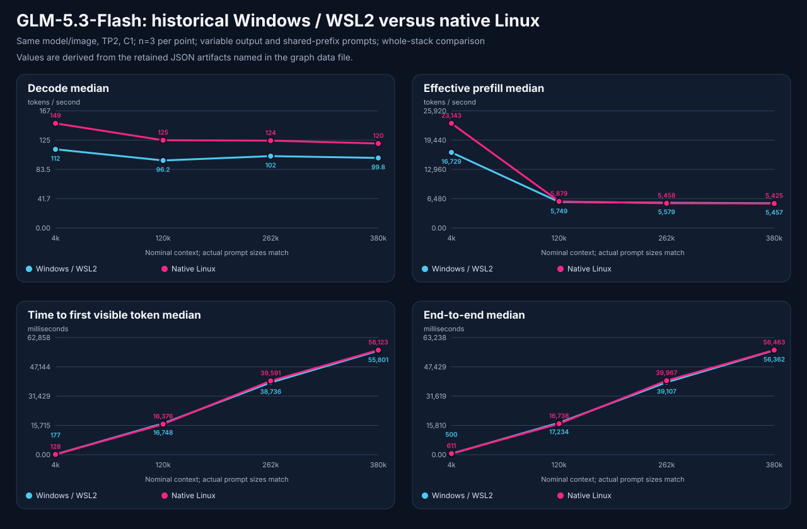
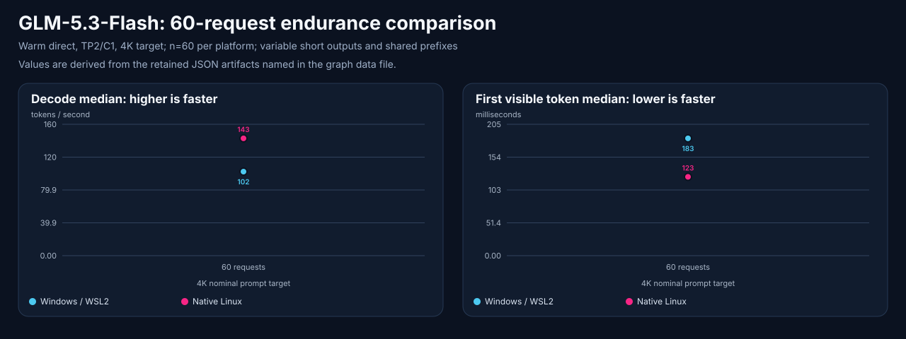

# GLM-5.3-Flash: native Linux versus Windows/WSL

**Date:** 2026-09-08

**Campaign state:** Completed with retained failures; no serving changes or promotion.

**Scope:** Same two RTX PRO 6000 Blackwell Max-Q cards, TP=2, pinned
GLM-5.3-Flash W4A16/NVFP4, SGLang rc14, 393,216 context, C1.

**Decision:** `no-promotion`; measure the existing deployment without changing
its model, image, routes, GPU ownership, or client settings.

<!-- benchmark-result-card/v1 -->
## Result card

> Historical-style decode medians increased 20.5–33.0% after migration to
> native Linux. Long-context effective prefill changed by approximately ±2%.
> These are local whole-stack measurements; strict output-control and routed
> compatibility failures prevent an all-gates qualification claim.

| Setup | Measured configuration |
|---|---|
| Model | `ormandj/GLM-5.3-Flash-W4A16-NVFP4-K32-Experts-FP8-WO@c3cbb9891b67c741bcbf6b176dd7af9265b069db` |
| Served name | `glm53-flash-ormandj-sglang-sm120-tp2-393k-c1-adaptive-mtp` |
| Hardware | 2x RTX PRO 6000 Blackwell Max-Q, TP2 over PCIe without NVLink; native Linux versus retained Windows/WSL2 |
| Runtime | Same SGLang rc14 image digest; mixed W4A16/NVFP4 weights, FP8 E4M3 KV, BF16 recurrent state, adaptive EAGLE [3,5] |
| Recipe | [Windows reference recipe](https://github.com/fakoli/anvil-serving/blob/8abcc5dc75a1b2389210b553120abb76e5864d3a/configs/glm53-flash-ormandj-sglang-sm120-tp2-393k-c1-adaptive-mtp-recipe.toml); native differences below |
| Measurement path | Existing warm direct online serve for performance; routed protocol gates; isolated macOS SWE worker |
| Contract | 393,216 configured context, C1; routed output cap 4,096; image/OCR; no video |
| Evidence | Historical-style capacity, functional, bounded quality, multimodal, endurance, agentic and SWE smoke; explicit failed strict gates |
| Decision | Existing deployment preserved; no new promotion or tuning |

| Headline measurement | Local result | Conditions |
|---|---:|---|
| 4K-target decode | 149.02 versus 112.07 tok/s | Linux versus WSL; 2,969 actual prompt tokens; n=3 per OS |
| 380K-target decode | 120.29 versus 99.79 tok/s | 304,491 actual prompt tokens; n=3 per OS |
| Endurance decode | 142.64 versus 102.19 tok/s | 4K target, C1, n=60 per OS; variable short answers |
| Quality and integration | Coding 15/15; image corpus 12/12; agentic 30/30; SWE smoke 1/1 | Independent deterministic assertions and official SWE grader |
| Negative controls | Strict output 0/3; unique natural canaries 1/10 | Failed populations excluded from performance claims |

**Why it matters:** The migrated serving stack generates tokens faster on
these retained workloads. The result does not establish a universal Linux
speedup, improved model quality, or improved end-to-end coding-agent latency.

**Important caveat:** The Windows baseline has uncontrolled short outputs and
reusable prefixes. There is no successful strict controlled-output A/B. Native
and routed context/reasoning gates also differ, as detailed below.

Artifact manifest: [manifest](2026-09-08-glm53-linux-wsl-comparison-evidence/artifact-manifest.json)
· Evidence index: [README](2026-09-08-glm53-linux-wsl-comparison-evidence/README.md)
· Publication summary: [summary](2026-09-08-glm53-linux-wsl-comparison-evidence/publication-summary.md)

## Exact configuration and comparison boundaries

The image digest is
`sha256:0c0637959c3931829f05154087bbefd2c50003fb9b2010200ce0ec82f4d71a53`.
Its OCI build revision is `a547c90c74f1363920287eb80adc88a16d1e7005`.
Native server metadata reports `0.0.0.dev1+g033446bb05`; that package version
must not be equated with the differently labeled historical source revision.
The exact image digest and model revision match the Windows reference.

Native Linux retains the reference flags and hash-gated patches, including
`NCCL_CUMEM_ENABLE=0` and disabled custom all-reduce. Its additional
`NCCL_P2P_DISABLE=1` was required during restoration. Endpoint/cache labels,
OS/driver/container host stack and cache history differ. This campaign neither
re-enabled P2P nor removed WSL compatibility patches. It measures the accepted
migration, not an optimized native-Linux configuration or an OS-only causal
experiment. The Linux NVIDIA driver was 595.91.07; no matched historical driver
version was recovered in the selected baseline artifacts.

The benchmark launcher is the isolated worktree at product revision
`8abcc5dc` through `python3 -m anvil_serving.cli`. The running deployment remains
its independently pinned installation. Exact identity and controls are in
[configuration](2026-09-08-glm53-linux-wsl-comparison-evidence/configuration-and-identity.json)
and [native metadata](2026-09-08-glm53-linux-wsl-comparison-evidence/native-server-contract.json).

## Historical-style performance

Every point uses C1, three requests, seed 0, thinking disabled, a 256-token
completion ceiling and the short-summary workload. Prompt construction was
checked byte-for-byte against the historical runner; actual prompt token counts
also match. Shared-prefix/cache behavior is explicitly allowed; cache history
is not reset. Short EOS-terminated outputs vary across requests and platforms.

| Nominal target | Actual prompt tokens | WSL decode tok/s | Linux decode tok/s | Decode change | WSL effective prefill tok/s | Linux effective prefill tok/s |
|---|---:|---:|---:|---:|---:|---:|
| 4,096 | 2,969 | 112.07 | 149.02 | +33.0% | 16,729 | 23,143 |
| 120,000 | 96,278 | 96.17 | 125.03 | +30.0% | 5,749 | 5,879 |
| 262,144 | 216,101 | 102.42 | 124.46 | +21.5% | 5,579 | 5,458 |
| 380,000 | 304,491 | 99.79 | 120.29 | +20.5% | 5,457 | 5,425 |

[Machine-derived comparison](2026-09-08-glm53-linux-wsl-comparison-evidence/historical-comparison.json)
· [Graph data and hashes](2026-09-08-glm53-linux-wsl-comparison-evidence/benchmark-graph-data.json)
· [Prompt equivalence](2026-09-08-glm53-linux-wsl-comparison-evidence/prompt-equivalence.json).

The chart uses equally spaced context categories. Decode and effective prefill
are faster when higher; TTFT and end-to-end time are faster when lower. The
comparison includes OS, driver, transport and cache-history differences.

The same cells also show why decode speed alone is insufficient. In the 4K
cell, Linux emitted a longer median answer, and median total request time was
higher despite lower TTFT. At long contexts, prefill dominates elapsed time.
These medians are computed independently across the three requests.

| Nominal target | TTFT seconds, WSL / Linux | E2E seconds, WSL / Linux | Median output tokens, WSL / Linux |
|---|---:|---:|---:|
| 4,096 | 0.177 / 0.128 | 0.500 / 0.611 | 36 / 74 |
| 120,000 | 16.748 / 16.376 | 17.234 / 16.738 | 48 / 46 |
| 262,144 | 38.736 / 39.591 | 39.107 / 39.967 | 39 / 48 |
| 380,000 | 55.801 / 56.123 | 56.362 / 56.463 | 51 / 48 |

All 60 endurance requests completed. Its decode median increased 39.6%, but
output length and cache limitations remain. TTFT measures the first visible
content; effective prefill includes scheduling, queueing and first-token work.
TPOT/mean ITL are per-request aggregate proxies, not raw token-arrival intervals.
At n=3 or n=60, p99 is descriptive and maximum-like, not a stable tail estimate.

The endurance chart is a separate n=60 population; it is not pooled with the
n=3 context cells. [Endurance graph data and source hashes](2026-09-08-glm53-linux-wsl-comparison-evidence/endurance-graph-data.json)
retain both measured values and their original artifacts.

## Functional, quality and software-task results

- Direct thinking-disabled checks pass text, JSON, retrieval, 20/20 tools,
  >=100K tools, streaming tools, tool-result continuation, Responses and OCR.
  General-image exact phrases fail once because correct values are separated
  into Markdown table cells. The independent six-case image corpus passes
  12/12, and the routed image check passes; the original failure is retained.
- Direct thinking-enabled smoke, JSON, tools, tool continuation and Responses
  pass with required reasoning evidence. This historical diagnostic allows
  10,240 completion tokens; it is distinct from the routed 4,096-token cap.
- Coding-agent-v2 passes all five deterministic checks across three repetitions
  (15/15). The native deep agentic profile passes ten cases across three
  repetitions (30/30), including recovery and actual incremental long sessions.
- The identical SWE-bench Verified smoke instance `django__django-11099`
  resolves with the pinned official grader (1/1), matching the old resolution.
  The new trajectory uses 22 model request IDs versus 11 historically. Agent
  stage time is 115.69 s versus 34.22 s; grader time is 53.50 s versus 29.08 s.
  Different trajectories and worker overhead make this unsuitable for an
  OS-only inference speed claim. This is not a full SWE-bench score.

See [SWE comparison](2026-09-08-glm53-linux-wsl-comparison-evidence/swe-comparison.json),
[agentic native evidence](2026-09-08-glm53-linux-wsl-comparison-evidence/agentic/artifact.json),
and [SWE native evidence](2026-09-08-glm53-linux-wsl-comparison-evidence/swe/artifact.json).

## Precision and modality decision

| Lane | Measured boundary | Decision |
|---|---|---|
| Existing W4A16/NVFP4 + FP8 KV, text/tools, TP2/C1 | Historical performance and bounded coding/agentic pass; strict output/canary and routed evidence failures retained | Existing profile preserved; no new all-gates qualification |
| Same checkpoint, images/OCR | Independent corpus12/12; one direct exact-phrase assertion fails; routed image/OCR passes | Bounded image/OCR evidence; no expanded image-count contract |
| Video | Unsupported by the deployed contract; not tested | No video qualification |
| Other precision, no-speculation, tuning or C2+ | No changed candidate loaded or measured | Outside this migration-baseline comparison |

## Extended context quality

The [150-case native sweep](2026-09-08-glm53-linux-wsl-comparison-evidence/context/artifact.json)
passed **128/150**: nine answers were empty at the length limit and thirteen
visible answers were incorrect. Three case families, five positions and two
repetitions were measured at every depth.

| Nominal prompt | Actual prompt range | Passed / 30 |
|---|---|---|
| 8,192 | 8,192–8,196 | 27 |
| 32,768 | 31,851–31,856 | 18 |
| 131,072 | 129,909–129,928 | 24 |
| 262,144 | 259,804–259,808 | 30 |
| 380,000 | 376,480–376,484 | 29 |

The curve is non-monotonic. The native threshold-derived `effective_context`
field is 8,192 because the 32K bucket first fails policy; it is **not a physical
8K context limit**. All observed prompts plus the 4,096 output allowance fit
the configured context. [Summary and limitations](2026-09-08-glm53-linux-wsl-comparison-evidence/context-summary.json)
retain the exact policy and family counts.

The adapter used default thinking despite the requested disabled setting and
did not retain reasoning token splits. Empty answers cannot all be attributed
to reasoning exhaustion from this evidence. The client was co-resident;
repository verification overlapped earlier cells, so latency is diagnostic
only. No matching Windows sweep exists to attribute these failures to Linux.

## Failures and routed limits

The newer strict-output, canary and extended diagnostic gates do not have a
matched retained Windows pass. Their failures describe the current contract;
they do not establish a regression caused by Linux.

The strict 128-word scout fails 3/3: each answer preserves the correct canary
but emits 503 code words until the 512-token ceiling. The natural-answer unique
prompt scout fails the required first-position canary on 9/10 responses; no
foreign marker is observed and all streams terminate. Both incomplete
populations are excluded. Their dependent long-context diagnostic cells are
not run. No validator was relaxed and no failed population was relabeled.

The routed 380K-target needle fails HTTP413 before upstream dispatch while
the identical direct request succeeds. Enabled media admission applies a
byte/word context estimate even to text-only requests, despite the tier's
upstream context-admission setting. The filler alone estimates at 534,375
tokens from 2,137,500 bytes. A separately labeled 260K routed needle passes.
This is a gateway admission boundary, not the model's measured context limit.

Routed thinking-enabled requests produce correct visible answers and tools,
but the protocol projection does not retain the reasoning channel required by
the evidence gate. Direct reasoning evidence passes. Do not call this a model
reasoning failure or a fully passing routed reasoning contract.

[Failure ledger](2026-09-08-glm53-linux-wsl-comparison-evidence/friction-log.md)
· Durable follow-up: `.tickets/2026-09-08-linux-benchmark-evidence-gaps.md`.

## Sustained GPU observation

One [snapshot during the deepest context sweep](2026-09-08-glm53-linux-wsl-comparison-evidence/sustained-gpu-observation.json)
recorded 85/84 C, 292.50/296.10 W and 1,957/1,972 MHz under300 W per-card
limits. Software power limiting was active; software and hardware thermal
slowdown were inactive. This is one observation, not continuous telemetry or
proof that no earlier throttling occurred. Historical power/thermal states
were not matched; preserve power limits and record thermal state in future A/Bs.

## Restoration and evidence boundary

[Before/after reconciliation](2026-09-08-glm53-linux-wsl-comparison-evidence/restoration.json)
verified unchanged configuration, model identities and container identity/image/state,
zero restarts and no OOM kill. Post-workload routed smoke and JSON checks passed.
No serving or route mutation was performed by this campaign. The two performance environments are separated in
time; driver, OS transport and cache histories are not independently
controlled. New capability tests have no newly measured Windows arm. Full
SWE-bench, unsupported video, larger engine concurrency and no-speculation
retuning are outside this deployed-profile comparison.

Public artifacts omit private endpoints, host paths, GPU UUIDs, credentials and
unrelated logs. Native schemas and load-bearing failures are retained; sanitized
stage-reference hashes are recomputed. Raw originals remain operator-private.

## Linux feature follow-up

The operator asked about enabling native Linux features after this baseline.
NCCL already runs; P2P, custom all-reduce and cuMem allocation overrides are
separate controls. A read-only [driver support check](2026-09-08-glm53-linux-wsl-comparison-evidence/p2p-support-observation.json)
reports bidirectional P2P reads/writes supported. It does not prove correct or
fast transfers. The [proposed test order](2026-09-08-glm53-linux-wsl-comparison-evidence/linux-feature-followup.json)
is P2P correctness/bandwidth and platform checks, then one managed change at a
time for P2P, cuMem, custom all-reduce and later scheduler/speculation tuning.
The restoration hang and failed controlled-output gate remain prerequisites.
No feature change or tuning run is included in this baseline. See
[NVIDIA GPU guidance](https://docs.nvidia.com/deeplearning/nccl/user-guide/docs/troubleshooting/gpu_troubleshooting.html),
[NCCL controls](https://docs.nvidia.com/deeplearning/nccl/user-guide/docs/env.html),
and [SGLang controls](https://docs.sglang.io/docs/advanced_features/server_arguments).

A further read-only [IOMMU observation](2026-09-08-glm53-linux-wsl-comparison-evidence/iommu-observation.json)
found both GPU groups in `DMA-FQ`, which the
[Linux ABI](https://raw.githubusercontent.com/torvalds/linux/v7.0/Documentation/ABI/testing/sysfs-kernel-iommu_groups)
defines as translated DMA with batched invalidation. NVIDIA's guidance above
identifies translated IOMMU as a bare-metal PCIe P2P incompatibility. Platform
review must therefore precede a P2P trial. This is a plausible lead for the
restoration hang, not an established root cause. No boot or firmware change
was made during the benchmark.
