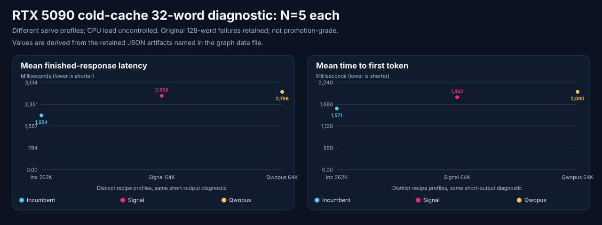

# Qwen3.8 efficient variants on one RTX 5090

**Date:** 2026-09-12. **Scope:** direct text/tools, one 32 GB RTX 5090,
llama.cpp, 64K/C1 challengers against the retained 262K/C1 incumbent.

**Decision:** retain the incumbent; no tested challenger cleared replacement
gates. This is a bounded local selection, not a universal model ranking.

<!-- benchmark-result-card/v1 -->
## Result card

> Signal, Swift, Qwopus Flash, and Minitron all served the functional workload
> on this RTX 5090, but output and quality failures prevented promotion.

| Setup | Retained value |
|---|---|
| Models | Four pinned variants in the [managed recipes](2026-09-12-qwen38-efficient-variants-rtx5090-evidence/recipes.toml); exact identities below |
| Hardware | One NVIDIA RTX 5090, 32,607 MiB, sm120, driver 616.64; Windows/Docker/WSL2 |
| Runtime | llama.cpp `a298422da78eb75e440a7de0ca408af64d323d93`; digest `cf2e30bc855cf58cdbdc65d05b5b5e02afa95fb788343a5334d704367ac5c9ac` |
| Recipe | Q6_K weights, Q4_0 K/V, full GPU placement, 64K/C1; Signal/Swift MTP3 and [matched no-spec controls](2026-09-12-qwen38-efficient-variants-rtx5090-evidence/nospec-controls.toml) |
| Measurement path | Direct online loopback; cache state retained per run; some diagnostic quality timings overlap repository tests |
| Contract | Text/tools, thinking on/off diagnostics; 64K configured is not proof of 57K input plus 8K output, nor a 262K replacement |
| Evidence | Functional, diagnostic quality, failed strict capacity and revised short-output scouts; no finalist statistical ranking |
| Decision | Operator authorized best-supported promotion; no challenger qualified. Exact incumbent restored, no route/client changes |

| Headline measurement | Local result | Conditions |
|---|---:|---|
| Original candidates completing functional gate | 4/4 | Six checks each, tools 20/20 each, C1 |
| Exact retrieval | 47,349 actual prompt tokens | All four original candidates; nominal filler was 57,344 |
| Signal / Swift strict reasoning screen | 9/10 each | Same ten questions, one attempt, 5,120 combined completion-token cap |
| Qwopus / Minitron strict reasoning screen | 1/10 / 3/10 | Same syntax and budget; format/exhaustion failures count |
| Signal / Swift exact 128-word output | 0/5 each, with and without MTP | Unique canaries, max 512 tokens; failed requests excluded from speed |

**Why it matters:** a short-answer fine-tune or smaller model is useful only
when it finishes the right answer. Repetitive cap-hitting decode is not a win.

**Important caveat:** this small fixed screen cannot establish broad
quality parity, a 2% loss bound, or the incumbent's full-context and client contract.

[Artifact manifest](2026-09-12-qwen38-efficient-variants-rtx5090-evidence/artifact-manifest.json)
· [Evidence index](2026-09-12-qwen38-efficient-variants-rtx5090-evidence/README.md)
· [Publication summary](2026-09-12-qwen38-efficient-variants-rtx5090-evidence/publication-summary.md).

## Outcome and decision

Keep the exact Unsloth Qwen3.8-27B UD-Q4_K_XL/native-MTP3 incumbent. The tested
challengers did not satisfy the preregistered failure-free advancement rule.
Signal is the most interesting efficiency research lead; its pinned publisher
card declares Apache 2.0 (see the source registry). It is
not a qualified replacement in this run. Swift tied its initial reasoning
screen and has a separately verified commercial-license threshold; eligibility
was not assumed. Qwopus and Minitron retained additional quality failures.

The user authorized unattended selection and promotion. No extra permission
was needed to decide, but authorization did not justify bypassing correctness
or silently reducing context from 262K to 64K. The incumbent's own exact
128-word failure is retained; retaining it is not a claim that it is flawless.

## Exact configuration

Repository `948346f5ab553361c6b61d9517b71a0e5e3cfe98`, isolated branch
`codex/rtx5090-model-bakeoff-20260912`, clean at start and campaign-dirty at
completion. Every command used verified `python -m anvil_serving.cli` from
that worktree. Installed metadata reported 1.0.0 despite v1.2.1 source; exact
module/commit identity was retained instead of treating that string as runtime provenance.

| Profile / served alias | Weight repository and revision | Weight file |
|---|---|---|
| Signal / `signal38-27b-q6k-mtp3-64k` | `agentionai/Signal-3.8-27B-GGUF@9848da210febc2141edb7e3f89cfc307a0d15163` | `AP-Q6_K/Signal-3.8-27B-AP-Q6_K.gguf` |
| Swift / `swift38-27b-q6k-mtp3-64k` | `ukisai/Swift-Qwen3.8-27B-GGUF@dfc5e7382fa86bd3b971108e23423be5ef18941e` | `Swift-Qwen3.8-27B-Q6_K.gguf` |
| Qwopus / `qwopus38-27b-flash-q6k-nospec-64k` | `mradermacher/Qwopus3.8-27B-Flash-i1-GGUF@a2f33e11aa22e467206633d7af9da1990f7111b9` | `Qwopus3.8-27B-Flash.i1-Q6_K.gguf` |
| Minitron / `qwen38-20b-minitron-q6k-nospec-64k` | `mradermacher/Qwen3.8-20B-Minitron-i1-GGUF@ef2d8cbbb83bbe27142546665163d2ab9d31727c` | `Qwen3.8-20B-Minitron.i1-Q6_K.gguf` |

All use the runtime above, batch/microbatch 512/256, eight threads, Flash
Attention, Jinja, graph optimization, full GPU layers, and no native KV
offload. All exact sampling, draft flags, revisions, cache paths, and served
aliases are in [recipes](2026-09-12-qwen38-efficient-variants-rtx5090-evidence/recipes.toml)
and [controls](2026-09-12-qwen38-efficient-variants-rtx5090-evidence/nospec-controls.toml).
The 3 GiB reserve was not waived. Feasibility produced benchmark survivors,
not guaranteed performance or full-context qualification.

Incumbent weights are `unsloth/Qwen3.8-27B-GGUF` revision
`4ca720788d1e01f1bff70c033e0d0028fd02e502`, same runtime digest, UD-Q4_K_XL,
native MTP3, 262,144 context. Its API advertises
`qwen38-27b-unsloth-ud-q4_k_xl-native-mtp3-262k`; earlier artifacts used the
accepted recipe label. See the [provenance errata](2026-09-12-qwen38-efficient-variants-rtx5090-evidence/provenance-errata.json).

## Method

[Run plan](2026-09-12-qwen38-efficient-variants-rtx5090-evidence/run-plan.json)
and [workload amendments](2026-09-12-qwen38-efficient-variants-rtx5090-evidence/workload-manifest.json)
separate the original gates from later diagnostics. Models never graded their
own answers. The pinned ten-domain MMLU-Pro fixture uses independent exact
answer keys and final-line syntax; it is a sanity screen, not representative
MMLU-Pro accuracy. Three repeats test stability on the same questions, not 30
independent topics.

Thinking-enabled scouts requested 1,024 visible allocation plus 4,096 reasoning
headroom, but the runtime enforces a combined 5,120-token cap, not separate
partitions. Thinking-disabled MMLU uses 1,024 tokens and three repeats. Earlier
built-in-only runs used 256 visible tokens and are a different workload.
The runtime reports total completion tokens and reasoning characters, not
separate reliable reasoning-token counts. Control-normalization warnings
remain visible in native evidence; requested controls are not relabeled verified.

Capacity scouts used N5/C1, nominal 4,096 input, explicit unique prefixes,
request canaries, max 512 completion tokens, and strict 128-word output.
After failures, a distinct 32-word diagnostic retained strict scoring. Cache
markers are deterministic across runs, so actual cached-token counters matter.
N5 percentiles are descriptive; they are not p99 service-level estimates.
No matched, statistically adequate finalist population exists. The chart below
is limited to the successful cold-cache N5 short-output diagnostic, with the
different serve profiles and uncontrolled CPU load explicitly labeled. The
quality artifact's built-in chat timing includes a
32K-class context probe and is not short-chat latency.

## Results

| Profile | Thinking-on strict screen | Completion tokens across 10 attempts | Thinking-off repeated MMLU | Strict 32-word diagnostic |
|---|---:|---:|---:|---|
| Incumbent UD-Q4_K_XL/MTP3 | 8/10 | 13,129 | 21/30 | 5/5, cold |
| Signal MTP3 | 9/10 | 10,966 | Not run in original MTP profile | Not run |
| Swift MTP3 | 9/10 | 11,020 | Not run | Not run |
| Signal no-spec | Isolated larger-budget retry failed | Not a ten-question enabled population | 24/30 | 5/5, cold |
| Swift no-spec | Not run | Not run | Not run | 5/5, warm |
| Qwopus no-spec | 1/10 | 12,017 | 24/30 | 5/5, cold |
| Minitron no-spec | 3/10 | 24,580 | 15/30 | 0/5 |

All four original recipes passed smoke, JSON, retrieval, tools 20/20,
streaming tools, and tool-result continuation. Signal and Swift passed the
earlier repeated built-in intelligence/tool checks; those are not substitutes
for the external suite.

Signal and Swift each exhausted the same computer-science question in the
thinking-on scout. Signal's later no-spec retry also exhausted 9,216 combined
tokens with no final answer. This is a diagnostic changed profile/budget,
not an otherwise matched budget-only speed comparison. Qwopus's 1/10 includes
eight answer-format failures; several visible answers selected the correct
option without the required final syntax. Reinforced syntax plus 2,048 visible
tokens yielded 7/10, preserving factual/format and exhaustion failures.
Minitron's smaller weights did not prevent factual mistakes or extended reasoning.

The incumbent passed 8/10 in the matched enabled diagnostic, with a chemistry
answer failure and the same computer-science budget exhaustion. Signal used
16.5% fewer total completion tokens and Swift 16.1% fewer than its 13,129.
Those are configuration-level observations on ten questions, not separate
reasoning-token measurements or statistical evidence of general superiority.

With thinking disabled, the incumbent passed 21/30 attempts versus Signal
no-spec and Qwopus at 24/30; Minitron passed 15/30. The incumbent exhausted the
business, computer-science, and engineering questions at the 1,024-token cap.

[Machine-derived chart data](2026-09-12-qwen38-efficient-variants-rtx5090-evidence/cold-output-graph-data.json)
bind each point to its native artifact hash. All three plotted populations
finished 5/5 exact 32-word requests with zero reported cached-prompt fraction.
Swift's warm population and Minitron's failed population are excluded. This
is not a matched MTP speedup or evidence of broader model quality.

The [summary](2026-09-12-qwen38-efficient-variants-rtx5090-evidence/summary.json)
and native artifacts contain the final incumbent comparison and request-level
failure classes. Do not pool the enabled/disabled or altered-budget populations.

## Failures and caveats

- **Strict output:** the incumbent, Signal, and Swift all failed original
  128-word output. Signal/Swift cap-hitting loops cannot be credited as fast
  useful output. Both still failed without speculation.
- **Context:** 57,344 nominal filler yielded 47,349 actual input tokens. No
  challenger qualified the planned actual 57K-plus8K reserve, 262K deployment,
  multimodal support, real client acceptance, endurance, or broad SWE quality.
- **Quality:** exact formatting and cap exhaustion are distinct from knowledge
  errors. Qwopus's known indentation concern did not receive a dedicated
  executed-Python qualification. The strict scores are intentionally bounded.
- **Timing:** cache states differ, samples are small, and some diagnostic
  quality runs overlapped CPU regression tests. These are not clean finalist
  throughput comparisons or proof of publisher speed claims.
- **Fix-forward:** managed retained-container lifecycle was missing. Guarded
  stop/start, admission, immutable fingerprints, timeout/readiness, MCP schema,
  and regressions were added. Independent review accepts serialized campaign
  use; general merge/release is held pending shared lifecycle locking and
  immutable process attestation. Windows Pi startup/pipe polling and a segmented
  HTTP test reader were separately repaired and independently reviewed.

See the [friction log](2026-09-12-qwen38-efficient-variants-rtx5090-evidence/friction-log.md),
[lifecycle review](2026-09-12-qwen38-efficient-variants-rtx5090-evidence/lifecycle-review.json),
[Pi review](2026-09-12-qwen38-efficient-variants-rtx5090-evidence/pi-rpc-review.json),
and the tracked ticket `.tickets/2026-09-12-retained-recipe-lifecycle-and-evidence-gaps.md`.

## Restoration and verification

All candidate containers were removed through managed unload; downloaded
weights remain cached. The exact retained incumbent restarted healthy and
passed all six preflight checks again, including tools 20/20. The original
camera process's executable and start time were checked immediately before
preview/apply and it was not terminated. Split ownership returned to the
incumbent; the router remained absent as at baseline; shared-memory files were
empty. See [restoration](2026-09-12-qwen38-efficient-variants-rtx5090-evidence/restoration.json)
and [sanitized post-run observations](2026-09-12-qwen38-efficient-variants-rtx5090-evidence/restored-state.json).

The final repository regression passed 8,117 tests with 391 skips. Ruff,
documentation/evidence consistency, strict documentation build, links, and
CLI reference checks passed; see the [verification record](2026-09-12-qwen38-efficient-variants-rtx5090-evidence/verification.json).
Skipped tests and green code checks do not fill missing model/client gates
or remove the general lifecycle release hold.

## What to test next

A future Signal lower-bit/full-context recipe would require its own
feasibility, strict-output, broader coding/quality, context, and client gates.
It is not qualified by the present Q6_K/64K results. The prior September 3
quant/runtime comparison remains historical evidence, not a fresh result of
this campaign. No weight training or blind runtime migration was attempted to
force a winner from a failed profile.

## Evidence boundary

Current official and publisher sources are recorded with dates and decision
impact in the [source registry](2026-09-12-qwen38-efficient-variants-rtx5090-evidence/source-registry.json).
Signal/Swift efficiency claims, Qwopus publisher metrics, and Minitron's
pruning tradeoff are external priors. Only this card executed the local model
workload. Retaining the incumbent preserves the deployment, not a universal
claim that it outperforms every available model. No model promotion, route,
client-catalog change, controller rebuild, source merge, or package release occurred.

## Publication scope

This publication ships the retained benchmark evidence, reproducible candidate
registries, documentation indexes and evidence-consistency tests only. The
campaign's lifecycle and Windows code fixes remain separate, unmerged work;
their recorded regression results describe that campaign tree, not newly
released runtime behavior. Publication CI validates the documentation-only
commit independently. No package, live service, or model promotion is part of
publishing these results.
