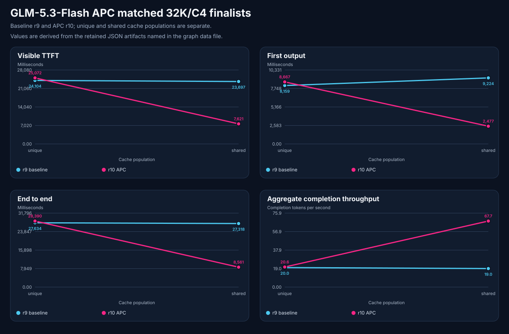

# GLM-5.3-Flash APC promotion follow-up

The [APC campaign](2026-09-19-glm53-apc.md) ended by restoring r9 and recording a recommendation. After explicit human approval, the same bounded r10 APC configuration was promoted and freshly accepted. This follow-up records that later decision without changing the historical campaign outcome.

<!-- benchmark-result-card/v1 -->

| Setup | Value |
| --- | --- |
| Model | `brandonmusic/GLM-5.3-Flash-tr3-4bpw@a5fee929cf4888b1824323e33e8a19b60129e025` |
| Runtime | v84 image `sha256:0f1cdcc8891f1cc3a444121eb61d366289a1cbba285f0892dcbb24bc94961692`; EXL3 4-bpw, FP8 MLA KV, no speculation |
| Hardware | Two NVIDIA RTX PRO 6000 Blackwell Max-Q GPUs, 96 GB each; TP2/EP2/DCP2 |
| Contract | 327,680 configured tokens, C4, 2,048 batch tokens, eight images, native Max reasoning |
| Decision | Human-approved bounded r10 APC promotion with fresh acceptance |

APC is valuable when an agent repeatedly sends the stable part of a conversation: system instructions, tool definitions, session history, and a long document prefix. Pi tool-use and continuing sessions are examples of that shape. The cache can reuse the prefix, leaving only the turn-specific suffix to process. A cold or mostly unique request cannot reuse that work, so it needs its own comparison rather than being folded into a warm result.

| Frozen 32-request finalist | r9 baseline | r10 APC | Change |
| --- | ---: | ---: | ---: |
| Shared-prefix visible TTFT | 23.70 s | 7.62 s | −67.84% |
| Shared-prefix first output | 9.22 s | 2.48 s | −73.15% |
| Shared-prefix completed requests/s | 0.146 | 0.462 | 3.17× |
| Unique-prefix completed requests/s | 0.144 | 0.141 | −2.39% |

The isolated 75.58% prefix-cache hit fraction supports the shared-prefix mechanism. The unique-prefix result remained within the frozen 5% non-regression bound. These are 32 observations per arm and cache mode, so they establish a bounded repeated-prefix tradeoff rather than a universal latency guarantee.

The finalists used nominal 32K context, about 25K actual prompt tokens at C4, strict 16-word visible output, and Max reasoning. Reasoning volume varied, so request throughput and visible TTFT lead the comparison. The 309,422-token C1 needle does not prove four simultaneous full-context requests.

Fresh direct and authenticated routed preflight and Pi, Hermes, and OpenClaw acceptance passed after promotion. Retained campaign evidence separately passed image/OCR, four eight-image cases, a 110,760-token tool call, and matched three-repetition diagnostic quality cells. The diagnostic cells checked six intelligence markers, three tool checks, and three session checks per arm; they are not a broad intelligence, SWE, repository-agent, video, or soak benchmark. The earlier eight-request unique-prefix scout regressed throughput 11.8%; it remains retained and was superseded for the promotion decision by frozen 32-request finalists.

The candidate used a tested 52 GiB RAM and 1 MiB swap entrypoint. A prior baseline unlimited-swap observation did not reproduce after managed recreation, which observed zero swap; its cause is unknown. Roll back to exact r9 on correctness, containment/OOM, routed-readiness failure, or reproduced unique-prefix request-throughput regression above 5%.

Fresh managed acceptance followed the explicit approval. This is a bounded configuration decision, not an automatic model-selection policy: the exact r9 recipe remains the rollback path if correctness, containment, routed readiness, or the frozen unique-prefix gate fails.

See the historical [campaign finding](2026-09-19-glm53-apc.md), its [sanitized evidence bundle](2026-09-19-glm53-apc-evidence/README.md), [artifact manifest](2026-09-19-glm53-apc-evidence/artifact-manifest.json), [publication summary](2026-09-19-glm53-apc-evidence/publication-summary.md), and [matched chart data](2026-09-19-glm53-apc-evidence/graphs/apc-graph-data.json) for artifacts, failures, and restoration history.
