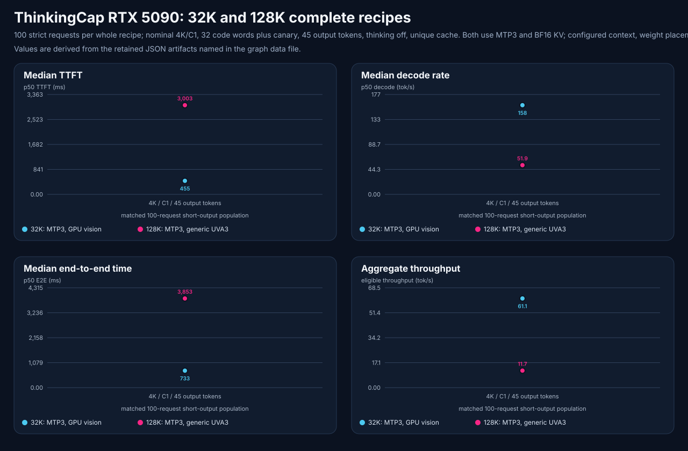

# ThinkingCap Qwen3.8 27B: 128K context on RTX 5090

**Date:** 2026-09-24 UTC. **State:** declared qualification gates passed; authorized direct candidate retained.

<!-- benchmark-result-card/v1 -->
## Result card

ThinkingCap runs with a 131,072-token total context window and vision on one RTX 5090. The retained MTP3/UVA3 configuration passed functional, vision, repeated quality, 100-request capacity, all 60 context cases and both synthetic agentic cases. Thirty context cases used 125,838–125,869 actual input tokens with a 4,096-token completion allowance. Its short-output median decode is 51.8855 tok/s, compared with 158.3552 tok/s for the earlier 32K recipe. The first memory-feasible, no-MTP configuration failed quality and was rejected.

| Setup | Recorded value |
|---|---|
| Model | `bottlecapai/ThinkingCap-Qwen3.8-27B-NVFP4A4-AWQ@f8fe157f207a13f977bc3d620ce10a3e9ba5ab11`, served as `thinkingcap-awq-5090` |
| Hardware | One 32 GB RTX 5090; Windows, Docker Desktop Linux and WSL2; direct loopback endpoint |
| Runtime | vLLM 0.29.0; NVFP4 W4A4 AWQ mixed FP8/BF16 weights; BF16 vision, BF16 KV, default FP32 recurrent state |
| Context contract | 131,072 total prompt plus output tokens, C1; up to two images, no video |
| Current tested recipe | [MTP3, generic UVA 3 GiB](2026-09-24-thinkingcap-context-evidence/configurations/thinkingcap-awq-vllm029-5090-128k-mtp3-bf16-uva3.toml); Triton target/draft, CUDA graphs, memory fraction .93 |
| Measurement path | Direct managed endpoint; warm process, unique prompts, prefix cache off; one active request |
| Decision boundary | `no-promotion`; direct candidate operations authorized by the user, no route/client changes |

| Current MTP3/UVA3 result | Value | Boundary |
|---|---:|---|
| Native functional / thinking observations | 27/27 and 9/9 | Deterministic behavior checks, separate thinking-off/on requests |
| Vision | 18/18 | Six synthetic cases, three repetitions; up to two images |
| Repeated quality diagnostic | **30/30 passed** | Ten MMLU-Pro questions repeated three times, all normal `stop`; small diagnostic only |
| Strict capacity | **100/100 passed** | Actual 3,609-3,687 prompt tokens and 45 output tokens; C1, thinking off |
| Median TTFT / decode / E2E | **3,003.0448 ms / 51.8855 tok/s / 3,852.9263 ms** | Same complete strict short-output population |
| Aggregate throughput | **11.6784 tok/s** | Includes prompt processing; not a long-context or reasoning speed claim |
| Context matrix | **60/60 correct and completed**, all `stop` | Thirty cases at 32,658–32,689 actual input tokens and thirty at 125,838–125,869; 4,096-token completion allowance |
| Synthetic agentic cases | **2/2 passed**, six turns and four tool calls | Deterministic tool workflow and recovery checks; not SWE |

**Why it matters:** System-RAM weight offload makes room for a larger BF16 cache while preserving the complete vision-capable checkpoint. The bounded context matrix passed at near-limit input depths, with a substantial speed cost on the matched short-output workload.

**Important caveat:** These are whole-configuration results. They do not establish that increasing context causes a quality loss or that MTP generally improves accuracy. The diagnostic is small and is not a full MMLU-Pro score.

[Evidence index](2026-09-24-thinkingcap-context-evidence/README.md) · [Artifact manifest](2026-09-24-thinkingcap-context-evidence/artifact-manifest.json) · [Publication summary](2026-09-24-thinkingcap-context-evidence/publication-summary.md)

## Exact identity and method

The image is `vllm/vllm-openai:v0.29.0@sha256:082ca6f035279109041ffd3fe0695cb568b29bc580b35c4f297a66a08b216c1b`, engine revision `98dff2a81d747d1dba01a47f939f48c3526d4206`. Operational commands use CLI 1.2.1 from the original checkout at `2b99e3353eb2e5a2813195af85050b1da0754332`, with unchanged source hashes from the prior campaign. A separate worktree authors the public evidence. Complete local weights remain cached, including vision and MTP tensors.

The quality suite is the same pinned ten-question diagnostic used by the [earlier 32K campaign](2026-09-23-thinkingcap-5090.md): temperature zero, three repetitions, a total 10,240-token completion cap (2,048 visible plus 8,192 nominal reasoning headroom). The endpoint does not hard-partition those budgets. Near-limit context reserves 4,096 completion tokens and a 1,024-token calibration margin. Tokenizer usage, not requested bucket labels, determines measured input depth. Separate text-context and small-image tests do not qualify a maximum-size two-image request at the context boundary.

## Failed and prepared branches

The GPU-only 128K branch at memory fraction .95 failed its initial CUDA reservation check before weights loaded: 30.2 GiB free was below the requested 30.23 GiB. That is not a KV-fit failure. A 64K MTP recipe and nonselective 1 GiB offload recipe were prepared but never loaded after the user required at least 128K.

The selective visual-UVA branch at .93 loaded 20.49 GiB of GPU weights, offloaded 0.86 GiB of visual weights, and reported an 8.4 GiB KV pool with 134,138-token capacity. It passed function, vision, thinking control and the two-request context scout. The quality test then returned the wrong `FINAL=D` for the computer-science question in all three repetitions, each with a normal `stop` after 8,650 completion tokens. This was a deterministic answer failure, not reasoning-budget exhaustion. Capacity, the full context matrix and agentic testing were not run on that rejected branch. [Native quality](2026-09-24-thinkingcap-context-evidence/native/candidate/quality.json).

## Current MTP3/UVA3 measurements

Startup reported 19.11 GiB of GPU weights, 3.02 GiB of weights offloaded through generic UVA (including 0.86 GiB visual), a 9.7 GiB KV pool, 138,519 cache tokens, and 0.10 GiB of CUDA graphs. BF16 KV and the model-default FP32 recurrent state were preserved. The native functional gate passed 27/27, separate thinking-enabled observations passed 9/9, and six synthetic image cases repeated three times passed 18/18. The quality diagnostic passed its initial 10/10 scout and full 30/30 repetition. [Startup](2026-09-24-thinkingcap-context-evidence/native/mtp-uva3/startup.log), [quality](2026-09-24-thinkingcap-context-evidence/native/mtp-uva3/quality.json).

The capacity population used the same nominal 4K/C1, unique-cache, 32-word-plus-canary contract as the earlier 32K profile: 100 requests, 45 actual output tokens, 512-token completion cap, thinking disabled, and strict adherence. Every request passed and was performance-eligible. P95 TTFT was 3,043.1308 ms and p95 E2E was 3,894.4201 ms. TPOT/mean inter-token latency is a per-request proxy (p50 19.27255 ms), not a measured distribution of every token arrival. With n=100, p99 is an order statistic rather than a stable SLA. [Native capacity](2026-09-24-thinkingcap-context-evidence/native/mtp-uva3/capacity.json).

The whole-recipe comparison changes context, memory fraction and weight placement together. It does not isolate the causal effect of any one setting. The earlier 32K profile remains a faster, smaller-context alternative with sealed evidence.

The [graph data](2026-09-24-thinkingcap-context-evidence/benchmark-graph-data.json) binds every plotted value to its raw artifact hash. Rendering twice produced byte-identical SVG and data files.

## Long context and tool workflows

The full context matrix completed 60/60 cases correctly, all with normal `stop`. It covered five deterministic retrieval tasks at two requested buckets, three positions (10%, 50%, 90%) and two repetitions. Actual input usage was 32,658–32,689 tokens for the lower bucket and 125,838–125,869 for the upper bucket, thirty cases each. The largest observed input plus its 4,096-token completion allowance totals 129,965; the configured limit is 131,072. Exact-total and one-over-limit admission were not tested. Native context artifacts do not retain separate generated-token counts, so the allowance must not be presented as actual generated output. [Context summary](2026-09-24-thinkingcap-context-evidence/context-full-summary.json), [native context](2026-09-24-thinkingcap-context-evidence/native/mtp-uva3-context-full/artifact.json).

The two synthetic agentic cases then passed with six API turns and four tool calls. Finish reasons were four `tool_calls` and two `stop`. This is a bounded deterministic tool and recovery check, not repository execution or a SWE benchmark. [Agentic summary](2026-09-24-thinkingcap-context-evidence/agentic-summary.json), [native agentic result](2026-09-24-thinkingcap-context-evidence/native/mtp-uva3-agentic/artifact.json).

## Host memory

WSL retained substantial reclaimable page cache while Windows headroom was low. On the earlier no-MTP branch, a managed idle cache reclaim reduced file cache from 12.9 to 2.1 GB; a delayed Windows sample recovered to approximately 11.8 GiB physical and 12.9 GiB virtual free. These are earlier-branch observations. See [earlier reclaim evidence](2026-09-24-thinkingcap-context-evidence/native/host/cache-reclaim-apply.json).

After the current MTP3/UVA3 load, the same guarded operation reduced file cache from 13.0 to 5.3 GB. The settled Windows sample had approximately 8.0 GiB physical and 9.7 GiB virtual free. During the full context workload at 06:26 UTC, Windows still reported 6.6 GiB physical and 8.7 GiB virtual free. No weights, volumes, host settings or WSL instance were removed or restarted. [Current reclaim](2026-09-24-thinkingcap-context-evidence/native/mtp-uva3/reclaim.json), [settled memory](2026-09-24-thinkingcap-context-evidence/native/mtp-uva3/host-memory-after-reclaim.json), [active-workload memory](2026-09-24-thinkingcap-context-evidence/native/mtp-uva3/host-memory-context-active.json).

After all model gates, Windows had 7.01 GiB physical and 9.04 GiB virtual free; the final GPU observation had 1,440 MiB free. Across 1,561 retained five-second GPU samples from readiness through the full context matrix, the minimum free memory was 1,440 MiB, above the declared 1,024 MiB floor; sampled peaks were 61°C and 431.89 W. The buffered CSV ends at 07:11:49 UTC, before the brief agentic gate, and retains an excluded incomplete terminal row. The separate final observation follows all gates. These samples do not establish a continuous minimum, energy per token, or production soak result. [Resource and ending-identity evidence](2026-09-24-thinkingcap-context-evidence/final-resource-summary.json).

## Evidence boundary

The first 128K branch remains a failed quality candidate. The retained MTP3/UVA3 branch passed every declared model gate and its ending health and identity checks. The same container, pinned image, model revision and recipe digest remain active; the retained engine log contains one launch configuration, one engine PID and no error signatures. Managed status does not expose a restart counter. [Ending state](2026-09-24-thinkingcap-context-evidence/restoration.json).

Text context and small-image vision were tested separately. Combined near-limit vision, C2, SWE, video and long-duration soak remain untested. No route or client alias was promoted. The earlier unrelated Windows Pi full-repository test failure remains a separate limitation; no runtime or test source was changed in this extension.
