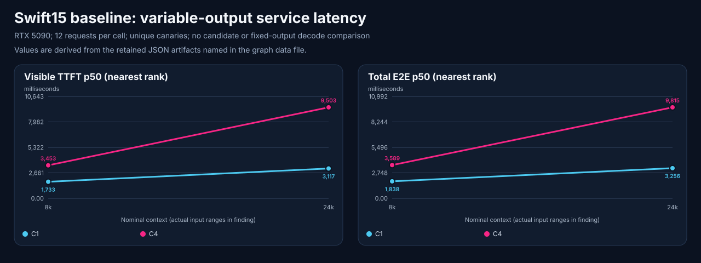

# Swift15 host-cache promotion after the 96 GB upgrade

**Date:** 2026-10-05. **Scope:** one RTX 5090, Windows/Docker/WSL2, direct endpoint.
**Decision:** Swift15 host-cache profile `current`; tested Flash Next/Strata profile `rejected`.

<!-- benchmark-result-card/v1 -->
## Result card

> Expanding the same Swift15 image from 2 GiB/four host cache slots to
> 8 GiB/eight slots reduced median visible latency by 41.2% on 12 matched
> revisits per arm. Fresh regressions and real-client acceptance passed.
> The larger Flash Next candidate failed the frozen practical latency gate.

| Setup | Recorded value |
|---|---|
| Model | Swift-1.5 derivative of Qwen3.8-27B; checkpoint `ff891a11…` |
| Hardware | One RTX 5090, 32,607 MiB; nominal 96 GB host, 64 GB WSL cap |
| Runtime | NInfer `bace20dc…`, image `59df48dd…`, NVFP4, K8V4, DFlash2 draft7 |
| Recipe | [Exact pins and reconstruction parameters](2026-10-05-swift-96gb-baseline-evidence/configuration-identity.json) |
| Measurement | Separate unique-prefix service cells, paired shared-history pilot, functional/quality and client checks |
| Selected contract | 262,144 tokens, C4; 8,192 MiB host KV/eight slots, 40 GiB hard RAM/no extra swap |
| Decision boundary | Same-image Swift cache bundle promoted; Flash expansion stopped after failed latency scout |

| Headline measurement | Local result | Conditions |
|---|---:|---|
| Repeated protocol preflight | 3/3 repetitions | All five check families passed in each run |
| Deterministic agentic cases | 18/18 | Synthetic tools/recovery, oracle 7; separate from repository patch execution |
| Retrieval/context cases | 27/27 + 9/9 | Up to 122,788 and 253,838–253,868 actual input tokens, respectively; 8,192 reserved output tokens |
| Images | 12/12 | Pinned synthetic image corpus; serial, no video qualification |
| Official SWE grading | 4/5 in each of two attempts | Historical boundary-only run and distinct immutable-image replay; five explicit instances each, not a full dataset score |
| Strict capacity | 0/12 completed | 8K/C1, exact 128-word stress, no visible output; performance-ineligible |

**Why it matters:** the extra RAM improved bounded conversation reuse with the
existing model. The result does not imply faster cold decode, a larger GPU KV
pool, or better coding quality. The combined byte/slot change was tested as one
bundle; its components were not separately measured.

**Important caveat:** Flash Next was rejected after the failed practical latency gate and bounded diagnostics; the selected Swift profile passed final acceptance.
Configured C4 is not four simultaneous 262K windows. Most correctness runs
overlapped bounded build/download activity, so their timings are not rankings.

[Evidence index](2026-10-05-swift-96gb-baseline-evidence/README.md) ·
[Artifact manifest](2026-10-05-swift-96gb-baseline-evidence/artifact-manifest.json) ·
[Machine-readable summary](2026-10-05-swift-96gb-baseline-evidence/summary.json)

## Identity and method

The measured checkpoint is
`kaushikvira/Qwen3.8-27B-swift15-nvfp4full-dflash2-NInfer-v3`
at `ff891a1130adfcf46bf745e06f0fa3dcde2e8c82`, served as
`qwen38-swift15-ninfer-dflash2-c4-262k`. It is a derivative, not the unmodified
official checkpoint or the earlier Swift Q6_K lane. Exact engine, image,
model-file and recipe hashes are retained in the configuration artifact.

The native runner records Anvil 1.5.0, source `1704cf58…` with a tracked diff
hash and oracle revision 7. Publication does not relabel those observations as
a clean later revision. Temperature 0.9, top-p 0.95 and default thinking were
sent for these measured workloads; the serving recipe's min-p is a separate
default. Preflight used 2,048 visible tokens plus 16,384 reasoning headroom.
Context and image probes reserved/requested 8,192 output tokens.

Only the RTX 5090 performed inference. A separate CPU-only worker executed
SWE tasks and official grading; it is not a benchmark of that worker's GPUs.
The strict capacity cell ran after local build/download I/O became idle,
although remote CPU grading initially remained active. These qualifications
do not establish concurrent model/media capacity or end-to-end client routing.

## Bounded quality and context results

The three context families tested needle retrieval, ordered extraction and
distractor rejection at positions 10%, 50% and 90%. All 27 lower-bucket cases
and nine full-reserve cases passed. The latter used 253,838–253,868 actual input
tokens inside the 262,144 window, leaving the requested 8,192-token reserve.
That is serial retrieval evidence, not general reasoning accuracy at that
length, C4 long-context capacity or proof that every possible position works.

All 12 image attempts passed the pinned corpus's deterministic checks. No
video result is included. The synthetic agentic suite passed 18/18; its tool
fixtures are distinct from the independently executed SWE tasks.

| Frozen SWE Verified instance | Official result |
|---|---|
| `astropy__astropy-12907` | Resolved |
| `django__django-10097` | Not resolved; test failure |
| `matplotlib__matplotlib-13989` | Resolved |
| `scikit-learn__scikit-learn-10297` | Resolved |
| `sympy__sympy-11618` | Resolved |

The five-case denominator stays fixed. Mini-SWE-Agent and SWE-bench revisions,
prediction/report hashes and container limits accompany the native result.
Task-image IDs were observed after task execution and after grading; unchanged
boundary observations do not prove pre-task pin enforcement. This limits any
future paired comparison and remains visible rather than being retroactively
fixed by newer harness checks.

A distinct [paired replay](2026-10-05-swift-96gb-baseline-evidence/swift-swe-paired-result.json)
also graded all five and resolved the same four; Django remained unresolved.
It ran clean source `575257efe7cca8205cea643cbd637416d71ea844`, froze the five
immutable image IDs, verified them before the agent and before the grader,
and used immutable IDs for grading. The task stage disallowed pulls. This
improves reproducibility without changing the official oracle or erasing the
first attempt. Its timings overlapped preparation activity and are not speed
evidence. Neither five-case attempt is a full SWE-bench Verified score.

## Failed stress and revised workload boundary

All 12 strict 128-word capacity attempts failed with no visible content.
The retained [diagnostic](2026-10-05-swift-96gb-baseline-evidence/swift-stream-diagnostic-001.json)
then tested ordinary prose and the repeated-word fixture in both streaming
and nonstreaming modes. Ordinary prose produced visible output in both;
the repeated-word fixture returned only reasoning-channel output in both,
with stop finishes. This narrows the observation to that workload and
answer separation; it is not evidence that streaming generally fails.

The campaign owner subsequently froze a separate practical summary/canary
service-latency v2 workload before candidate results. Variable answer lengths
mean service TTFT and E2E must stay distinct from fixed-output decode rates.
The original failed stress remains a failure; no validator is relaxed to turn
its responses into performance evidence. All four v2 cells completed 12/12 after local download/build and remote CPU
grading had ended. They preserve visible output, own-marker, no-foreign-marker
and complete-capture gates; summary semantics are assessed by separate quality
suites, not by those markers. With only 12 requests per proposed cell, p99
would in any event be descriptive and maximum-like, not a stable service tail.

## Versioned practical service latency

All cells use 12 requests, unique-prefix intent, request canaries, default
thinking, temperature 0.9/top-p 0.95 and an 8,192-token completion cap.
`response_words=0` and `observe` specify variable output; they do not claim
fixed-word adherence. Nominal context labels are filler targets, not actual
token counts. Native nearest-rank p50 visible TTFT and total E2E include service/queue work. The table preserves this historical convention; later paired cache comparisons use explicitly recomputed average-middle-pair medians.

| Nominal context / concurrency | Completed | Actual input tokens | Completion tokens | Visible TTFT p50 | E2E p50 |
|---|---:|---|---|---:|---:|
| 8k-c1 | 12/12 | 7,415–7,433 | 186–396 | 1.733 s | 1.838 s |
| 8k-c4 | 12/12 | 7,415–7,433 | 142–1075 | 3.453 s | 3.589 s |
| 24k-c1 | 12/12 | 22,467–22,495 | 195–425 | 3.117 s | 3.256 s |
| 24k-c4 | 12/12 | 22,467–22,495 | 217–470 | 9.503 s | 9.815 s |

[Native sources and derivation](2026-10-05-swift-96gb-baseline-evidence/service-latency-summary.json)
retain the full numerical precision. These are baseline measurements only.
No fixed-output decode, speculation gain, broad semantic correctness or p99
service-tail claim follows. The native artifact does not retain every request's
finish reason or exact reasoning-token split, so neither is inferred.

[Chart data and exact source hashes](2026-10-05-swift-96gb-baseline-evidence/benchmark-graph-data.json).

## Research leads and memory lessons

The retained recipe explicitly reduced host KV/state pools for the previous
32 GB host. The proposed same-image trials are 8,192 MiB/eight slots, followed
by 16,384 MiB/eight slots. They target inactive conversation reuse, not guaranteed
cold decode gains. Active requests still reserve the shared GPU KV pool;
host RAM does not create more VRAM. SMBIOS reports two 48 GiB Corsair
DDR5 modules configured at 6000; that is a configuration observation, not
measured bandwidth or equivalence to the community DDR5-6400 system. The
8 GiB/eight-slot arm now has the bounded paired pilot below; the 16 GiB
proposal remains unmeasured.

Flash Next with Strata UD-IQ4_XS is a separate larger-model hypothesis. The
pinned engine provides expert offload, so a resident-GPU SGLang memory estimate
cannot reject every implementation. Current primary documentation and recent
5090/96 GB community reports informed the choice; none is a local result.
The [dated source registry](2026-10-05-swift-96gb-baseline-evidence/source-registry.json)
separates publisher specifications, engine behavior and community anecdotes.

## Same-image host-cache pilot

The predeclared sequential pilot compared 2 GiB/four host slots with
8 GiB/eight slots, keeping the immutable Swift image/model, full engine
configuration and 282,112-token device KV pool fixed. Six actual prompts
totaled 373,981 tokens, exceeding that device pool. Each fresh server handled
25 preflight requests plus 18 pilot requests; native starts and completions
matched all 43, with no unmatched inference observed. Each arm passed 18/18
canaries. Benefit statistics use only the 12 matched revisits per arm.

| Revisit measure | 2 GiB / four slots | 8 GiB / eight slots |
|---|---:|---:|
| Retained prompt tokens | 124,648 | 373,954 |
| Requests with retained prefix | 2/12 | 6/12 |
| Visible TTFT, average-middle-pair median | 9.100 s | 5.353 s |
| E2E, average-middle-pair median | 9.227 s | 5.498 s |
| Visible TTFT, native nearest-rank p50 | 8.967 s | 1.753 s |
| E2E, native nearest-rank p50 | 9.130 s | 1.861 s |

The conservative statistical median shows 41.2% lower visible TTFT and
40.4% lower E2E. The conventions differ materially because the expanded arm
has exactly six hits and six misses; neither may silently replace the other.
Both satisfy the predeclared gate. The retention branch independently passes
with about three times the retained tokens and no E2E regression.

Peak container memory was 23.10 versus 29.88 GiB within a 40 GiB/no-extra-swap
bound, with zero memory-max, OOM and OOM-kill events. The observed benefit is
for the combined host-byte/slot change; this experiment cannot separate their
individual effects. It is a small control-then-expanded reuse experiment,
not a cold-decode, p99, general coding-quality or new SWE score. State-transfer
fields named `bytes` have uncertain producer units and are not interpreted as
physical byte volumes; main-KV transfer counters are separately recorded.
Fresh service, agentic, long-context, image and explicitly cache-aware continuation gates passed; final configuration and client acceptance passed.

[Predeclared plan](2026-10-05-swift-96gb-baseline-evidence/swift-host-cache-experiment-plan.json),
[comparison](2026-10-05-swift-96gb-baseline-evidence/swift-host-cache-comparison.json),
[control analysis](2026-10-05-swift-96gb-baseline-evidence/swift-cache-control-analysis.json)
and [expanded analysis](2026-10-05-swift-96gb-baseline-evidence/swift-cache-expanded-analysis.json)
retain exact values, request pairing and private source hashes. The evidence
index links the six native capacity artifacts; shared-history revisits remain
separate from the earlier unique-prefix service populations.

## Initial Flash Next feasibility and failed latency gate

The pinned Strata UD-IQ4_XS candidate subsequently prepared and loaded on the
same RTX 5090. The measured initial recipe used 32,768 context tokens, C1,
36 GiB resident experts and a 50 GiB RAM/RAM-plus-swap bound (zero swap),
with native-IQ MTP window 4. This differs from the earlier 52 GiB preparation
proposal. [Measured image, recipe and memory observations](2026-10-05-swift-96gb-baseline-evidence/follow-up-identity.json)
separate the initial runtime from the later instrumented image.

All five [protocol families](2026-10-05-swift-96gb-baseline-evidence/flash-m50-preflight-001.json)
and all 12 [image attempts](2026-10-05-swift-96gb-baseline-evidence/flash-m50-images-001.json)
passed. The frozen nominal 8K/C1 service-v2 cell completed 12/12 visible/canary
requests with 7,415–7,433 actual input tokens and 144–437 completion tokens.
Its native nearest-rank p50 visible TTFT was **30.406 s** and E2E **30.852 s**, versus Swift's
**1.733 s / 1.838 s** on the same versioned workload. It failed both the
declared 2× relative latency limit and 30-second 8K median-TTFT limit.
This is a failed practical gate with successful request validation, not 12
failed responses. [Native cell](2026-10-05-swift-96gb-baseline-evidence/flash-m50-32k-service-v2-8k-c1.json)
and [derived comparison](2026-10-05-swift-96gb-baseline-evidence/flash-m50-32k-initial-comparison.json)
retain the exact values. Variable outputs prevent a fixed-decode ranking;
no matched no-MTP control establishes speculation gain.

### Instrumented MMQ diagnosis is a separate population

The instrumented MMQ image passed protocol checks and three canary requests;
median visible TTFT was 29.196 s and E2E 29.447 s. These three diagnostic
requests do not replace the frozen 12-request gate or prove an optimization.
[Native diagnostic](2026-10-05-swift-96gb-baseline-evidence/flash-diagnostic-mmq-8k-c1.json),
[phase observations](2026-10-05-swift-96gb-baseline-evidence/diagnostic-mmq-phases.json)
and [source interpretation](2026-10-05-swift-96gb-baseline-evidence/strata-phase-interpretation.json)
remain separate from uninstrumented measurements.

The three large batched runs took 12.532, 10.285 and 10.581 seconds. Their
after-chunk callbacks took 7–9 ms, so those callbacks alone cannot explain
the larger request-time gap. The `dequant` bucket includes MMQ/gather and
submission gaps; it does not prove FP16 fallback or isolated kernel cost.
`host_staging_ms` and `ple_ms` accumulate within one engine process, whereas
wall, GPU timeline and chunk setup/wait/after-chunk counters are per run.
Cumulative differences require the same process and all intervening calls.
DONE `file_blobs`/`file_mb` are decode-only deltas after prompt/refill; they
neither measure total prompt I/O nor prove physical SSD reads. These bounds
remain in force after the investigation ended.

The supported fused-prefill diagnostic also passed preflight and 3/3 canaries,
but showed no useful latency benefit: median visible TTFT 29.570 s and E2E
29.927 s. Activation evidence proves at least one eligible fused branch ran,
not that every layer used it. [Native fused result](2026-10-05-swift-96gb-baseline-evidence/flash-diagnostic-fused-8k-c1.json),
[activation observation](2026-10-05-swift-96gb-baseline-evidence/fused-activation-observation.json)
and [diagnostic comparison](2026-10-05-swift-96gb-baseline-evidence/prefill-diagnostic-comparison.json)
remain an instrumented three-request comparison only. The original failed
twelve-request latency gate remains unchanged.

### Trace attribution retains a failed functional gate

The separate trace image failed preflight: shared-prefix tools passed 19/20,
with one connection closing without a response; the other four families
passed. Bounded authoritative logs and status left the disconnect unresolved.
Healthy container state and zero OOM events do not establish the cause or
convert that failure into a pass. [Native preflight](2026-10-05-swift-96gb-baseline-evidence/flash-trace-preflight.json)
and [failure disposition](2026-10-05-swift-96gb-baseline-evidence/trace-preflight-disposition.json)
retain that boundary.

Three subsequent C1 requests were authorized for diagnosis only. In ordered
pairing, each actual prompt equals batched tokens plus four window tokens and
one final token; no intervening traffic was observed by the campaign owner.
The measured cache refill took 13.211–13.973 s, versus 10.376–12.398 s in the
batched run. Summed trace components account for first output within 109–193 ms;
first output is distinct from visible-answer TTFT. This identifies material
refill cost, not physical SSD latency or a qualified improvement.
[Native diagnostic](2026-10-05-swift-96gb-baseline-evidence/flash-trace-8k-c1.json)
and [paired component analysis](2026-10-05-swift-96gb-baseline-evidence/trace-refill-analysis.json)
retain all three observations.

Cgroup `memory.events.max` increased from 1,087,870 to 2,166,246 across
asynchronous preflight-end/final observations, with zero OOM/OOM-kill counts.
These indicate charge/reclaim pressure at the bound, not a per-request count
or proof that memory caused the disconnect.

### Final fixed-4096 diagnostic and no-promotion decision

The final single-setting trial passed all five protocol families, including
20/20 tools, and three canary requests. It reduced borrowed slots from 1,424
to 883 and median refill from 13.402 s to 8.682 s, while batched prompt time
increased from 10.818 s to 16.333 s. Median visible TTFT was 27.813 s and E2E
28.218 s, versus 28.610 s / 29.049 s in the automatic trace diagnostic.
That tradeoff did not establish useful service improvement. These are three
instrumented requests per arm, without a reverse-order repeat or an
uninstrumented twelve-request confirmation; they do not replace the original
failed service gate or estimate p99.

[Fixed-4096 preflight](2026-10-05-swift-96gb-baseline-evidence/flash-prefill4096-preflight.json),
[native diagnostic](2026-10-05-swift-96gb-baseline-evidence/flash-prefill4096-8k-c1.json)
and [paired analysis](2026-10-05-swift-96gb-baseline-evidence/prefill4096-analysis.json)
retain the observations. The earlier trace disconnect remains unresolved;
a later functional pass does not erase it.

**Flash Next was rejected for promotion on this host and tested configuration.**
The failed scout stopped 128K/262K expansion, C4 capacity, agentic, SWE-finalist
and strict-stress runs. Those gates were not run, not passed. The evidence does
not establish a broad model-quality disadvantage or reject every possible
quantization and engine. The separate Swift host-cache profile subsequently passed its gates and was promoted.

Initial 32K/C1 feasibility therefore does not replace the baseline's 262K/C4
declaration; no changed Flash service contract is accepted.

## Evidence boundaries

Prompt/answer/reasoning text, tool arguments, operator paths, endpoints and
identifiers are removed from public artifacts. Native schemas, counts,
completion states, case decisions and original-source hashes remain. Redacted
text prevents public reruns of those exact captured responses; the private
originals and public harness/fixture hashes preserve audit provenance.

Final promotion and post-run acceptance are recorded below. The [friction log](2026-10-05-swift-96gb-baseline-evidence/friction-log.md)
records failed stress, historical SWE identity limits, memory containment and
source-version lessons. The RTX 5090 reuse recommendation changes only within the measured scope.

## Expanded-cache regressions

The expanded 8 GiB/eight-slot arm completed all 48 requests across the same
four service-v2 cells. Each retained its own canary without errors and passed
the predeclared nonregression limit of 1.10 times baseline latency. The
[comparison](2026-10-05-swift-96gb-baseline-evidence/swift-cache-expanded-service-comparison.json)
recomputes average-middle-pair medians from both raw populations. This differs
from the historical native nearest-rank p50 table above; neither population
was edited to change its statistic.

| Cell | Expanded visible TTFT median | Expanded E2E median | TTFT / baseline | E2E / baseline |
|---|---:|---:|---:|---:|
| 8K/C1 | 1.596 s | 1.722 s | 0.920 | 0.934 |
| 8K/C4 | 3.222 s | 3.652 s | 0.931 | 1.015 |
| 24K/C1 | 2.952 s | 3.100 s | 0.940 | 0.948 |
| 24K/C4 | 8.062 s | 9.448 s | 0.841 | 0.962 |

The expanded arm also passed [18/18 agentic cases](2026-10-05-swift-96gb-baseline-evidence/swift-cache-expanded-agentic-cases.json),
[nine long-context cases](2026-10-05-swift-96gb-baseline-evidence/swift-cache-expanded-context262-cases.json)
at 253,838–253,868 actual input tokens with 8,192 output reserve, and
[12/12 image attempts](2026-10-05-swift-96gb-baseline-evidence/swift-cache-expanded-images.json).
These are fresh bounded regressions, not a new SWE score or a guarantee of
four simultaneous full windows. Variable output and sequential historical
versus current runs limit performance attribution. Final configuration metadata and endpoint/client acceptance subsequently passed.

## Explicit cached continuation after pressure

The final [targeted validation](2026-10-05-swift-96gb-baseline-evidence/swift-explicit-history-outcome.json)
passed four concurrent appended-history branches with independent fresh-answer
checks. Each reused 56,963 native prefix tokens after five pressure requests
whose 311,646 actual prompt tokens exceeded the unchanged 282,112-token GPU
pool. The isolated changed interval recorded 1,455,587,328 main-KV host-to-device
bytes, supporting host restoration for the group. Exact accounting retained
ten requests across warm, pressure and changed stages. Peak container cgroup memory was
30.016 GiB under the 40 GiB/no-swap bound, with no memory-limit or OOM events.

This request shape explicitly marked the stable prior-history boundary and
retained the actual preceding assistant message before appending a new turn.
It establishes correctness with substantial reuse for that shape. It does not
prove that each branch individually transferred from host memory, that implicit
clients receive the same reuse, or that this shape improves service latency.

Two earlier attempts returned correct answers but had zero prefix hits:
[changed-suffix validation](2026-10-05-swift-96gb-baseline-evidence/swift-cache-continuation-outcome.json)
and [unmarked appended history](2026-10-05-swift-96gb-baseline-evidence/swift-appended-history-native-analysis.json).
They remain uninformative for restored continuation. Pinned-source
[admission analysis](2026-10-05-swift-96gb-baseline-evidence/swift-cache-admission-diagnosis.json)
shows that automatic checkpoint retention is conditional. The exact planner
branch responsible for those attempts remains an inference. Correct output and
byte-identical earlier history alone do not establish retained usable cache.
Final selected deployment and client acceptance are recorded below.

## Selected deployment and rollback

The [final decision](2026-10-05-swift-96gb-baseline-evidence/promotion-final.json)
records human-authorized promotion after independent review. Startup engine,
server and environment match the tested expanded arm. The same immutable
image and weight revision remain selected; context, C4, arithmetic and the
282,112-token GPU pool are unchanged. Final protocol checks and real Pi,
OpenClaw and Hermes tool/nonce paths passed against the selected secondary.
OpenClaw reported the expected 262,144 context, 32,768 output cap and no
fallback; Hermes did not expose those three fields, so their parity is not
claimed. These smokes made no persistent client catalog changes.

The first final load was refused by Windows physical-memory admission. A later
measured admissible retry passed without reducing the reserve. The final
status retains the 40 GiB RAM limit, equal RAM-plus-swap limit, no OOM and
zero memory-limit events. This is bounded acceptance, not a reboot or soak.

A managed router handoff updated only the secondary configuration fingerprint.
Primary routes and the immediately observed owner state were preserved. The
owner profile had refreshed during concurrent work before that handoff; this
campaign does not establish its author or reconcile the prior failed native
workflow and stale observer contract. Model acceptance therefore does not
claim fleet provisioning convergence or package/controller version parity.

The [restoration record](2026-10-05-swift-96gb-baseline-evidence/restoration.json)
records the selected ending state and retained original stopped serve, recipe,
bindings and router rollback candidate. Frozen [Strata build inputs](https://github.com/fakoli/anvil-serving/tree/main/configs/runtime/strata-6f32ec0-sm120)
retain the exact bytes used in the measured images. Larger-context profiles
baked into those images remain unqualified; unused unbuilt variants are absent.
