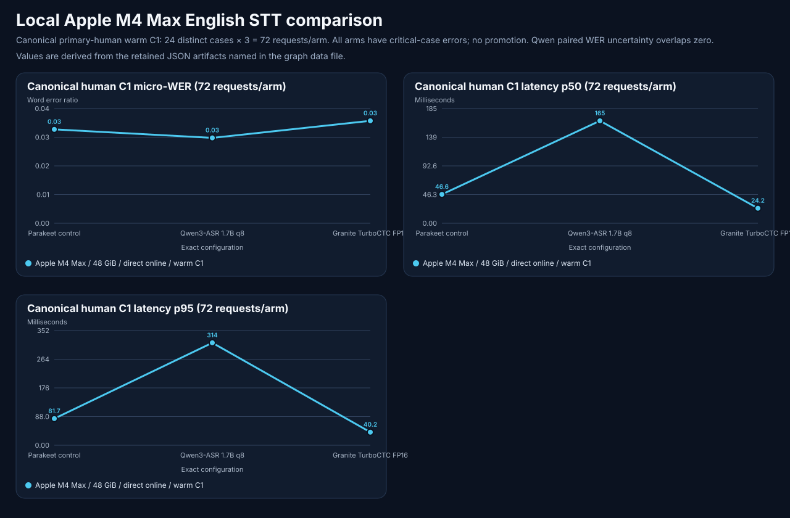

# Apple M4 Max English voice qualification — 2026-10-06

**Decision:** no qualified replacement; existing controls retained. Evidence and bounded restoration were independently reviewed. No promotion, release, or deployment follows from this local documentation.

## Outcome and decision

This quality-first English campaign tested multiple STT, TTS, and local LLM configurations on one Apple M4 Max with 48 GiB unified memory. Completed evidence has not established a replacement that passes every frozen gate. Retain the existing Parakeet Metal, Qwen3 4B, and Kokoro controls. Retention is not a new qualification of those controls, which also have measured failures or missing coverage.

<!-- benchmark-result-card/v1 -->

!!! info "Bounded campaign result"

    - **STT:** 24 distinct human utterances × 3 warm C1 requests per arm. Parakeet, Qwen3-ASR q8, and Granite FP16 measured 3.064%, 2.786%, and 3.343% normalized micro-WER. All fail a critical entity case; paired uncertainty does not establish a Qwen quality win.
    - **TTS:** Kokoro and both full Breeze q8 retry configurations returned 60/60 warm requests. Breeze BF16 stopped at 59/60 and Fish q8 at 56/60 under resource guards. ASR fidelity is a proxy; no human listening winner was established.
    - **LLM:** Baseline 4B, stock 9B off, private-cache0 27B off, and 27B low scored 132/144, 131/144, 138/144, and 144/144 on the semantic suite. Historical strict failures and 0/3 eligible strict 8K completions remain separate hard gates.
    - **Scope:** Direct same-host HTTP components, separate cold requests, warm corpus schedules, C1 LLM/TTS and C1/C4 STT. This is not end-to-end voice quality, a usable-context ranking, or a deployment decision.
    - **Decision:** `no-promotion`; human listening, microphone/accent, actual playback interruption, and combined stability coverage remain missing. Final medium/restoration closure: independently closed; no qualified replacement.

    [Exact recipe](2026-10-06-m4-max-voice-quality-qualification-evidence/reproduction.md) · [evidence index](2026-10-06-m4-max-voice-quality-qualification-evidence/README.md) · [artifact manifest](2026-10-06-m4-max-voice-quality-qualification-evidence/artifact-manifest.json) · [publication summary](2026-10-06-m4-max-voice-quality-qualification-evidence/publication-summary.md)

## Exact configuration

All measured lanes use the same Apple M4 Max, 40-core GPU, 48 GiB unified-memory host and direct local endpoints. Private hostnames, addresses, service paths, and operator identity are redacted. The source base is `6c8b061db10336957b6e9de6577e01d6b0c5fd62`; this was a dirty worktree, not a clean released build. The reviewed audio launcher file has SHA-256 `e7149c09668713835e1cd70725f2af78608ac023c72541f96462c61d7c924661`. Final source/version attestation: the final source ledger binds 116 original identities; the post-measurement lint amendment preserves original measured fixtures and changes only a native-pull identity helper plus unused test imports. The full Mac log lacks its original source receipt; exact bounded replay identities remain retained.

| Lane | Immutable model identity | Engine and important controls |
|---|---|---|
| STT control | Parakeet `tdt-0.6b-v3`; loaded checkpoint revision not independently attested | Existing parakeet.cpp Metal service; 16-kHz mono WAV |
| Qwen STT | `mlx-community/Qwen3-ASR-1.7B-8bit@a8379a2e2f9e313c9292cdf1af4055ab56d50d55` | MLX Audio 0.5.8 / source `70f4add32911bab6f869b824864ad9f1e24dcb97`, MLX 0.32.3; English conditioning |
| Granite STT | `iky1e/granite-speech-5.0-470m-turboctc-mlx-fp16@319abff7072204bc6cd30485aac58da6c1216214` | Same pinned audio runtime; FP16, no language-conditioning override |
| TTS control | Kokoro served alias; loaded checkpoint revision/default voice not independently attested | Kokoro FastAPI 0.8.2 / MPS; streaming; 24-kHz source PCM |
| Breeze BF16 | `mlx-community/Breeze-TTS-2-mlx@3c8829fb7fd335818f085cd2ef49b4100c0e46c8` | Pinned audio runtime; voice S0; streaming; HTTP default 1,200-token cap; initial cache policy |
| Breeze q8 R2 / R3 | `mlx-community/Breeze-TTS-2-mlx-8bit@c6e4a2ff6ab9afba68b7853de802273ffe23fb49` | Pinned audio runtime; S0; 750-token cap; MLX free-buffer cache disabled; R2 streaming / R3 buffered; 24-kHz source PCM |
| Fish q8 R2 | `mlx-community/fish-audio-s2-pro-8bit@c8d4481b3f7cbfe64d855c8b7cda7739502fc3ff` | Pinned audio runtime; default voice unverified; buffered; 1,024-token cap; free-buffer cache disabled; 44.1-kHz source PCM |
| LLM control | `mlx-community/Qwen3-4B-Instruct-2507-4bit`; loaded revision not independently attested | Existing MLX-LM 0.31.3 configuration; do not infer a supported thinking override from the candidate recipes |
| Stock 9B | `mlx-community/Qwen3.5-9B-4bit@8b2b98c00a6b4d291155e4890773ca8f769aee53` | MLX-LM 0.32.0 / MLX 0.32.3; native `enable_thinking=false` |
| 27B arms | `mlx-community/Qwen3.8-27B-4bit@10c35caafbb80f7dc6a7a432cdd11af10a6d4818` | Same stock distributions; off/low/medium profiles separate; retries use a reviewed **private, unshipped** cache0 validation fixture |

TTS audio is normalized to 16-kHz mono PCM for independent Parakeet transcription. Quantization, native voice, runtime, and streaming mode are parts of the configuration being assessed; the comparison does not isolate model architecture or quantization as the cause of a difference.

## Method

The original plan froze at `2026-10-06T07:10:46.451751+00:00`, before measured requests. The common publication wrapper was first prepared at `2026-10-06T08:30:55.370226+00:00`, after requests had begun. Later remedy, listening, reasoning, and phase-monitoring amendments keep their actual timestamps. This evidence does **not** satisfy the newer wrapper-before-first-request workflow retroactively.

STT uses 30 canonical cases: 24 LibriSpeech human recordings and six synthetic agent utterances, with human and synthetic results separate. C1 repeats each case three times; C4 repeats once. A disjoint supplemental holdout has 120 human cases, once each. Micro-WER is total edits divided by total reference words after NFKC/case/punctuation normalization. No number-word/digit equivalence is applied. Raw CER remains a formatting-sensitive diagnostic. Paired 20,000-draw case bootstrap intervals cluster repeated utterances and use seed 20261006.

TTS uses 60 distinct English prompts across ten categories, one separate cold request and one warm request per prompt. Returned PCM hashes, timing, format, completion, and failures are retained. Client first-audio time includes transport and buffering; a buffered response cannot establish interactive playback responsiveness. No p99 from these small populations is treated as a stable service tail.

LLM sampling is temperature 0.2, C1. The new semantic suite is 48 cases × 3; the historical exact suite is a separate 12 × 3 population. Strict capacity requests require 128 lowercase `code` words, exact request canaries, unique-cache controls, and actual prompts of at least 8,192 tokens. Off uses a 512-token total completion cap; low/medium use 4,608 total tokens. “512 visible plus 4,096 reasoning” is a planning label, not independently enforced partitions or measured internal token usage. The first calibration helper incorrectly counted two `BatchEncoding` keys; its retained corrected successor asserted integer token counts before candidate inference.

## STT results

| Canonical primary human, warm C1 | Edits / words; micro-WER | p50 / p95 endpoint latency | Critical case gate |
|---|---|---|---|
| Parakeet control | 33 / 1,077; **3.064%** | 46.62 / 81.68 ms | Fail |
| Qwen3-ASR 1.7B q8 | 30 / 1,077; **2.786%** | 165.37 / 314.25 ms | Fail |
| Granite TurboCTC FP16 | 36 / 1,077; **3.343%** | 24.23 / 40.16 ms | Fail |

Each latency population has 72 warm requests from 24 distinct utterances; these are component endpoint times. All requests completed without HTTP failures. All arms misrecognize the critical “MISSUS THORNTON” case in each of its three repetitions: Parakeet/Qwen return “mister” and Granite “miss.” A failing control does not relax the zero-critical-error gate.

| Candidate versus control | Canonical paired WER-difference 95% interval | Supplemental point micro-WER; paired interval |
|---|---|---|
| Qwen q8 | −1.770 to +1.084 percentage points | 3.112%; −1.225 to +0.570 points |
| Granite FP16 | −1.017 to +1.846 points | 4.399%; −0.363 to +2.260 points |

Supplemental Parakeet measured 3.433% (64/1,864 edits/words); Qwen 58 edits and Granite 82. All intervals overlap zero. Qwen's lower point WER does not establish a quality winner; Granite also misses the no-regression point gate. The supplemental repeat flag was a reference-supported “up and down up and down” phrase, not independently confirmed added repetition. At C4, primary-human p95 was 279.02 / 1,086.95 / 109.10 ms for Parakeet/Qwen/Granite, respectively; those 24-request populations remain separate.

The chart uses only the matched warm C1 human population, with source projection hashes in its graph-data file. [STT assessment](2026-10-06-m4-max-voice-quality-qualification-evidence/projections/stt-independent-assessment.json) retains critical cases and uncertainty.

## TTS results

| Exact configuration | Warm completion | First PCM p50 / p95 | Endpoint completion p50 / p95 | Independent ASR proxy and disposition |
|---|---|---|---|---|
| Kokoro control, streaming | 60/60 | 1,026.71 / 1,709.21 ms | 1,028.08 / 3,185.44 ms | 8.118% raw micro-WER; unresolved names; retained control, no new naturalness qualification |
| Breeze BF16, streaming | **59/60** | Partial cell; not ranked | Partial cell; not ranked | 11.919% on 59 successful outputs; resource-rejected configuration |
| Breeze q8 R2, streaming/cache0/750 | 60/60 | 1,527.19 / 1,582.73 ms | 4,904.30 / 15,549.21 ms | 8.026%; fidelity/pauses and client gates unresolved |
| Breeze q8 R3, buffered/cache0/750 | 60/60 | 5,458.13 / 17,346.36 ms | 5,459.07 / 17,348.28 ms | 7.749%; full-arm resources pass observed scope, quality/client gates unresolved |
| Fish q8 R2, buffered/cache0/1024 | **56/60** | Partial cell; not ranked | Partial cell; not ranked | 9.443% on 56 successful outputs; resource-rejected configuration |

Cold first-PCM / completion times were Kokoro 1,095.65 / 1,096.03 ms, Breeze BF16 3,850.48 / 7,307.75 ms, Breeze R2 2,063.56 / 5,290.56 ms, Breeze R3 6,326.18 / 6,327.63 ms, and Fish 4,632.26 / 4,634.88 ms. Cold rows are single samples; retry cache/resource histories differ, so they are not an isolated cold-start speed experiment.

The R3 retry changed only Breeze's request streaming mode after an eight-case diagnostic, then reran the unchanged full 60. It observed no swap growth across 435 samples, minimum free memory 42%, and maximum sampled RSS 5,053,333,504 bytes. Forty-one advisory repeated-block flags were attributable to digital zeros, with no nonzero identical triples; they are not confirmed spoken repetition. The longest output was 50.56 s. Independent ASR leaves a possible “sixteen-bit samples” omission, an added “Yeah,” name pronunciation, and pauses unresolved. These require human acoustic review, not model self-grading or an assertion that the recognizer's transcript proves an acoustic error.

No human listening preferences were collected. The 40-trial R2 blind pack is research-only, not an eligible complete preference panel and not a qualification of R3. The frozen winner rule requires at least 60% of non-tied pairs with a Wilson 95% lower bound above 50%. [Final TTS assessment](2026-10-06-m4-max-voice-quality-qualification-evidence/projections/tts-final-candidate-control-assessment.json) records no winner. The exact configurations remain unqualified; this is not a terminal rejection of the Breeze family.

## LLM results

| Exact profile | Semantic attempts | Historical exact attempts | Strict 8K capacity | Decision |
|---|---|---|---|---|
| Baseline 4B | 132/144 | 36/36 | 0/3 eligible | Retain existing control; tools 0/3; not newly qualified |
| Stock 9B off | 131/144 | 33/36 | 0/3 eligible | No promotion |
| Stock 27B off | Not measured | Not measured | Not measured | Startup resource abort before inference |
| Private-cache0 27B off | 138/144 | 36/36 | 0/3 eligible | No promotion; private fixture |
| Private-cache0 27B low | 144/144 | 33/36 | 0/3 eligible | No promotion; private fixture |
| Private-cache0 27B medium | 144/144 | 31/36 | 0/3 eligible | No promotion; private fixture |

### Baseline 4B

Four semantic cases fail at least one repetition. Duration arithmetic returns 110 instead of 140 in all three repetitions; other failures include extra work around a correct 8.25 answer and strict leading-zero/spoken formatting. Historical exact scores 36/36, while shared-prefix tools score 0/3. Capacity receives all three full streams with 8,192/8,193/8,195 actual prompt tokens and passing canaries, but returns 493 rather than 128 `code` words at the 512-token length cap. No request is performance eligible.

### Stock 9B off

Functional preflight passes all nine observations, including three tools, with no exposed reasoning under the verified native off template. Semantic failures include nine wrong arithmetic attempts across three cases and four formatting/schema attempts across two cases. Historical exact fails the three correct-intent `Tea.` responses because the frozen oracle requires `tea` without punctuation. This is a hard exact-format failure. All three 8,192-token capacity requests fail the same 493-versus-128 controlled output gate; timings are not ranked. The resource guard observed 309 samples, zero swap growth and minimum free memory 45%.

### Stock 27B startup abort

Before inference, startup swap grew 6,192,292,168 bytes above its recorded pre-up baseline. The first resource sample triggered managed shutdown. Eight subsequent connection-refused probes are transport-only after shutdown; they are not model quality or parser failures. The protected endpoint collision and create-only service identity changes remain in the friction record.

### Private cache0 27B off

The reviewed fixture disabled MLX's free-buffer cache on the actual stock inference worker before preload, preserving official request, template, sampler, semaphore, and lifecycle behavior. Preload active memory was 15,133,588,496 bytes with cache zero. All nine preflight observations pass. Semantic improves in aggregate to 138/144 but has **six substantive arithmetic failures**: cash 4.25 instead of 8.25 and duration 120 instead of 140, each three times. A higher aggregate than baseline does not make it a quality-first winner. Historical exact passes 36/36; strict capacity fails 3/3 at 493 words. The guard observed 433 samples, zero swap growth and minimum free memory 37%, against a nonzero residual-swap baseline.

### 27B low reasoning

The global native low preset and request merge are source-verified; preflight passes 9/9 and semantic 144/144 with reasoning separated from visible answers. Historical exact fails 3/36 correct-intent `No.` responses against strict `No`; this is not evidence of unsafe compliance. All capacity streams reach their length terminal at 4,608 total completion tokens, with actual prompt counts 8,192/8,192/8,194 and 745,790.27 ms combined wall time.

The expected canary occurs once in each retained prefix but does **not** start it. Separately, the 8,192-character capture is incomplete: each prefix already contains 1,633 complete `code` words, exceeding 128, but the exact full total and absence of later foreign markers are unobservable. Native `observed_extra_words=1` has unknown origin, possibly an unstripped marker; it is not proof of a real extra word or clipped partial word. Native `request_canary_failed` is retained without a false missing-marker claim. The 120-second urllib timeout is connect/read inactivity, not a total stream deadline. The distinct resource guard bounded work to 1,800 seconds and observed 1,533 samples, zero growth and minimum free memory 35%.

### 27B medium reasoning

The source-verified medium preset passes preflight 9/9 and semantic 144/144. Historical exact scores 31/36: two `Tea.` and three `No.` outputs are semantically correct but fail unchanged punctuation oracles. No waiver was applied. Capacity receives all three terminals at actual prompt counts 8,192/8,192/8,193. Two requests exhaust 4,608 tokens entirely in separated reasoning with **zero visible content**. The third stops at 4,301 total tokens but its retained prefix has 1,633 complete `code` words, with the expected marker once and not at the start; capture is incomplete. Exact full count and later foreign-marker absence remain unknown. None is performance eligible; combined capacity wall time is 736,632.79 ms, not a 120-second-total-deadline pass.

Two separate 1,800-second guards cover 906 and 834 samples. Both close against the original pre-up baseline and same process identity, with a verified no-inference handover. The handover has point resource samples; this is not continuous monitoring of a 3,600-second arm. Final managed down and immutable log custody are separately bound. Semantic perfection does not override exact-profile/capacity failures or private unshipped integration. [Final medium audit](2026-10-06-m4-max-voice-quality-qualification-evidence/projections/qwen38-27b-cache0-r2-medium-final-independent-audit.json).

## Compatibility stops

The pinned Granite q8 conversion `f8911a51b3be9092a71fd0c676b9d8c3b9812035` declares global group size 128 while relevant quantized inputs use 64; the pinned loader lacks that override. It was rejected by static compatibility inspection before weight loading. The FP16 arm is a distinct admitted configuration.

The English Nemotron conversion `animaslabs/nemotron-speech-streaming-en-0.6b-mlx-8bit@678a03646fceb33f78d1aa18897726cfd73b8943` lacks the expected model-type remapping and has incompatible causal-downsampling loader assumptions. No supported pinned runtime was admitted. This is an integration stop with no inference or quality score. Fish's upstream streaming path raises `NotImplementedError`; its negative HTTP probe returns no audio and cannot be a speed comparison. [Compatibility evidence](2026-10-06-m4-max-voice-quality-qualification-evidence/projections/compatibility-notes.json).

## Runtime remedies and resource limits

`mx.set_cache_limit(0)` disables MLX's reusable free-buffer cache. It does not cap active allocations or total unified memory. The product audio launcher offers the explicit optional cache limit and safe worker diagnostics; its default is preserved when unset. The 27B LLM cache0 retry instead uses a source-pinned **private validation experiment**, not a shipped command or durable product qualification. Promotion would require a packaged integration, source gates, and rerun of all required acceptance conditions. The blocked v1 diagnostic wrapper and independently cleared v2 are retained; a closed stderr must not suppress stock preload or replace its original failure.

Host swap/free memory, sampled process RSS, and MLX active/cache/peak bytes measure different things. MLX active excludes cached buffers; process peaks do not become per-request peaks without a declared reset. Sampled maxima can miss startup or aborted-generation transients. Breeze BF16's swap rose from 33.88 MB to 9,129.94 MB before abort and 9,833.88 MB after unload; the exact allocation cause is not established. Fish's guard observed 728,099,718 bytes growth, exceeding the 536,870,912-byte gate, and rejected four long-form requests. Its aborted generation's MLX peak is unknown; the 15,286,476,287-byte completed-generation peak is not a substitute. No unsupported memory-limit hard-cap claim is made. [Official cache-limit semantics](https://ml-explore.github.io/mlx/build/html/python/_autosummary/mlx.core.set_cache_limit.html).

## Failures and caveats

The frozen critical-error, correctness, and resource gates remain unchanged. Successful retries are separate exact configurations with separate source and resource histories. Native failures, incomplete capture, null reasoning-token usage, and startup-transient unknowns are preserved. These results do not support a forced quality winner, failed-cell throughput ranking, broad accent coverage, or maximum useful context.

The full product test run under macOS / CPython 3.14.6 returned **31 failed, 9,808 passed, 687 skipped**, not full green. Bounded worktree/canonical comparisons confirm 30 existing platform-assumption failures with matching relevant source files; one SQLite failure did not reproduce and its cause is unresolved. This documentation does not claim release readiness. [Test triage](2026-10-06-m4-max-voice-quality-qualification-evidence/projections/product-test-triage.json).

## Restoration and missing client gates

Independent bounded restoration verifies the original production configuration hash and four core process identities, with 13 noncore candidate/legacy supervisors unloaded. A single local synthetic audio loop has normalized WER 0.0 and 720.05 ms round trip. The exact pinned Realtime fixture passes two authenticated text turns with nonempty correlated PCM/exact transcripts and rejects unauthenticated WebSocket access with 401. Earlier evidence-path and invalid-tail argument attempts remain retained as operator/probe failures, not model failures.

The ending point observation has 65,525,723,136 free disk bytes and 80% system free memory; residual swap remains 13,742.94 MB. Native cache inventory lists 12 snapshots: 10 with valid local link integrity and **two unsafe Kokoro snapshots**, with artifact completeness unverified for all 12. It is metadata evidence, not whole-cache safety or cleanup authority. No cache bytes were deleted. [Final restoration audit](2026-10-06-m4-max-voice-quality-qualification-evidence/projections/restoration-final-independent-audit.json) bounds these claims. Before/after supervisor identity remains the lifecycle authority even when an unloaded candidate's port probe reaches another service.

No replacement ran the full combined 100-warm-turn / at-least-1,200-second soak, real microphone/accent assessment, blind naturalness preference, or actual playback interruption within 250 ms. Component HTTP corpus completion and a text-turn Realtime smoke cannot establish those gates. Before/after service checks do not prove uninterrupted protected endpoint availability. No route, client catalog, or deployment promotion is implied.

## Evidence boundary

The [evidence index](2026-10-06-m4-max-voice-quality-qualification-evidence/README.md) wraps all ten roles. Public JSON is an explicit sanitized, sometimes structurally compacted derivative of original private evidence. The [projection ledger](2026-10-06-m4-max-voice-quality-qualification-evidence/projection-ledger.json) binds original SHA-256/byte counts to projected SHA-256/bytes and identifies every omission/redaction. TTS retains all request rows, failures, first-PCM/EOF controls, metrics and hashes; only intermediate captured size/timing chunk events are omitted, with first/last events and array hashes retained. Those omissions prevent reconstructing all intermediate chunk gaps from public data. STT alone adds an identical `schema` alias beside unchanged `schema_version` for the existing renderer. TTS and LLM schemas remain unchanged and are presented as tables because that renderer does not support them.

No audio, weights, personal name, private host address/path, or private fixture source is published. One operator-name prompt is redacted, so its exact text is not publicly reconstructible; original prompt metrics/hashes remain authoritative. Internal native hashes refer to the original private bytes, never silently to redacted text. The final closed inventory binds projections, graphs, table wrappers and reconstruction references. This local documentation change is not a release, push, deployment, or external publication.
