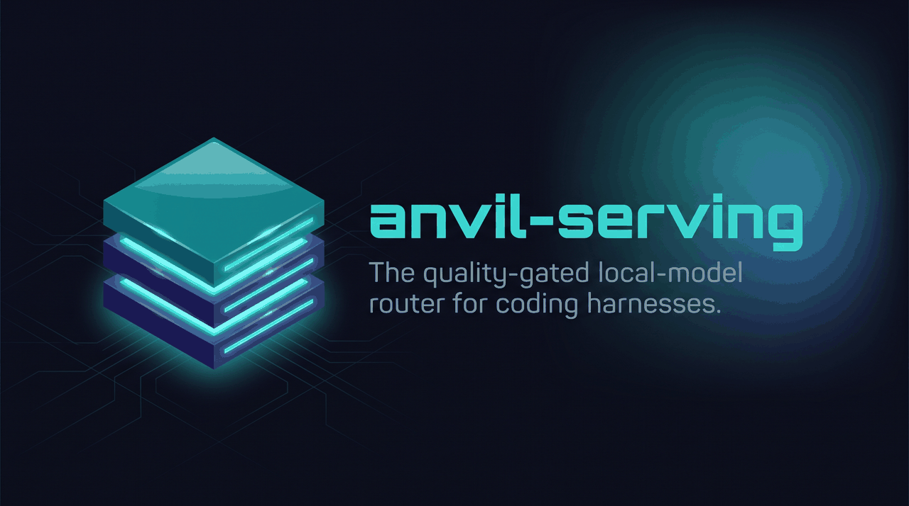

# anvil-serving

> **The quality-gated local-model router for coding agents.**
>
> *Run local where it is measured safe. Verify risky local output. Keep cloud explicit.*

[](https://github.com/fakoli/anvil-serving/blob/main/LICENSE)
[](https://github.com/fakoli/anvil-serving/blob/main/CHANGELOG.md)
[](https://fakoli.github.io/anvil-serving/)

anvil-serving sits between coding agents and local/cloud model tiers. It speaks Anthropic Messages
and OpenAI Chat Completions, routes each request by workload intent, checks risky local output before
returning it, and keeps metered cloud usage explicit.

For OpenClaw and remote operations, it also exposes explicit MCP/controller tools for status,
voice lifecycle, preflight, benchmark, OpenClaw sync, and promotion evidence. The router stays the
data plane; the control plane handles operations across same-host, private, and tailnet-reachable
device topologies.

## The Product Promise

| Question | anvil-serving answer |
|----------|----------------------|
| Can this run local? | Only if the quality profile says the tier is trusted for that work class. |
| What if local output is risky? | Buffer and structurally verify before committing the response. |
| What if local cannot serve it? | Exhaust cleanly or use an explicitly configured cloud tier. |
| Will this lock me into one harness? | No. The front door is protocol-standard; OpenClaw is the reference integration. |
| How do agents operate it? | Through explicit MCP/controller tools, not raw SSH as the product contract. |

## Why Not Just Use A Proxy?

Token proxies move requests. They do not know whether a specific local model is good enough for a
specific coding task on your workload. anvil-serving adds the missing quality gate:

- **Intent presets** let clients ask for `planning`, `quick-edit`, `review`, `chat`, `chat-fast`,
  or `long-context` instead of pinning a model everywhere.
- **Quality profiles** record per-tier, per-work-class trust decisions.
- **Structural verification** catches cheap, concrete failures before the agent sees them.
- **Transparent responses** report what actually served the request.

## Evaluate It

Start with the no-GPU front door smoke test:

```bash
pip install -e .
python -m anvil_serving.router
```

Install from this clone when evaluating the current `main` docs. Published packages can lag the
source tree and may not include main-only MCP/controller commands yet.

If port `8000` is already in use, pass `--port <free-port>` and use that port in the URLs below.

Then query the protocol surface:

```bash
curl -s http://127.0.0.1:8000/v1/models
curl -s http://127.0.0.1:8000/v1/chat/completions \
  -H 'content-type: application/json' \
  -d '{"model":"chat","messages":[{"role":"user","content":"hello from anvil-serving"}]}'
```

That proves the front door, model discovery, request parsing, and response rendering. To evaluate
real routing, run compatible local model serves at the `base_url` values in `configs/example.toml`
and start:

```bash
anvil-serving serve --config configs/example.toml
```

Follow the full path in [Getting started](GETTING-STARTED.md).

## Operating Defaults

- Default config is local-only and contains no cloud API key.
- Metered cloud requires an explicit cloud tier plus `[router].metered_cloud`.
- Local URLs use `127.0.0.1`.
- Credentials are referenced by env-var name only.
- Token auth is required before exposing the router beyond loopback.
- OpenClaw's native fallback is not a reliable safety net for plugin-pinned local-preferred classes;
  use `ANVIL_CLOUD_CLASSES` or anvil-serving's opt-in cloud tier for at-risk work.
- The MCP/controller control plane is for explicit operations; the router remains the model data plane.

## Core Terms

| Term | Meaning |
|------|---------|
| Intent preset | The value a client sends in `model`, such as `planning` or `quick-edit`. |
| Tier | A configured backend candidate, usually fast-local, heavy-local, or cloud. |
| Quality profile | The trust table that decides `allow`, `allow-with-verify`, or `deny`. |
| Verify-and-fallback | The response path that checks local output and escalates when it fails. |
| Local serving tools | The CLI surface for profiling usage, cataloging models, managing serves, and validating endpoints. |
| Device topology | The assignment of gateway, voice, router, serve, controller, and operator roles to reachable devices. |
| Voice pipeline | The local Realtime voice runtime: STT -> routed LLM -> TTS, with managed audio serve lifecycle. |
| Control plane | MCP/controller tools for status, route probes, preflight, benchmark, OpenClaw sync, voice lifecycle, and promotion evidence. |

See [Terminology](TERMINOLOGY.md) for the naming guide.

## Documentation Map

| Read this | When you need |
|-----------|---------------|
| [Getting started](GETTING-STARTED.md) | Evaluate the front door, then route real local tiers. |
| [Product architecture](QUALITY-GATED-ROUTER.md) | Understand intents, routing, verification, and fallback. |
| [Operator playbooks](OPERATOR-PLAYBOOKS.md) | Run MCP/controller workflows. |
| [Operator skills and sub-agents](OPERATOR-SKILLS-AND-SUBAGENTS.md) | Map verbs to MCP/skills and run small-model workflow slices safely. |
| [Operator skills ADR](adr/0015-operator-skills-and-subagent-workflows.md) | Understand the workbench skill, harness packaging, and sub-agent model split. |
| [Device topologies](DEVICE-TOPOLOGIES.md) | Expand from Fakoli Mini/Dark to additional laptops or hosts over Tailscale/private connectivity. |
| [Model settings](MODEL-SETTINGS-EXAMPLE.md) | Tune thinking/sampling behavior for a served model. |
| [Serves & eval](SERVES-AND-EVAL.md) | Manage model serves and run evals. |
| [Voice pipeline](VOICE.md) | Run native voice commands, multi-device audio/LLM topology, Realtime server, and benchmarks. |
| [External benchmarks](EXTERNAL-BENCHMARKS.md) | Import and compare advisory benchmark data. |
| [OpenClaw integration](OPENCLAW-INTEGRATION-SPEC.md) | Use the reference gateway integration. |
| [OpenClaw operations ADRs](adr/0013-openclaw-layers-and-mcp-control-plane.md) | Understand hook, router, MCP, and tailnet-controller layers. |
| [Hugging Face speech-to-speech](https://github.com/fakoli/anvil-serving/tree/main/examples/huggingface-speech-to-speech/) | Run Realtime audio with anvil-routed LLM turns. |
| [ADRs](adr/README.md) | Read why major decisions were made. |
| [Changelog](changelog.md) | Track release history. |
