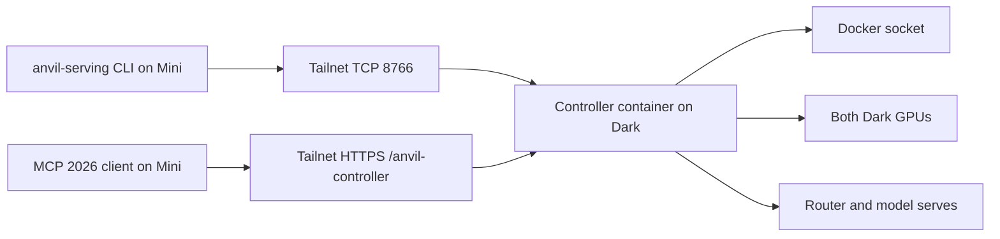

# Operate Fakoli Dark from Fakoli Mini

This runbook covers the deployed split-host control plane:

- **Fakoli Mini** runs the `anvil-serving` CLI, the MCP stdio proxy, and
  OpenClaw.
- **Fakoli Dark** runs the hardened Linux controller container, Docker model
  serves, the router, and both GPUs.
- **Tailscale Serve** carries controller traffic. Mini never receives Dark's
  Docker socket.

The controller supports MCP `2026-07-28` only. It does not implement the
removed `initialize` lifecycle.

## Current status

The deployment is ready for direct Anvil CLI use from Mini. The OpenClaw
server declaration is installed but disabled because OpenClaw `2026.7.1-2`
still bundles an initialize-based MCP client. Do not enable legacy MCP support
in Anvil to work around that client.



## Use it now from Mini

SSH to Mini and load the owner-only service environment into the current
shell. This exports the existing token; it does not print it:

```bash
ssh fakoli-mini
set -a
source "$HOME/.openclaw/service-env/ai.openclaw.gateway.env"
set +a
```

Confirm the installed topology and controller:

```bash
anvil-serving topology validate
anvil-serving controller status \
  --url http://100.64.0.10:8766 \
  --auth-token-env ANVIL_CONTROLLER_TOKEN
```

The private topology at
`~/.anvil-serving/operator-topology.toml` already declares Mini as the command
host, Dark's container as the execution runtime, and the controller transport.
Normal commands can therefore execute on Dark:

```bash
anvil-serving router status --transport controller
anvil-serving router transition-status --transport controller
anvil-serving router logs --tail 50 --transport controller

anvil-serving serves status --transport controller
anvil-serving serves logs primary --tail 50 --transport controller

anvil-serving host gpus \
  --target host:fakoli-dark \
  --transport controller
```

Add `--json` to any command for a machine-readable envelope that records the
command host, resource owner, execution runtime, transport, and result.

## Preview before mutation

Remote lifecycle commands retain their normal safety gates. Preview the exact
operation first:

```bash
anvil-serving router restart --dry-run --transport controller
anvil-serving serves up primary --dry-run --transport controller
anvil-serving serves down primary --dry-run --transport controller

anvil-serving voice audio up \
  --config /etc/anvil/voice.toml \
  --profile dark-audio \
  --dry-run \
  --transport controller

anvil-serving eval preflight \
  --base-url http://127.0.0.1:8000/v1 \
  --model agents-a1-fp8-mm-262k \
  --api-key-env ANVIL_ROUTER_TOKEN \
  --checks smoke \
  --dry-run \
  --transport controller
```

In controller operations, `127.0.0.1` is rewritten to the explicit
container-to-Dark alias. It does not point to Mini.

Apply only after reviewing the preview and accepting the affected serve:

```bash
anvil-serving router restart --confirm --transport controller
anvil-serving serves up primary --confirm --transport controller
```

Do not use `--confirm` speculatively. Promotion, native Windows repair,
Docker/WSL restart, cache deletion, GitHub publication, and SSH-authenticated
work remain outside this controller.

## Router transition sequence

Transition commands require an exact tier:

```bash
anvil-serving router quiesce \
  --tier primary-local \
  --dry-run \
  --transport controller

anvil-serving router transition-status --transport controller
```

`router drain` is meaningful only after the tier has actually been quiesced.
A dry-run quiesce does not change admission state, so a subsequent drain may
correctly report that the tier is still admitting. A live quiesce/readmit
sequence is a maintenance action and requires explicit confirmation.

## MCP client configuration

An MCP `2026-07-28` client can launch the Mini-side stdio proxy:

```bash
anvil-serving mcp serve \
  --controller-url \
  https://fakoli-dark.<tailnet>.ts.net/anvil-controller/mcp \
  --auth-env ANVIL_CONTROLLER_TOKEN
```

The proxy exposes 15 restricted tools:

```text
operation_contracts
router_status, router_logs, router_manage, router_transition, decision_summary
serves_status, reservation_status, serves_manage, serves_logs
voice_manage, gpu_inventory
preflight_probe, benchmark_probe, workflow_packet_validate
```

OpenClaw's saved `mcp.servers.anvil-serving` entry uses this command but remains
disabled until OpenClaw ships an MCP v2 client that can pin `2026-07-28`.

```bash
openclaw mcp status --json
```

After that upstream upgrade:

```bash
openclaw mcp configure anvil-serving --enable
openclaw mcp probe anvil-serving
```

## One-time Dark setup

From an updated Anvil Serving checkout on Dark:

```powershell
$env:ANVIL_CONTROLLER_TOKEN = '<load from secret storage>'
docker compose `
  -f examples/fakoli-dark/docker-compose.controller.yml `
  up -d --wait --build controller

tailscale serve --bg `
  --set-path=/anvil-controller `
  http://127.0.0.1:8765

tailscale serve --bg `
  --tcp=8766 `
  tcp://127.0.0.1:8765

tailscale serve status
```

The HTTPS path is for MCP clients. The tailnet TCP listener gives the typed CLI
controller transport a literal `100.64.0.0/10` endpoint while Tailscale still
encrypts and restricts the connection to the tailnet.

The container mounts only declared manifests, its controller topology, the
Docker socket, and durable operation state. It does not mount a user home,
`.ssh`, GitHub CLI configuration, or raw GitHub credentials.

## Validation coverage

Validated from Mini against the live Dark controller on 2026-07-29:

| Surface | Result |
| --- | --- |
| Controller discovery | Healthy; 15 restricted tools |
| MCP `server/discover` and `tools/list` | Passed with `2026-07-28` |
| All 15 controller tools | Exercised successfully as a live read or non-mutating preview |
| Direct typed CLI matrix | 19 passed; 3 state-dependent refusals described below |
| Router status, logs, lifecycle previews | Passed |
| Serve status, primary logs, lifecycle previews | Passed |
| GPU inventory | Both Dark GPUs visible |
| Preflight and capacity benchmark previews | Passed without sending model requests |
| Voice lifecycle preview | Passed |
| Voice status/logs | Correctly report unavailable while STT/TTS containers are absent |
| Live lifecycle mutation | Not exercised; human confirmation intentionally withheld |
| OpenClaw MCP probe | Blocked by OpenClaw's older initialize-based client |

This is not a claim that every command in the entire Anvil Serving CLI is
remote-capable. Only operations declared in the controller catalog and Mini's
topology are remote. Local-only recipe authoring, publication, native host
repair, promotion, and other excluded commands remain on their owning host.

## Troubleshooting

Check the path in this order:

```bash
tailscale status
anvil-serving topology validate
anvil-serving controller status \
  --url http://100.64.0.10:8766 \
  --auth-token-env ANVIL_CONTROLLER_TOKEN
anvil-serving router status --transport controller --json
```

- `missing_controller_token`: load the owner-only service environment.
- No controller transport: validate
  `~/.anvil-serving/operator-topology.toml`.
- Router drain refuses: quiesce the exact tier first; a preview is not a
  quiesce.
- Voice status/logs return unavailable: bring up the declared audio profile or
  treat the absent containers as the current expected state.
- OpenClaw reports `Connection closed`: keep the entry disabled until its
  bundled MCP client supports `2026-07-28`.
